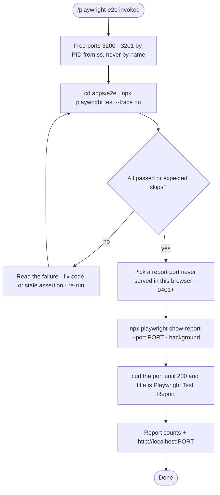

# /playwright-e2e — Run the Suite, Hand Back a URL That Opens

**What:** Run the Playwright suite against the built portals and serve its report on a port the user's Windows browser can actually reach.

**Why:** The tests are the easy part. Every failure in this repo has been in the delivery — a stale server from another repo squatting the report port, a browser caching an older trace viewer, a `pkill` pattern that killed the shell running it, a rebuild under a live server serving dead chunks. Each one looks like "the tests are broken" and none of them are.

**How:** Free the ports by number, let `playwright.config.ts` build and serve both portals itself, run the suite with tracing on, then serve the report on a port nothing has served before in this browser session. Report the counts and one URL.

## SOP



## Structured Output: E2E Run

Print at the top of every response without exception:

```
▶ /playwright-e2e · [freeing ports | running | serving | done]
  🧪 Result:  [N passed · N skipped · N failed | "not yet run"]
  🌐 Report:  [http://localhost:PORT | "not yet served"]
  🔄 Status:  [in progress | done]
```

## Procedure

### Step 1 · Free the app ports by number

```bash
for p in 3200 3201; do
  pid=$(ss -ltnp 2>/dev/null | grep ":$p " | grep -o 'pid=[0-9]*' | cut -d= -f2 | head -1)
  [ -n "$pid" ] && kill "$pid" && echo "killed $pid on $p"
done
```

`playwright.config.ts` sets `reuseExistingServer: !CI`, so a server left over from a hand-run `npm run start` gets reused — including one serving an older build. Kill it and let the config build fresh.

### Step 2 · Run the suite

```bash
cd apps/e2e && npx playwright test --trace on
```

Let the config own the servers. It builds `@rf/business` and `@rf/investor` and serves them on :3200 and :3201 with `NEXT_PUBLIC_PRIVY_APP_ID` cleared, which is what makes the portals open straight onto the dashboard instead of a sign-in gate.

Add `--reporter=html` if the run was already done once with `list` and only the report is wanted.

### Step 3 · Serve the report on a port with no history

```bash
cd apps/e2e && npx playwright show-report --port 9401   # run in background
for i in $(seq 1 15); do curl -sf -o /dev/null http://127.0.0.1:9401 && break; sleep 1; done
curl -s http://127.0.0.1:9401 | grep -o "<title>[^<]*</title>"
```

9323 is Playwright's default and is therefore the port every repo's stale report server is sitting on. Before using it, check who holds it:

```bash
pid=$(ss -ltnp 2>/dev/null | grep ':9323 ' | grep -o 'pid=[0-9]*' | cut -d= -f2 | head -1)
ps -p "$pid" -o cmd=
```

### Step 4 · Hand back the URL

`http://localhost:PORT` — not the WSL IP. WSL2 forwards `localhost` from Windows to a loopback-bound service; `172.x.x.x` only answers if the service bound `0.0.0.0`, and binding `0.0.0.0` is refused by the sandbox classifier on this machine.

## Hard Rules

**Never `pkill -f` a pattern that appears in your own command**
- **What:** Kill by PID resolved from `ss -ltnp`, never `pkill -f "next-server"` or `pkill -f "next start"`.
- **Why:** `pkill -f` matches against full command lines, and the Bash tool's own wrapper command line contains the pattern you just typed. It kills the shell running it, and the call returns exit 144 with no output and no explanation.
- **How:** Resolve the PID from the port, `kill` that PID, verify the port is free.

**Never rebuild while a server is serving that build**
- **What:** Kill the running server first, then build, then start.
- **Why:** `next build` replaces the chunk files under the running process. The page then loads and immediately 500s on every chunk, and the app renders "This page couldn't load" — which reads as a broken feature and is not one.
- **How:** Free the port, build, start, curl until 200.

**Never serve a report on a port that served a different repo's report in this browser**
- **What:** Pick a fresh port, or have the user hard-refresh with Ctrl+Shift+R.
- **Why:** The trace viewer is JS cached per origin. A port that previously served another repo's report hands the browser that older viewer, which then rejects the new trace with "created by a newer version of Playwright" — a cache error wearing a version error's clothes.
- **How:** Before claiming a version mismatch, print `npx playwright --version` and the installed `@playwright/test` version. If they match, it is the cache.

**Never weaken a skipping test to make it run**
- **What:** Tests that self-skip without `PRIVY_APP_SECRET` or `PRIVY_DIRECTOR_ACCESS_TOKENS` stay skipped.
- **Why:** They assert that Privy refuses, not that we refuse. A mocked refusal proves only that a mock was written that refuses.
- **How:** Report the skip and name the credential that would run it. Never substitute a fake.

**Never hand-roll the servers when the config already declares them**
- **What:** Do not `npm run start` a portal and point tests at it.
- **Why:** `NEXT_PUBLIC_*` values are inlined at build time, so a hand-started server built with `.env.local` present renders the sign-in gate and every panel the tests look for is absent — a 30-second timeout on a locator that will never exist.
- **How:** Run `npx playwright test` and let `webServer` do it. If a portal must be served by hand for a screenshot, rebuild it first with the same env the config uses: `NEXT_PUBLIC_PRIVY_APP_ID= npm run build -w @rf/business`.

**Never use the Playwright MCP server for this repo's e2e**
- **What:** Drive the browser through the repo's own `@playwright/test`, not `mcp__playwright-mcp__*`.
- **Why:** The MCP server pins its own Chromium revision, which is not among the ones installed in `~/.cache/ms-playwright`, and it fails with a download prompt.
- **How:** Write a throwaway script importing `chromium` from `@playwright/test` and run it from inside the worktree, so it resolves the workspace's own install.

## Watching it happen

```bash
npm run test:headed -w @rf/e2e
```

Headed mode needs WSLg — a real window opens on Windows. Use it when the point is to watch a refusal happen rather than to find out whether it did. For a recording instead, the config keeps video and trace on failure; pass `--trace on` to keep them for a passing run too.
