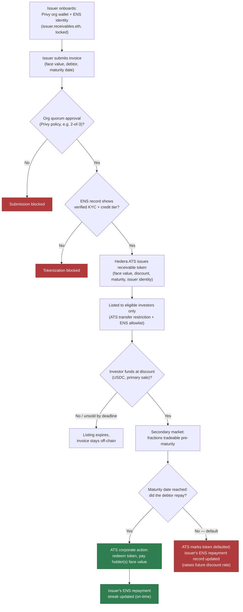
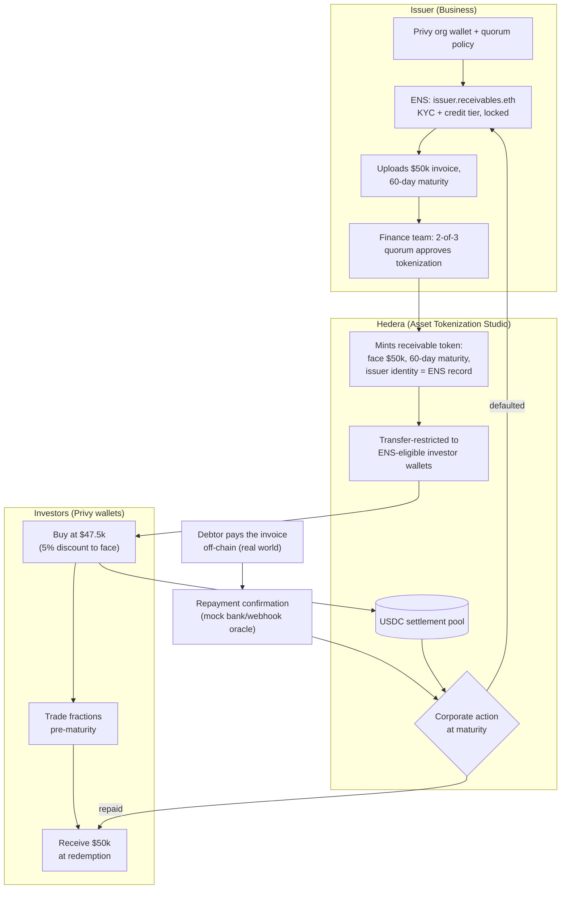

# receivable-flow

## Event Basics

- **Dates:** September 4 – 16, 2026, fully online/async
- **Submission deadline:** Sunday, September 13, 2026, 12:00pm EDT
- **Build time:** ~9 days from start to submission
- **Judging:** sponsor tracks judged async on repo/README/demo video (no live pitch required); top ~20% of all submissions also advance to a 7-min live round for the general track. Criteria both ways: Technicality, Originality, Practicality, Usability, WOW factor.

Full prize list: https://ethglobal.com/events/ethonline2026/prizes

## Chain/Sponsor Stack — Decided

**Hedera + Privy + ENS. Single settlement chain (Hedera), same discipline as the insurance project.**

- **Hedera** — the receivable itself is minted, restricted, and redeemed here via Asset Tokenization Studio (ATS). This is the anchor track and the only chain touched for settlement.
- **Privy** — the issuer side is a real B2B org, not a single EOA. Org wallets + policies + quorum approval model the actual internal control a finance team needs before it can turn a real invoice into a tradeable token.
- **ENS** — functional, locked identity/eligibility layer (Permissioned Resolver + hierarchical namespace), the same mechanism `insurance-demo.md` already validated for PayableAgent's spending scope, reused here for issuer KYC/credit-tier and investor eligibility. Deliberately reused rather than reinvented — less net-new design risk across two submissions in one 9-day window.

**Arc was considered and dropped**, for the identical reason it was dropped from the insurance project: it's a second chain, a second wallet SDK, and its tracks pay out of a pool split evenly among all qualifying teams rather than a fixed amount — unpredictable and likely diluted, not worth the added build surface. An investor funding a receivable in USDC is a real "treasury workflow" that would have fit Arc's literal bar, but Privy's B2B track already covers the org-wallet story on one chain without the extra integration cost.

Other sponsors (World, 1inch, Uniswap, Ledger, Chainlink, Bazantic) are out of scope for *this* project specifically — not evaluated exhaustively here, just not the three chosen.

**The Graph — explicitly not pursued (updated from "stretch," see below):** requires self-hosting `graph-node` plus its own Postgres + IPFS + a custom subgraph manifest against Hedera's JSON-RPC relay — new infrastructure, not an SDK integration, on top of whatever else ships in 9 days. Worse, the published qualification text for both AI-tooling tracks requires you to *"consume live data from a Graph provider, for example Subgraph Studio... or The Graph Market"* and explicitly disqualifies *"mocked, local-only, or static datasets."* A privately self-hosted node that only you ever queried reads a lot closer to "local-only" than to "a Graph provider" as that sentence clearly means it (Graph's own live, third-party-operated services) — real risk of building it and still not qualifying. Not worth the build risk for either project in this window.

## Target Sponsors & Prize Tracks

| Sponsor | Track | Prize | Requirement |
|---|---|---|---|
| Hedera | Tokenization of Anything | $6,000 total (up to 3 teams × $2,000 fixed) | "Use the Asset Tokenization Studio (SDK, contracts, web application, or a combination) to issue or manage a tokenised asset," with lifecycle/corporate-action operations — not just a one-shot mint |
| Privy | Best B2B Financial Product | $2,500 | Business-focused digital asset management using Privy wallets — "organization wallets, policies, team permissions, quorum approvals" |
| ENS | Best Use of ENSv2 | $4,500 | Build on ENSv2 beta (Sepolia) using hierarchical registry, wildcard resolution, or permissioned features — functional, not cosmetic |

**Three sponsors, one submission — $13,000 addressable**, all compatible with a single Hedera settlement layer.

(Not pursued here for reference: Hedera's own "AI & Agentic Payments" track is the *other* submission's target, not this one's — same sponsor, different pool, no conflict. Privy's second track, "Best Financial Flow," is a plausible bonus if the investor-side UX ends up polished, but B2B Financial Product is the literal fit being built for.)

## Key Lesson: The ColdProof Precedent (carried over)

[ColdProof](https://ethglobal.com/showcase/coldproof-qsb02) (ETHGlobal Lisbon 2026) used Hedera *and* ENS but only won The Graph's prize — its ENS usage read as a display name, not a functional record, and it missed the literal bar on the other sponsors it touched. Full writeup in `insurance-demo.md`. Same discipline applies here: every ENS record used below has to actually gate something (issuance eligibility, investor eligibility), and every Hedera ATS call has to be a real lifecycle operation (issuance, transfer restriction, corporate action/redemption, default), not a single mint dressed up as "tokenization."

## Chosen Idea: Tokenized Invoice Receivables

### The problem (verified against a current, cited source — not a guessed figure)

The global trade finance gap sits at **$2.5 trillion** (2025, unchanged from 2023, ~10% of global trade), and SMEs are hit hardest — their financing requests still get rejected **41% of the time**, even after some recent improvement (down from 45% in 2023) ([ADB Global Trade Finance Gap Survey](https://www.adb.org/publications/adb-global-trade-finance-gap-survey); [Global Trade Review coverage](https://www.gtreview.com/news/global/trade-finance-gap-stabilises-at-us2-5tn/)). A rejected SME financing request isn't abstract — it's a missed contract, a stalled shipment, or a cashflow crisis that takes months to recover from. Traditional invoice factoring exists to close exactly this gap, but capital inside it is siloed per-factor: once an investor funds a receivable, that position is illiquid until maturity, and pricing/underwriting happens off-chain and opaquely.

Tokenizing the receivable itself — not just logging the transaction, the actual claim on repayment — turns an opaque, untradeable IOU into a compliant, transferable, fractionalizable asset with a programmable lifecycle: issuance, restricted transfer to eligible holders, corporate actions at maturity (redemption or default), all enforced on-chain instead of by a factor's internal spreadsheet.

### Why this is justified as a hackathon pitch (not oversold)

- **Is** a real, cited, currently-open financing gap ($2.5T, SME-concentrated), not a manufactured need.
- **Is not** claiming to replace bank underwriting or credit scoring in 9 days — the demo's credit/eligibility layer (ENS-recorded KYC + credit tier) is deliberately simple and rule-based, not an AI underwriting model. That's a conscious choice, explained below.
- The genuine technical differentiator for the demo — real-time secondary-market liquidity for individual receivable tokens pre-maturity, not just pooled capital locked until maturity — is something most invoice-factoring products, on-chain or off, don't offer retail-side today.

### Relationship to Orbbit's core business (read before building)

`insurance-demo.md`'s rejected-ideas list explicitly ruled out an "Invoice underwriting agent" for being *"too close to Orbbit's actual business."* This idea is closer still — Orbbit's real product is literally USDC-based invoice factoring (businesses upload invoices for working capital, investors fund pools for yield). That's not a reason not to build it — deep domain expertise is a legitimate reason to pick this over an idea built from scratch — but it should be a deliberate choice, not a default. Two things keep this demo distinct rather than a copy: (1) it tokenizes and restricts-transfers the receivable itself as an ATS asset with on-chain lifecycle state, where Orbbit's actual product funds pooled positions, not tradeable per-invoice tokens; (2) the credit/eligibility gate here is intentionally a simple rule-based ENS record, not an AI underwriting agent — avoiding the exact pattern that was already ruled out. If the pitch/README ends up needing to explain "how is this different from Orbbit," these two points are the answer.

### Actors

| Actor | Side | Job |
|---|---|---|
| **Issuer** | Business (seller of the receivable) | Onboards with a Privy org wallet, gets an ENS identity carrying KYC/credit-tier records, submits invoices for tokenization, subject to org quorum approval before anything mints |
| **Finance team (quorum signers)** | Business | The Privy org wallet's policy-enforced signers (e.g. 2-of-3) — no single compromised key can tokenize a fabricated receivable alone |
| **Investor** | Capital side | Buys a tokenized receivable at a discount to face value via a Privy wallet, may hold to maturity or trade a fraction on the secondary market before then |
| **Debtor** | Off-chain | The issuer's own customer who actually owes the invoice — never touches the chain directly; their real-world payment (or non-payment) is what the redemption/default corporate action responds to |
| **Hedera ATS contracts** | Protocol | Mints the receivable token, enforces transfer restriction to eligible holders, executes the maturity corporate action (redeem or default) |

### How it works

1. Business (Issuer) onboards a **Privy** organization wallet with a real approval policy (e.g. 2-of-3 finance-team quorum), and registers under a hierarchical **ENS** namespace (e.g. `issuer.receivables.eth`), locked via a Permissioned Resolver, carrying KYC status and a credit tier — an enforceable record, not a display name.
2. Issuer submits an invoice (face value, debtor reference, maturity date) for tokenization. Nothing mints until the org's quorum signers approve — a compromised or careless single signer can't fabricate a receivable alone.
3. On quorum approval, **Hedera Asset Tokenization Studio** issues a token representing the receivable — face value, discount-adjusted sale price, maturity date, and issuer identity resolved from the ENS record — and restricts its transfer to investor wallets that pass the same eligibility check.
4. Eligible investors fund the primary sale in USDC at a discount to face value (the "advance"); before maturity, fractions can trade on a secondary market instead of sitting locked, the demo's main liquidity differentiator.
5. At maturity, the debtor's real-world repayment (simulated in the demo via a mock bank/webhook oracle — there's no real counterparty to actually pay an invoice in a hackathon) triggers an ATS corporate action: **redemption**, paying face value to whoever holds the token at maturity, and the issuer's ENS record updates with an on-time repayment mark.
6. If the debtor doesn't pay, ATS instead marks the token **defaulted** — investor(s) absorb the loss, and the issuer's ENS record reflects it, raising the discount rate the market will demand on that issuer's next receivable. This is the credit-history flywheel: reliable issuers get cheaper capital over time, purely from on-chain history other investors can check before buying.

### Why it legitimately earns each sponsor's money (not just uses the tech)

1. **Hedera** — the demo runs ATS's actual lifecycle machinery (issuance → transfer restriction → maturity corporate action → redeem or default), not a single ERC-20-style mint relabeled as "tokenization." Meets the literal "issue or manage a tokenised asset" bar with genuine lifecycle operations, which is exactly what separates this track from a generic token launch.
2. **Privy** — the issuer isn't a single wallet; it's an org with a real quorum-approval policy gating the one action (minting a receivable claim against a real customer) that actually matters to get right. Meets the literal "organization wallets, policies, team permissions, quorum approvals" bar directly.
3. **ENS** — the Permissioned Resolver record is what both issuance and investor eligibility actually check against, and it updates with real repayment history after the fact. Functional and load-bearing, not cosmetic — the exact distinction ColdProof missed.

### Architecture + worked example

Issuer is a mid-size supplier waiting 60 days on a $50,000 invoice from a large retail customer. Their finance team (2-of-3 Privy quorum) approves tokenizing it; Hedera ATS mints a receivable token carrying that $50k face value, 60-day maturity, and the issuer's ENS-verified identity, restricted so only ENS-eligible investor wallets can hold it. An investor buys it at a 5% discount ($47,500) — the issuer gets working capital today instead of in 60 days. Unlike a pooled factoring position, that investor can sell a fraction of the token on the secondary market at day 20 if they want liquidity back early, instead of being locked until maturity. At day 60, the real customer pays the invoice; a mock repayment oracle confirms it, and ATS's redemption corporate action pays face value to whoever holds the token at that moment, while the issuer's ENS record gets a fresh on-time mark that makes their *next* receivable cheaper to fund. If the customer had defaulted instead, ATS would have marked the token defaulted and the ENS record would reflect that instead — the discount the market demands on this issuer's next invoice goes up, not down.

### Ideas considered and passed over (for reference, do not reuse)

- **Generic RWA index token** (basket of arbitrary real-world assets) — too abstract for a 4-minute demo video; no single "here's the moment it worked" narrative.
- **Real estate / property tokenization** — proven ATS use case but requires fabricated legal/title data with no real source to point judges at; invoice receivables have a real, cited market gap behind them instead.
- **AI-driven underwriting/pricing agent** — deliberately not pursued; this is the exact pattern already rejected in `insurance-demo.md` for being too close to Orbbit's real business. Rule-based ENS credit tiers instead.

## Application Answer Draft

**"What will you be developing at this event?"**

> We're tokenizing invoice receivables — the actual $2.5 trillion trade-finance gap that SMEs face today, where 41% of financing requests still get rejected. A business tokenizes an unpaid invoice as a real, lifecycle-managed asset on Hedera via Asset Tokenization Studio: issued, restricted to eligible holders, and redeemed or defaulted at maturity based on whether the underlying customer actually paid — not a static mint dressed up as "tokenization."
>
> The issuer side runs on a real organization, not a single wallet: a Privy-managed org wallet with quorum approval means no single compromised key can fabricate a receivable and mint it. Both the issuer's credit standing and each investor's eligibility to hold these assets are enforced through a locked ENS record — a functional, on-chain-checked gate, not a display name — and that record updates itself with real repayment history after every redemption or default, so reliable issuers get cheaper capital over time purely from their own on-chain track record.
>
> Unlike pooled factoring capital that's locked until maturity, investors can trade fractions of a receivable on a secondary market before it matures — real liquidity for what's normally one of the most illiquid asset classes in finance.

**"How you got here / what about Web3 is interesting to you"** — shared with the insurance submission; open, needs personal input.

## Open Items

- [ ] Decide whether this ships as a genuinely separate second submission alongside `insurance-demo.md` in the same 9-day window, or only if the first project finishes early — team capacity for two full builds is the real constraint, not sponsor conflict (the two Hedera tracks don't compete for the same pool)
- [ ] Pick the repayment-confirmation mechanism for the demo (mock webhook vs. a simple manual "mark as repaid" trigger) since there's no real debtor to actually pay an invoice in a hackathon setting
- [ ] Confirm exact ATS deployment path (SDK, hosted web app, or self-hosted contracts) against the 9-day budget
- [ ] Verify ENSv2 beta (Sepolia) works as a cross-chain identity reference for a Hedera-settled asset end to end — same pattern `insurance-demo.md` relies on, not yet build-tested by either project
- [ ] Decide default/recovery detail: full loss on default, or a partial-recovery corporate action — affects how much real "lifecycle variety" Hedera judges actually see
- [ ] Build plan / task breakdown (not yet started)
