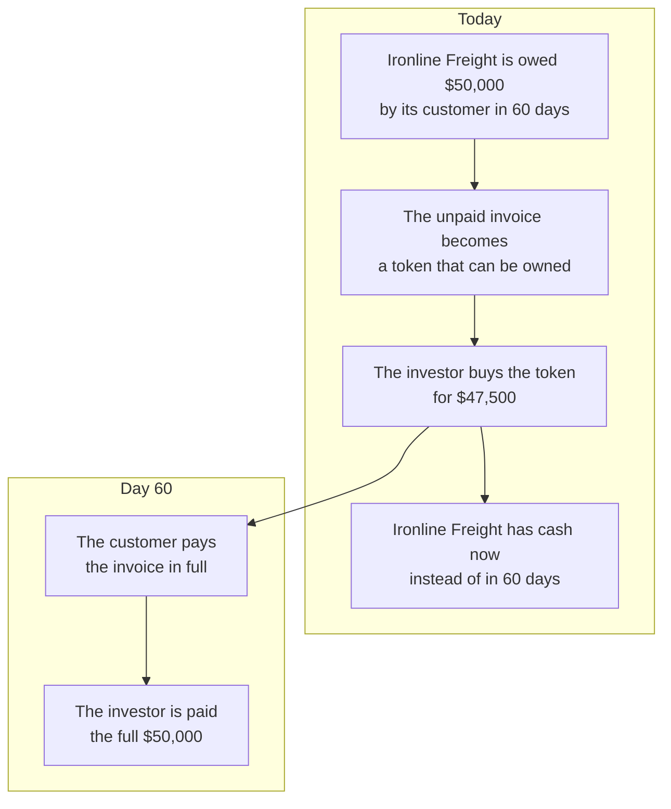
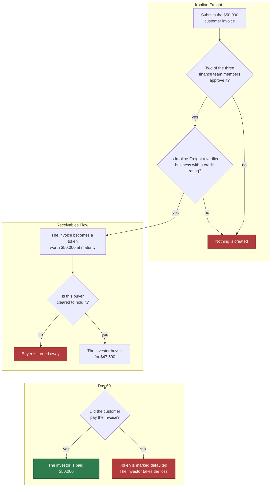
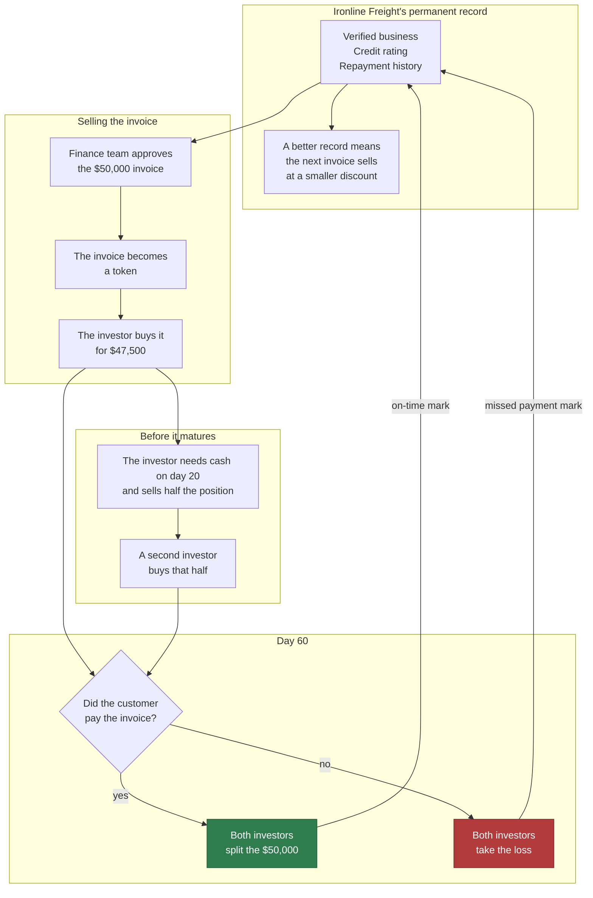
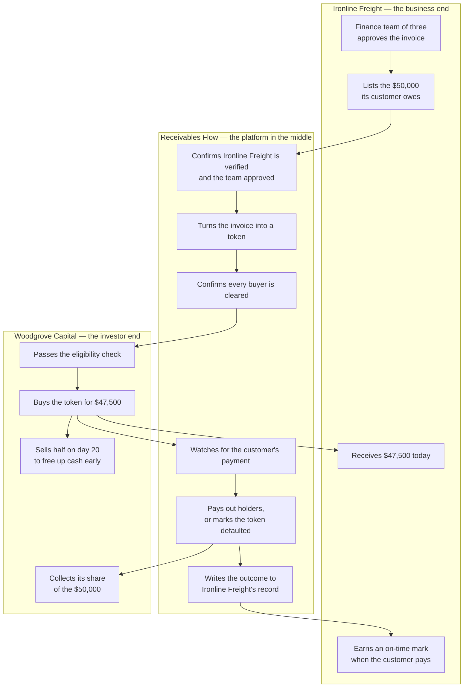
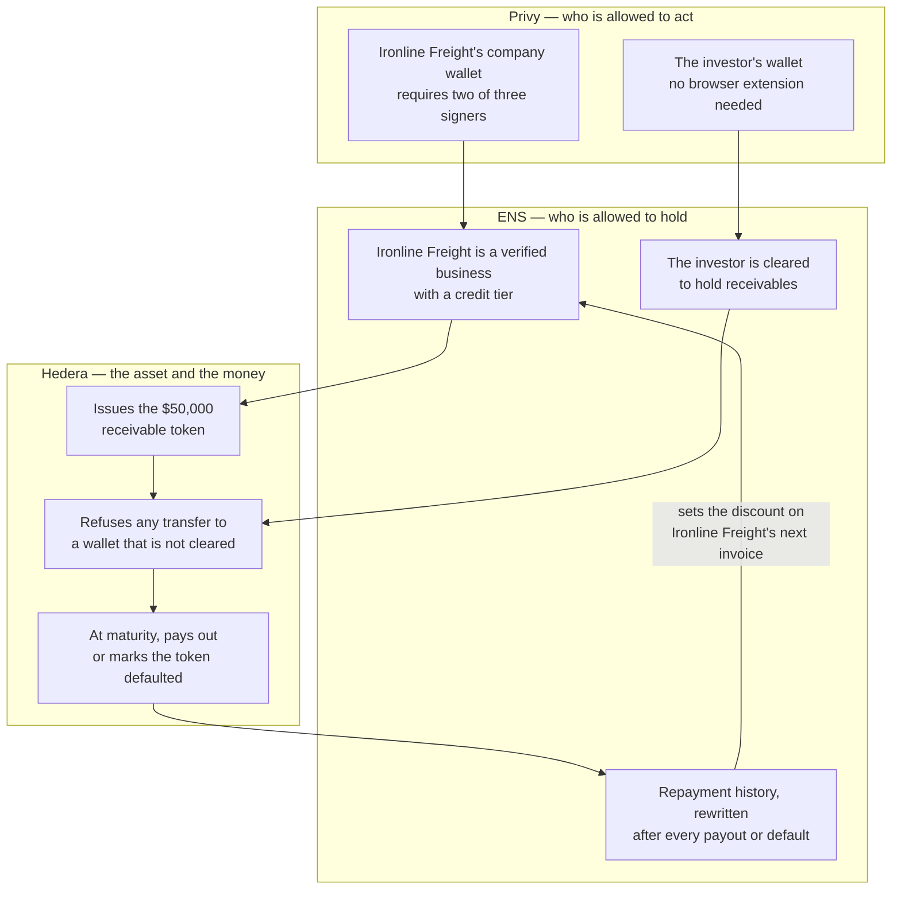

# Receivables Flow — Unpaid Invoices, Turned Into Something You Can Sell

## What

**One liner:** An unpaid invoice becomes a token someone can buy, hold, trade, and get paid out on.

**What it does:** A business that is owed money sells that claim today instead of waiting 60 days for it. The claim itself is minted as an asset with a full lifecycle — it is issued, it can only be held by people allowed to hold it, and at maturity it either pays out or defaults, depending on whether the real customer actually paid.

**Best for:** a supplier whose cash is trapped in invoices its customers have not paid yet.

### The cast

| | Who |
|---|---|
| **Business** | **Ironline Freight** — owed $50,000 by a customer, waiting 60 days to be paid |
| **Investor** | **Woodgrove Capital** — has capital to deploy and wants a short, secured return |
| **Platform** | **Receivables Flow** — decides what can be listed, who can buy it, and what happens when the invoice comes due |

Ironline Freight's customer is the one who owes the original invoice. They never touch the platform: the sale is made **with recourse**, so it is Ironline Freight that owes the $50,000 back at maturity, whether or not the customer has paid it.

Four people sign in across the two portals: three directors on the business side, who must agree two-of-three before the company account will sell anything, and one portfolio manager on the investor side, whose fund account refuses outside its mandate without asking anyone. [**Who signs in, and what each account refuses**](docs/accounts.md) sets out the cast, the two controls, and how to produce both refusals on screen.

## Why

Ironline Freight does the work, sends the invoice, and then waits 60 days to get paid. Payroll and suppliers do not wait. The financing meant to bridge that gap keeps failing businesses like theirs: the global trade finance gap is **$2.5 trillion**, and small businesses still get **41% of their financing requests rejected** ([ADB Global Trade Finance Gap Survey](https://www.adb.org/publications/adb-global-trade-finance-gap-survey)).

Invoice factoring exists to solve exactly this, but it has two structural problems:

| Problem | What it means in practice |
|---|---|
| **The money gets stuck** | Once the investor funds an invoice, that money is locked until the customer pays. No way out early, so the investor demands a bigger discount to compensate. |
| **Nobody can check the seller** | Whether Ironline Freight actually pays on time lives inside one factoring company's spreadsheet. The next investor cannot see it, so Ironline Freight is priced like a stranger forever. |

Both problems come from the same root: the claim on an unpaid invoice is not a thing you can hold, inspect, or sell. This project makes it one.

---

## How

Three versions, each one adding a layer to the one before it.

### V1 — Sell the invoice, get paid at maturity

The whole idea in one line. Ironline Freight is owed $50,000 in 60 days. Instead of waiting, they sell that claim for $47,500 today. When the customer pays the invoice, the investor collects the full $50,000. The $2,500 difference is the investor's return; the 60 days of cash is Ironline Freight's.



This version is deliberately naive. Anyone can list an invoice, anyone can buy it, and it assumes the customer always pays.

---

### V2 — Decide who is allowed to sell, who is allowed to buy, and what happens when nobody pays

V1 breaks the moment someone lists an invoice that does not exist, or the customer refuses to pay. V2 closes both holes.

Three checks get added. Before Ironline Freight can list the invoice, their own finance team has to approve it — two of three people, not one — so a single employee cannot invent a fake invoice and cash it. Ironline Freight also has to be a verified business with a credit rating attached to their name. And on the other side, only investors who have cleared the same kind of check can buy.

Then the honest ending gets added: sometimes the customer does not pay. The token is marked defaulted, and the investor takes the loss. That is what buying a receivable actually means.



---

### V3 — Let the investor get out early, and let Ironline Freight earn cheaper money

V2 is safe but still has the two problems from the top of this page: the investor's money is stuck for 60 days, and Ironline Freight's track record goes nowhere.

V3 fixes both. An investor needing cash on day 20 sells part of the position to a second investor instead of waiting — the claim is liquid, not frozen. And every ending, good or bad, is written back to Ironline Freight's permanent record. A business that pays on time three times running is visibly less risky than an unknown one, so the next buyer accepts a smaller discount. Reliable businesses get cheaper money over time, and they earn it from their own history rather than from a relationship with one lender.

That loop is the point of the whole project. Everything before it is setup.



---

## Proof — the user journey app

`tools/proof/` is a journey map of both sides: every step, touchpoint, thought, pain point
and opportunity for Ironline Freight and the investor. Modelled on Orbbit's own `tools/proof`, with
the same board and sidebar, and the same seed-to-SQLite-to-JSON authoring pipeline.

```bash
cd tools/proof && npm install && npm run dev    # http://localhost:6322
```

Journeys are written as TypeScript in `src/engine/seed/`, one file per actor. Running a seed
wipes that actor's rows, rewrites them, and exports `public/journey.json` — so the board is
always generated, never edited by hand.

| Side | The one journey |
|---|---|
| **Ironline Freight** | Issue And Settle A Receivable — Set Up → Issue → Settle |
| **Woodgrove Capital** | Fund And Exit A Receivable — Get Cleared → Fund → Exit |

19 steps, each badged with the one sponsor whose technology does the work — cut to only what
clears a stated prize bar. Step text names no technology at all; it says what the user does.
The mapping to each track's requirements, and the two open design questions, are in
[`tools/proof/README.md`](tools/proof/README.md). Every step is `proposed`; no code exists yet.

---

## The same flow, grouped two ways

The three versions above tell the story in time order. These two views cut it differently — once by who is doing the work, and once by which technology is doing it.

### Grouped by entity — how it works on both ends

Ironline Freight never sees the investor side. The investor never sees the finance team's approval. The platform is what makes each end simple for the other.



### Grouped by sponsor — which technology does which job

Three sponsors, one settlement chain, no overlap in responsibility.



| Sponsor | Its one job here | Where you see it in the story |
|---|---|---|
| **Privy** | Makes Ironline Freight a company, not a single key — and gives the investor a wallet without the setup friction | The two-of-three approval before anything is listed |
| **ENS** | Holds who is verified, who may hold a receivable, and how the business has paid in the past | Both eligibility gates, and the record that reprices the next invoice |
| **Hedera** | Issues the asset, enforces who can hold it, and runs the maturity outcome | The token itself, and the payout or default on day 60 |

---

## Worked Example

Ironline Freight is waiting 60 days on a $50,000 invoice from one of its customers.

Their finance team approves tokenizing it — two of three signers, so no single employee can do it alone. The invoice becomes a token carrying its $50,000 face value, its 60-day maturity, and Ironline Freight's verified identity. Only cleared investors can hold it.

An institutional investor buys it at a 5% discount for $47,500. Ironline Freight has working capital today instead of in two months.

On day 20 that investor wants liquidity back, so it sells half the position to a second investor rather than sitting locked until maturity.

On day 60 Ironline Freight repays the $50,000. The sale was made **with recourse**, so that obligation is Ironline Freight's whether or not its own customer has paid — which is also why the price was quoted against Ironline Freight's credit record rather than the customer's. The repayment is split between the two investors in proportion to what each holds, and Ironline Freight's record gets a fresh on-time mark — which is what makes their *next* invoice cheaper to sell.

Had Ironline Freight not repaid, the token would be marked defaulted, both investors would absorb the loss in the same proportions, and Ironline Freight's record would show the miss. The next buyer would demand a steeper discount.

### What the money is

The repayment settles in **mUSDC** — mock USDC this repository deploys on Hedera testnet, not Circle's own. Circle's testnet faucet gives $20 per address every two hours, so a $50,000 repayment can never be funded from it, and the only alternative was an invoice worth $20 — which makes the price, the credit score and the split beside it unbelievable. mUSDC carries Circle's six decimals, so no figure on any screen changed with the money, and anyone may deposit it, which is how Ironline Freight tops its account up to what it owes before paying:

```
npm run deploy:musdc -w @rf/contracts-hedera-ats
```

Circle's own USDC on Hedera testnet is token `0.0.429274` (`0x0000000000000000000000000000000000068CDA`), recorded in `.env.example` as the address to use on mainnet. Every transfer on day 60 is real and linked to HashScan from Ironline Freight's screen; what is a stand-in is the dollar, not the payment.

### What this does not enforce

Nothing on-chain compels Ironline Freight to repay. The receivable can divide a repayment across its holders the instant one arrives, and it can mark itself defaulted when none does — but it cannot reach into a bank account and take the money.

Real factoring closes that gap with a recourse clause and a personal guarantee, which is paperwork rather than code, and with a notice of assignment telling the customer to pay the funder direct. Naming the boundary reads better than a demo that pretends it is not there: what this system makes trustworthy is the *division* — who is owed what, and whether they got it — not the willingness to pay in the first place.

---

## Tech Stack

| Layer | Technology | What it does here |
|---|---|---|
| **The asset** | Hedera Asset Tokenization Studio | Issues the receivable token, restricts who can hold it, and runs the maturity action — pay out or default |
| **Settlement** | Hedera | The single chain everything settles on |
| **The business's organization** | Privy organization wallets | Gives Ironline Freight a real company wallet with an approval policy, so listing an invoice takes a finance-team quorum rather than one key |
| **The investor's wallet** | Privy | The investor funds and holds positions without managing an external wallet |
| **Identity and eligibility** | ENSv2 permissioned records | Holds Ironline Freight's verified status, credit tier, and repayment history, and gates which investors may hold a receivable — checked by the contracts, not displayed as a label |
| **Repayment signal** | Ironline Freight's own portal | Records the repayment at maturity — under recourse the obligation is the business's, so the business is the party that ends day 60 |

---

## On-chain — Hedera testnet

Every address this project put on the ledger, and the two ATS addresses it builds on. Nothing here is a screenshot of our own database — open any of them and read the state for yourself.

| | Hedera contract ID | What it is |
|---|---|---|
| **Receivable token** | [`0.0.10425572`](https://hashscan.io/testnet/contract/0.0.10425572) | Acme Invoice #1042 as a security — $50,000 face value, matures 2026-11-07, whitelist-only |
| **Settlement contract** | [`0.0.10425570`](https://hashscan.io/testnet/contract/0.0.10425570) | `ReceivableDvp` — the only Solidity we wrote. Moves the payment and the units in one transaction. Source verified, exact match |
| **Issuing account** | [`0.0.10422573`](https://hashscan.io/testnet/account/0.0.10422573) | Receivables Flow's operator — holds the compliance and issuer roles on the token |
| ATS Factory | [`0.0.9213391`](https://hashscan.io/testnet/contract/0.0.9213391) | Hedera's, not ours. Deploys the token |
| ATS BusinessLogicResolver | [`0.0.9212226`](https://hashscan.io/testnet/contract/0.0.9212226) | Hedera's, not ours. Points the token at its 108 shared facets |

**What to look at.** The token is issued in whitelist mode, which cannot be switched off after creation: an address that is not on its approved list can never receive it. The settlement contract is what makes a purchase safe in both directions — an investor who is not approved has their payment reverted along with the delivery, so they cannot pay for something the token will refuse to give them.

```bash
cd contracts/hedera-ats
npx hardhat run scripts/demo-settlement.ts   # the refusal and the sale, end to end
npx hardhat test                             # 11 tests, including the refusal
```

**Addresses come from** `contracts/hedera-ats/deployed.json`, written by the deploy scripts rather than typed by hand.
