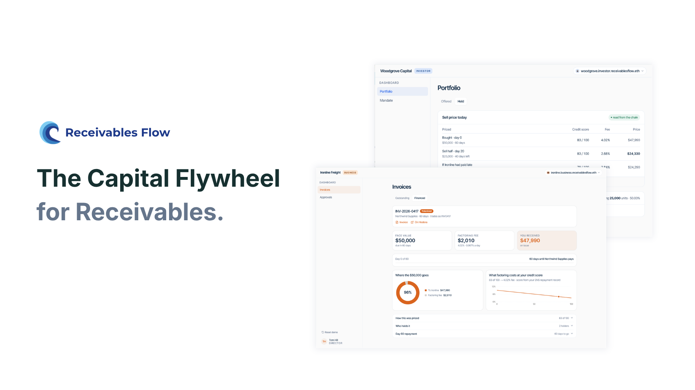
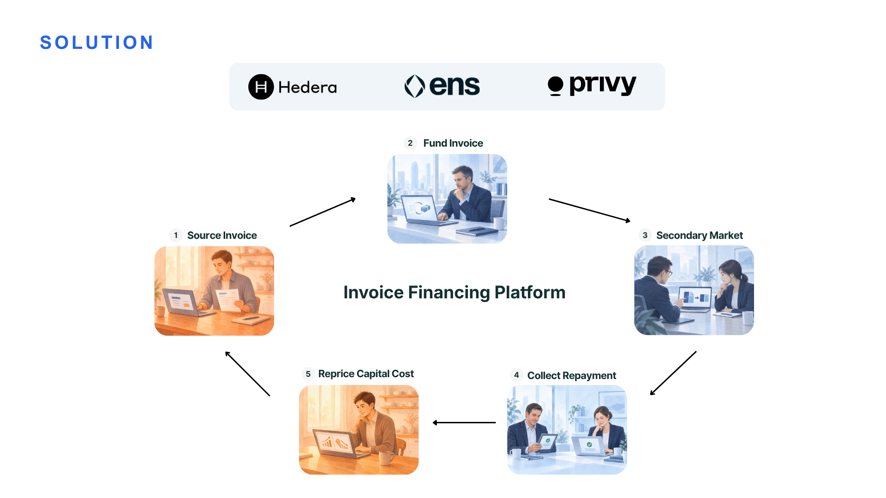
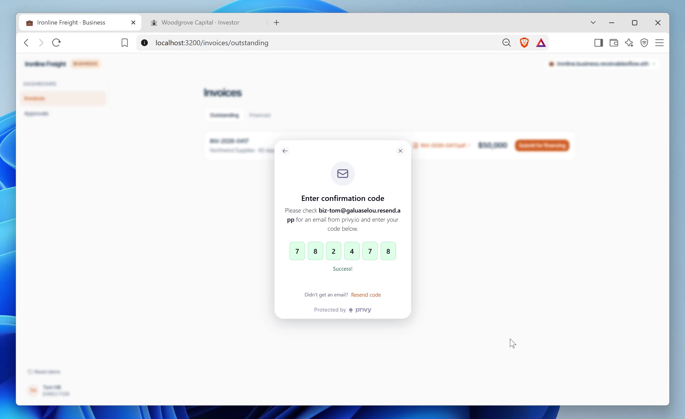
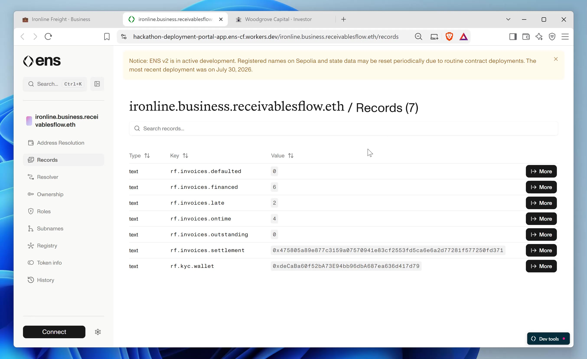
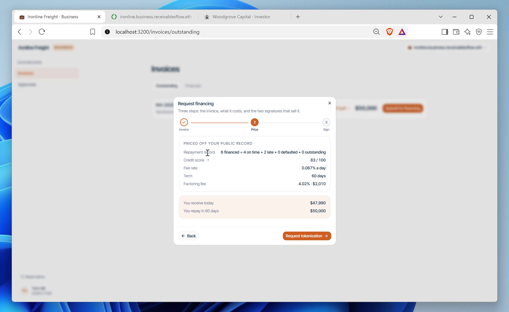
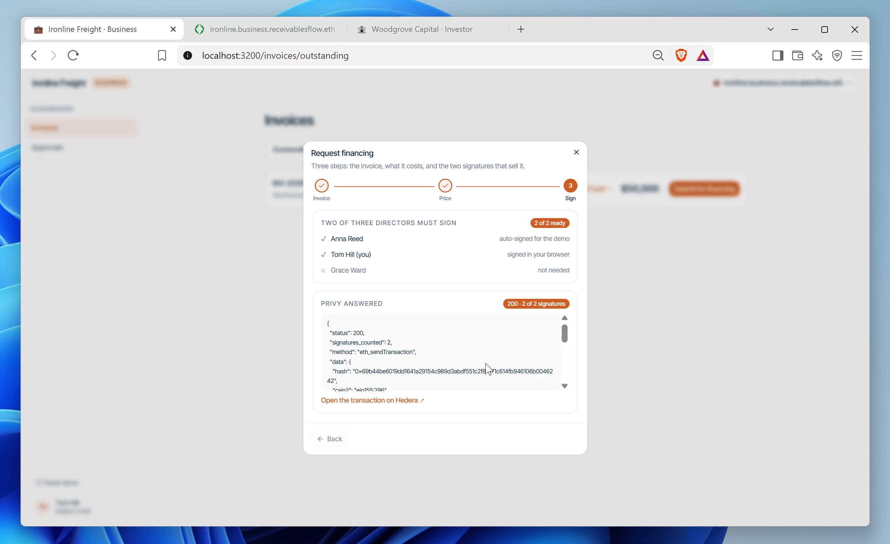
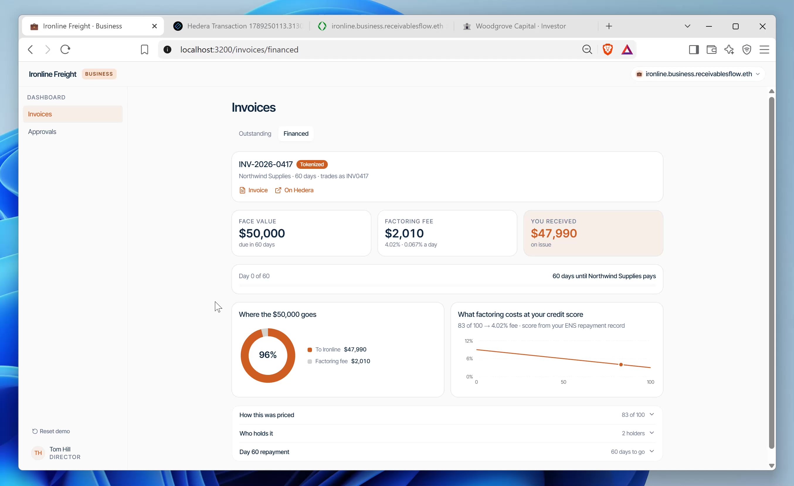
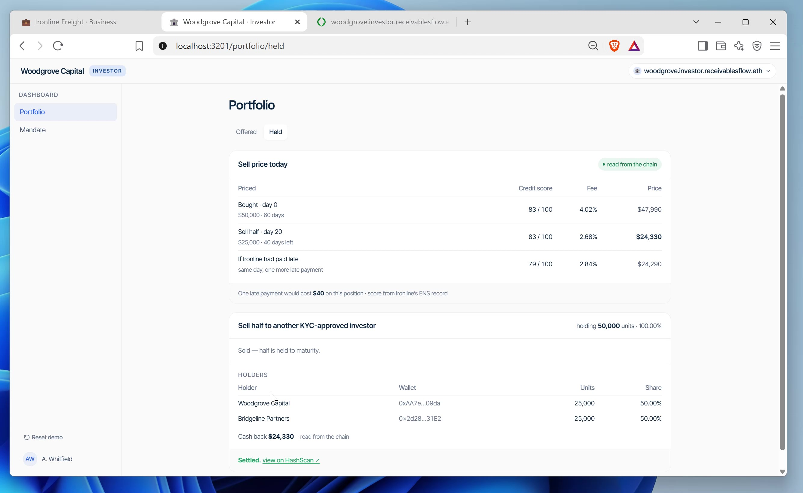
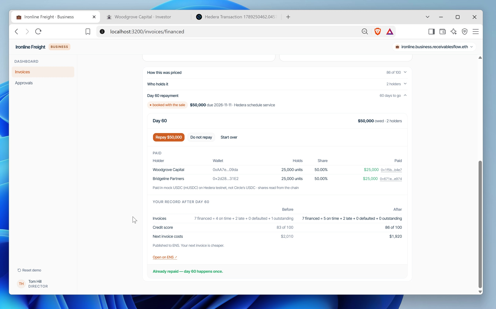
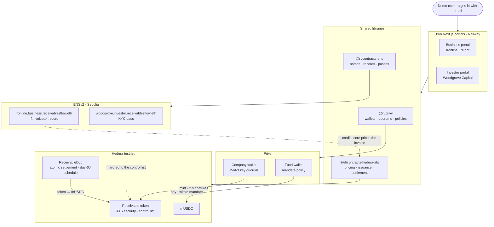

# Receivables Flow



Sell an unpaid invoice and get the cash today. A business tokenizes its invoice on Hedera (ATS), two of its three directors approve through Privy, a fund buys it under a mandate its own wallet enforces, and every repayment is written back to the business's ENS record — which is what prices the next invoice.

## Live demo

| Portal | URL |
|---|---|
| Business — Ironline Freight | https://business-production-0df2.up.railway.app |
| Investor — Woodgrove Capital | https://investor-production-d938.up.railway.app |

Sign in with your own email address; Privy sends a six-digit code. On the business portal, whoever signs in is seated as one of Ironline's three directors.

Press **Reset demo** (bottom of either sidebar) before a run — it forgets the invoice, rewrites the ENS record to its starting counts, and redeems the receivable so it can be minted again. About a minute.

## The cycle



### In six clicks

**1. Sign in with email.** Privy sends a code; no wallet, no seed phrase. On the business portal, whoever signs in is seated as one of Ironline's three directors.



**2. Read the record behind the name.** The ENS chip opens `ironline.business.receivablesflow.eth` on the ENS explorer: how many invoices were financed, paid on time, paid late.



**3. Submit for financing.** The invoice is priced off that record, then two of three directors sign: the app backend auto-signs one seat, yours is the second, and Privy counts them and mints the receivable on Hedera.




**4. Financed.** $50,000 face, $2,010 fee, $47,990 received — with the mint one click away on HashScan.



**5. Investor: fund it, then sell half.** The fund's wallet pays only what its Privy mandate allows; on day 20 it sells half to another KYC-approved investor for $24,330 through the settlement contract.



**6. Day 60: repay.** Each holder is paid its share in its own transaction, the on-time repayment is written to ENS, the score rises from 83 to 86, and the next invoice is cheaper.



## Sponsor tech

- **Privy** — company and fund wallets, a 2-of-3 key quorum with a nested seat granted to whoever signs in, policies on the fund's wallet, P-256 authorization signatures made in the browser.
- **Hedera / ATS** — the receivable is an Asset Tokenization Studio security with a control list; `ReceivableDvp` settles both legs of a sale in one transaction and books the day-60 repayment on the schedule service.
- **ENSv2** — `ironline.business.receivablesflow.eth` carries the repayment record (`rf.invoices.*`) that prices every invoice; `woodgrove.investor.receivablesflow.eth` carries the fund's eligibility pass.

## Architecture



## Run it locally

```
npm ci
cp .env.example .env.local        # fill in the keys
npm run provision -w @rf/privy    # opens the wallets, writes libs/privy/accounts.json + keys.json
npm run issue -w @rf/contracts-hedera-ats
npm run onboard -w @rf/contracts-ens
npm run demo:reset
npm run start -w @rf/business -- --port 3200
npm run start -w @rf/investor -- --port 3201
```

## Tests

- `cd apps/e2e && npx playwright test --trace on` — six specs, one per phase, driving real sign-ins and every on-chain hop by clicking the portal's own links. `npx playwright show-report --port 9401` serves the traces.
- `cd contracts/ens && npx hardhat test test/unit/*.test.ts --network hardhat`
- `npx mocha --import=tsx contracts/hedera-ats/test/pricing.spec.ts`

## Deploy

Railway, two services from one Dockerfile — see [`docs/deploy-railway.md`](docs/deploy-railway.md).

## Layout

```
apps/business      Ironline's portal (Next.js)
apps/investor      Woodgrove's portal (Next.js)
apps/e2e           Playwright, one spec per phase
libs/privy         wallets, quorums, signing, demo controls
libs/shared        the one demo invoice
contracts/ens      the registry, records, passes (Sepolia)
contracts/hedera-ats   pricing, issuance, settlement (Hedera testnet)
tools/proof        the journey board
docker/            the image both portals run from
```
