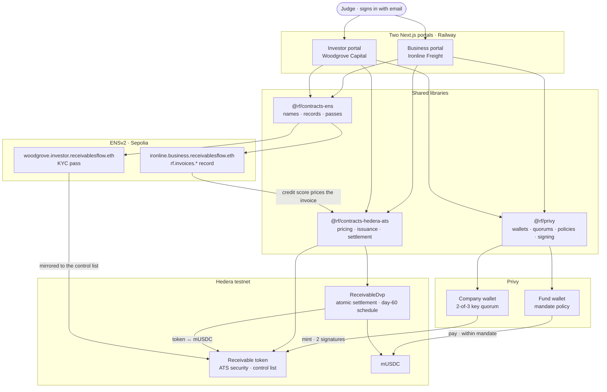

# Receivables Flow

Sell an unpaid invoice and get the cash today. A business tokenizes its invoice on Hedera (ATS), two of its three directors approve through Privy, a fund buys it under a mandate its own wallet enforces, and every repayment is written back to the business's ENS record — which is what prices the next invoice.

## Live demo

| Portal | URL |
|---|---|
| Business — Ironline Freight | https://business-production-0df2.up.railway.app |
| Investor — Woodgrove Capital | https://investor-production-d938.up.railway.app |

Sign in with your own email address; Privy sends a six-digit code. On the business portal, whoever signs in is seated as one of Ironline's three directors.

Press **Reset demo** (bottom of either sidebar) before a run — it forgets the invoice, rewrites the ENS record to its starting counts, and redeems the receivable so it can be minted again. About a minute.

## The cycle, in six clicks

1. **Business → Invoices → Submit for financing** — the invoice, its price off the ENS record, then *Approve & tokenize*: Anna's seat is auto-signed, yours is the second, Privy counts two and mints the receivable. Privy's answer is shown as it came.
2. **Financed → On Hedera** — the mint on HashScan.
3. **Investor → Offered → Fund $47,990** — the fund's wallet signs only what its mandate allows; the units move to the fund.
4. **Held → Sell half to Bridgeline** — settled on Hedera through the settlement contract; the receivable itself checks the buyer's KYC.
5. **Business → Financed → Day 60 → Repay $50,000** — each holder is paid its share in one transaction each.
6. **Open on ENS** — paid on time is written to `ironline.business.receivablesflow.eth`, and the next invoice is cheaper.

## Sponsor tech

- **Privy** — company and fund wallets, a 2-of-3 key quorum with a nested seat granted to whoever signs in, policies on the fund's wallet, P-256 authorization signatures made in the browser.
- **Hedera / ATS** — the receivable is an Asset Tokenization Studio security with a control list; `ReceivableDvp` settles both legs of a sale in one transaction and books the day-60 repayment on the schedule service.
- **ENSv2** — `ironline.business.receivablesflow.eth` carries the repayment record (`rf.invoices.*`) that prices every invoice; `woodgrove.investor.receivablesflow.eth` carries the fund's eligibility pass.

## Architecture



## Run it locally

```
npm ci
cp .env.example .env.local        # fill in the keys
npm run provision -w @rf/privy    # opens the wallets, writes libs/privy/accounts.json + keys.json
npm run issue -w @rf/contracts-hedera-ats
npm run onboard -w @rf/contracts-ens
npm run demo:reset
npm run start -w @rf/business -- --port 3200
npm run start -w @rf/investor -- --port 3201
```

## Tests

- `cd apps/e2e && npx playwright test --trace on` — six specs, one per phase, driving real sign-ins and every on-chain hop by clicking the portal's own links. `npx playwright show-report --port 9401` serves the traces.
- `cd contracts/ens && npx hardhat test test/unit/*.test.ts --network hardhat`
- `npx mocha --import=tsx contracts/hedera-ats/test/pricing.spec.ts`

## Deploy

Railway, two services from one Dockerfile — see [`docs/deploy-railway.md`](docs/deploy-railway.md).

## Layout

```
apps/business      Ironline's portal (Next.js)
apps/investor      Woodgrove's portal (Next.js)
apps/e2e           Playwright, one spec per phase
libs/privy         wallets, quorums, signing, demo controls
libs/shared        the one demo invoice
contracts/ens      the registry, records, passes (Sepolia)
contracts/hedera-ats   pricing, issuance, settlement (Hedera testnet)
tools/proof        the journey board
docker/            the image both portals run from
```
