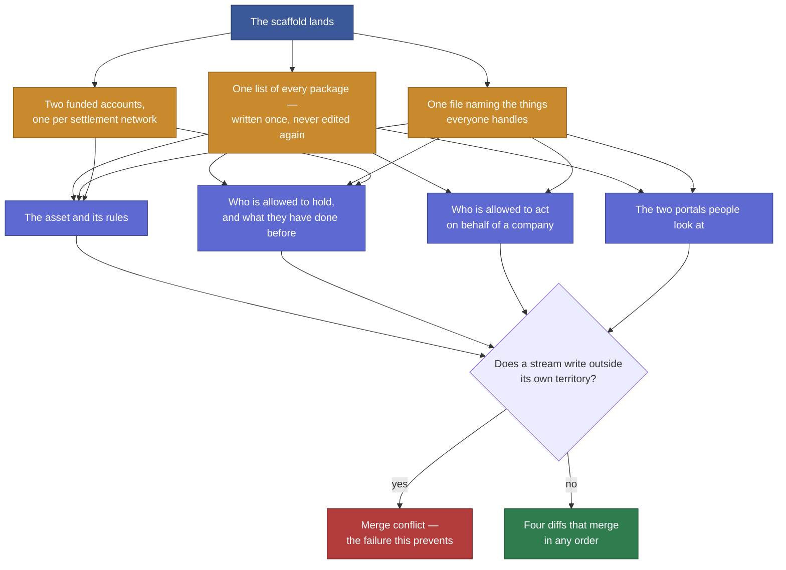

# Scaffold the lane folders and fund the testnet accounts

## Overview

**What:**
Four streams of work can start building the product at the same time without any of
them waiting on, or colliding with, the others.

**Why:**
The work has been split into four streams meant to run at once, but they have nowhere
agreed to put anything, no shared words for the things they all handle, and no funded
accounts to act on either settlement network. Started as they are, each stream invents
its own answers and the first attempt to combine them is a rewrite rather than a merge.
That costs more days than the whole schedule has.

**How:**
Settle everything the four streams must agree on before any of them starts — where each
one's work lives, what the shared things are called, and the accounts they act through —
and give each stream its own territory that nobody else writes into.

**Zone 1 check:**
Advances **Implementation**. Four parallel streams are cheap to verify only if each one's
output can be checked on its own, which requires their territories to be disjoint and
their shared vocabulary fixed in advance. Settling both here turns four unbounded
integration risks into four independently verifiable diffs.

---

## Core Logic



### Business rules

- The list of packages is written complete here and nothing later edits it. A file every
  stream must touch is a guaranteed conflict.
- The shared vocabulary file is written complete here. Nothing else forces four
  independent streams to describe the same things the same way.
- Each contracts package keeps its own record of deployed addresses. There is never one
  shared address file.
- The internal journey board stays outside the package list — it is not the product, and
  its native database dependency is the one thing dependency hoisting can break.
- No private key is ever tracked. Only example environment files are committed.
- Every package installs and typechecks on its own, so a failure is always attributable to
  one stream.
- Each stream writes only inside its own territory. The two portals are shared between two
  streams at directories that do not overlap.

---

## File Tree

```
receivables-flow/
├── package.json                      # the package list
├── apps/
│   ├── business/
│   │   ├── package.json
│   │   ├── tsconfig.json
│   │   ├── next.config.ts
│   │   ├── .env.example              # variable names only, no values
│   │   └── src/
│   │       ├── app/                  # skeleton routes
│   │       └── lib/{privy,ats,ens}/  # empty, so nothing later has to create them
│   └── investor/                     # same shape
├── libs/
│   └── shared/
│       ├── package.json
│       ├── tsconfig.json
│       └── src/types.ts              # invoice · receivable · eligibility pass · holding
├── contracts/
│   ├── hedera-ats/
│   │   ├── package.json
│   │   ├── hardhat.config.ts         # one settlement network only
│   │   ├── .env.example
│   │   ├── deployed.json             # its own addresses, empty to start
│   │   └── scripts/check-balance.ts  # proves the account is funded
│   └── ens/                          # same shape, the other network
└── specs/
```

---

## Action Items

**[x] The package list**

Implement: Create `package.json` at the repo root declaring the workspace globs for
`apps`, `libs` and `contracts`, deliberately excluding `tools/proof`.

Verify:
```
node -p "require('./package.json').workspaces.join(',')"
```
→ prints `apps/*,libs/*,contracts/*`, exits 0

---

**[x] The shared vocabulary**

Implement: Create `libs/shared` as package `@rf/shared` exporting `src/types.ts` with only
the types that cross a boundary between streams — invoice, receivable, eligibility pass,
holding.

Verify:
```
npm -w @rf/shared exec -- tsc --noEmit
```
→ exits 0

---

**[x] Both portals exist and can read the shared vocabulary**

Implement: Create `apps/business` and `apps/investor` as Next.js apps `@rf/business` and
`@rf/investor`, each with empty `src/lib/privy`, `src/lib/hedera-ats` and `src/lib/ens`
directories, an `.env.example` naming the variables that app needs, and configuration that
lets `@rf/shared` imports compile.

Verify:
```
npm -w @rf/business run build && npm -w @rf/investor run build
```
→ both exit 0

---

**[ ] The asset package, with a funded account**

Implement: Create `contracts/hedera-ats` as package `@rf/contracts-hedera-ats` with a Hardhat
configuration targeting Hedera testnet only, its own empty `deployed.json`, an
`.env.example`, and a `check:balance` script; fund the operator account.

Verify:
```
npm -w @rf/contracts-hedera-ats run check:balance
```
→ exits 0, prints a balance greater than 0

---

**[ ] The identity package, with a funded account**

Implement: Create `contracts/ens` as package `@rf/contracts-ens` with a Hardhat
configuration targeting Sepolia only, its own empty `deployed.json`, an `.env.example`, and
a `check:balance` script; fund the account.

Verify:
```
npm -w @rf/contracts-ens run check:balance
```
→ exits 0, prints a balance greater than 0

---

## Outstanding

The two funded-account items cannot be closed from here. Each needs credentials that
only a human can obtain:

- **Hedera testnet** — create an account at the Hedera portal, then put its ECDSA private
  key in `contracts/hedera-ats/.env` as `HEDERA_OPERATOR_KEY`.
- **Sepolia** — claim faucet ETH for an account, then put its key in `contracts/ens/.env`
  as `SEPOLIA_PRIVATE_KEY`.

Both packages are otherwise wired and their check scripts run: with no key configured they
exit non-zero saying `No account configured — set the private key in .env`, which is the
correct failure. Adding a funded key is the only step between that and a green check.

---

## Pruned — what was cut and why

Twelve raw Action Items became five. Every cut is logged.

| Cut | Reason |
|---|---|
| Separate items for each portal, plus a third for shared-vocabulary resolution | Merged into one. The build command proves all three at once and is stronger than the two typecheck commands it replaced. |
| A compile check on both contracts packages | Meaningless here — there are no contracts yet, so compiling an empty directory proves nothing. Compilation gets verified when actual contracts are written. |
| A standalone "keys cannot be committed" item | The ignore rules already landed and were verified against a real `.env`, an `.env.example` and the tracked files. What remained was the per-package example files, folded into each package's own item. |
| "The internal journey board still runs" | Covered by the package list verify. The globs are `apps/*`, `libs/*` and `contracts/*`, so the board is not reachable by any of them and the glob string is the proof. |
| A README section on running each package | This spec documents it, and the submission write-up is separate work. Writing it twice means maintaining it twice. |

Merging each funded account into its own package item also closed a real gap: split apart,
they could report a green package that had no money in it.
