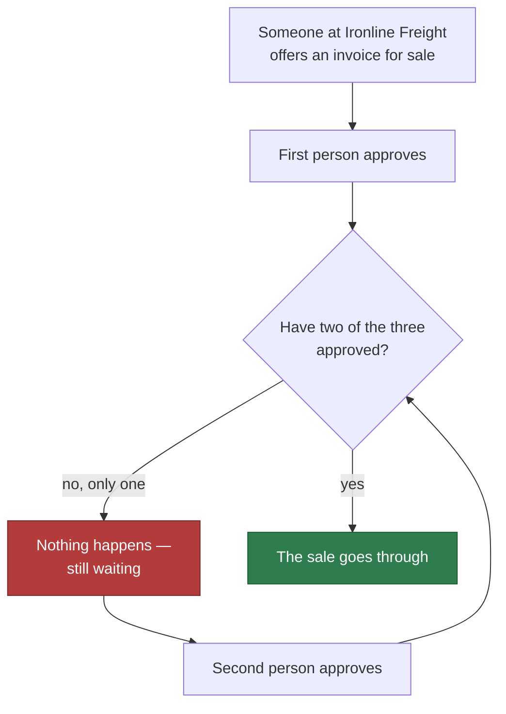
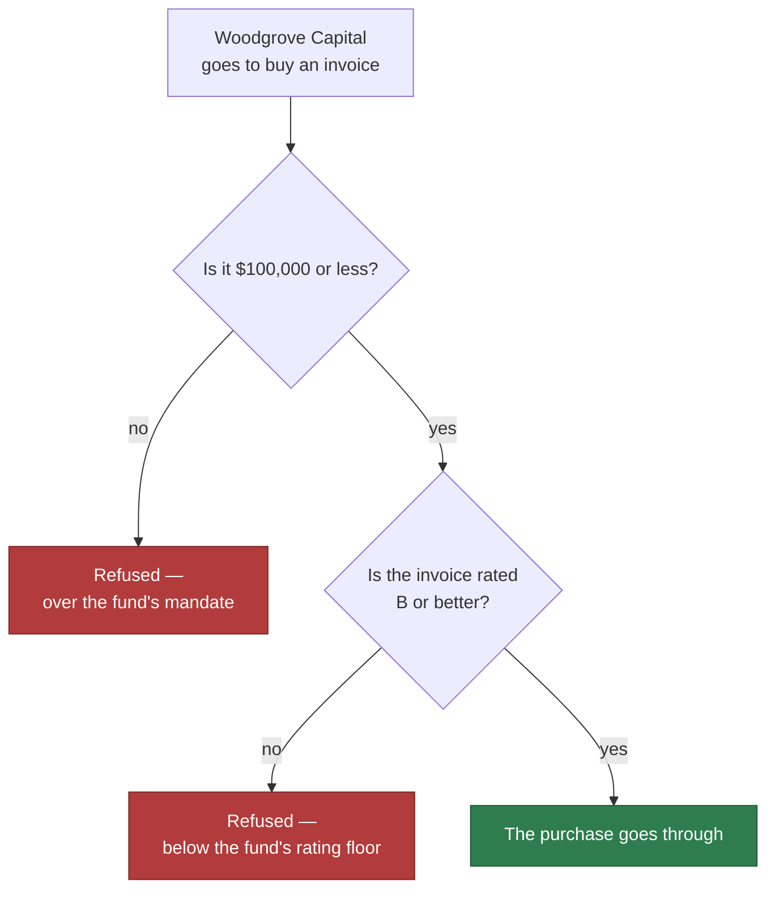

# Open the company account and the fund's account with their own approval limits

## Overview

**What:**
Ironline Freight gets a company account that three people share, where any two of them must approve
before it does anything. Woodgrove Capital gets an account it can invest from with nothing to install,
carrying its own rule: never more than $100,000 on one invoice, and never anything rated below B.

**Why:**
One person acting alone must not be able to sell an invoice, and a fund must not be able to buy
outside what its investors agreed to. Both are the same failure — a rule that lives in someone's
judgement instead of in the account — and both are what the platform is selling.

**How:**
Each account is opened with its rule already attached, so the refusal comes from the account provider
rather than from our code. Two refusals are then shown end to end: one approval alone does not sell
an invoice, and an allocation over the fund's mandate will not sign at all.

**Zone 1 check:**
Advances **Sourcing**. "Was this invoice legitimately offered for sale?" is currently a human trust
judgement with nothing to inspect. After this it is a binary check — either two of three approved and
the transaction exists, or it does not.

---

## Core Logic

**Ironline Freight — the business selling the invoice**



**Woodgrove Capital — the fund buying the invoice**



### Business rules

- The company account is shared by three people, and any two of them must approve before it does
  anything. One approval on its own never moves money.
- The two approvals do not have to arrive together. The first one waits until the second arrives, and
  the sale goes through the moment it does.
- The fund's account refuses any purchase above $100,000.
- The fund's account refuses any purchase of an invoice that is not on the platform's list of invoices
  rated B or better. A newly rated invoice becomes investable by being added to that list, without the
  fund's rule being rewritten.
- Anything the rules do not explicitly permit is refused.
- Both accounts hold far more than any amount attempted, so no refusal can be explained by an empty
  account.
- One HBAR stands for $10,000 throughout, so the accounts can be funded from a free testnet faucet.

---

## File Tree

```
libs/privy/
├── package.json                 # workspace package @rf/privy — the existing libs/* glob picks it up, so no root manifest edit
├── tsconfig.json                # standalone typecheck, mirroring libs/shared
├── .env.example                 # Privy app id, app secret, approving group id
├── accounts.json                # resolved wallet addresses, policy id, rated list id — the counterpart of contracts/*/deployed.json
├── src/
│   ├── policies.ts              # the rules as plain data — the approving group, the fund's cap and rating floor, the scale
│   ├── provision.ts             # sends those rules to the provider when opening the accounts, writes accounts.json
│   └── accounts.ts              # what the other lanes call: offer an invoice, approve one, buy one, read balances
└── test/
    ├── policies.test.ts         # unit — the rules we build say what we mean, no credentials needed
    └── refusals.test.ts         # integration — the provider actually enforces them
```

---

## Action Items

**[x] Stand up the Privy package so it installs and typechecks on its own**

Implement: Create `libs/privy/package.json`, `libs/privy/tsconfig.json` and `libs/privy/.env.example`
declaring `@rf/privy` with the Privy server SDK and a test runner as its only dependencies, mirroring
`libs/shared`, and naming every credential the package needs without carrying a value for any of them.

Verify:
```
cd libs/privy && npm install && npx tsc --noEmit && echo OK
```
→ exits 0 and prints `OK`

---

**[x] Write both rules down as data**

Implement: Create `libs/privy/src/policies.ts` exporting the approving group's shape, the fund's cap
and rating-floor requirement, and the single rate that converts the story's dollar figures into chain
amounts — so every rule in the system can be read, and tested, in one file without credentials.

Verify:
```
cd libs/privy && npx tsx -e "import {APPROVERS_REQUIRED, FUND_CAP_USD, USD_PER_HBAR} from './src/policies'; console.log(APPROVERS_REQUIRED, FUND_CAP_USD, USD_PER_HBAR)"
```
→ prints `2 100000 10000`

---

**[ ] Create the approving group of three**

Implement: In the Privy dashboard, enrol three people with multi-factor authentication and create an
approving group over them that requires two of the three, then record its identifier in
`libs/privy/.env`. Manual because the provider only enrols human members through the dashboard.

Verify:
```
cd libs/privy && npx tsx -e "import {readQuorum} from './src/provision'; readQuorum().then(q => console.log(q.members.length, q.threshold))"
```
→ prints `3 2`

---

**[ ] Open both accounts with their rules attached**

Implement: Create `libs/privy/src/provision.ts` which sends the rules from `policies.ts` to the
provider: opening Ironline Freight's account owned by the approving group, opening Woodgrove Capital's
account under the fund's mandate rule, creating the platform's list of invoices rated B or better, and
writing every resulting identifier to `libs/privy/accounts.json`. Running it a second time changes
nothing.

Verify:
```
cd libs/privy && npx tsx src/provision.ts && npx tsx src/provision.ts && node -e "const a=require('./accounts.json'); console.log(!!a.company.address, !!a.fund.address, !!a.ratedBOrBetterListId)"
```
→ prints `true true true` on both runs, and the second run reports nothing created

---

**[ ] Fund both accounts above every amount attempted**

Implement: Send testnet HBAR from the operator account created in TECH-560 to both addresses in
`libs/privy/accounts.json`, enough that every refused attempt sits far below the balance, and record
the top-up instructions as a comment in `libs/privy/.env.example`.

Verify:
```
cd libs/privy && npx tsx -e "import {balances} from './src/accounts'; balances().then(b => console.log(b.company >= 100n, b.fund >= 100n))"
```
→ prints `true true`

---

**[ ] Give the other lanes the four ways in**

Implement: Create `libs/privy/src/accounts.ts` exposing what the rest of the platform needs, so
TECH-568 can require two approvals without knowing how the accounts were opened.
  - `offerInvoice` — propose a sale from the company account, returning something the second approver can act on
  - `approveOffer` — add one approval to a proposed sale
  - `buyInvoice` — purchase an invoice from the fund account
  - `balances` — what each account currently holds

Verify:
```
cd libs/privy && npx tsc --noEmit && npx tsx -e "import * as a from './src/accounts'; console.log(typeof a.offerInvoice, typeof a.approveOffer, typeof a.buyInvoice, typeof a.balances)"
```
→ prints `function function function function`

---

**[~] Cover the rules we author and the refusals the provider makes** — unit half done, provider half deferred

Implement: Create `libs/privy/test/policies.test.ts` asserting that the rules built in `policies.ts`
say what they are meant to say — the approving group requires two of three, the fund's rule caps a
purchase at $100,000 and demands membership of the rated list, anything not explicitly allowed is
refused, and dollars convert to chain amounts at the stated rate. Create
`libs/privy/test/refusals.test.ts` asserting that the provider then enforces them: a sale with one
approval does not go through and does once a second approval is added, a $150,000 purchase is refused
as over mandate, a purchase of an invoice absent from the rated list is refused, and a $50,000
purchase of a listed invoice succeeds — each refusal asserted to be a rule refusal rather than an
empty account.

Verify:
```
cd libs/privy && npx vitest run
```
→ exits 0, `10 passed`

---

## Amended during build — browser-first

Halfway through Phase 2 the shape of this issue changed, and the change is large enough that the
Action Items above no longer describe what shipped. Recording it rather than rewriting history.

**What changed.** The spec had both accounts opened and driven from a server, with the two refusals
proved by a test. That is provable but not demonstrable — and this issue's own acceptance criteria
ask for two refusals *on camera*. It also quietly dropped the fund's story beat, which is that
Woodgrove signs up "with nothing to install" — inherently a browser flow, not a server call.

**What shipped instead.** Both portals now sign in with Privy. Each of Ironline Freight's directors
signs in as themselves; Woodgrove signs in and an account is created in the page, no extension and no
seed phrase. Every actor in the demo is a person in a browser. The rules from `policies.ts` and their
unit tests are unchanged and shipped as specified.

**What did not ship, and why.** Opening the accounts, the approving group, funding, the four entry
points and the provider-side refusal tests are all still to do. They were specified against the
server-first shape and need rewriting against this one — chiefly because approvals now come from
logged-in people rather than from keys a server holds, so the second approval is a person tapping a
button rather than a test signing twice. That belongs in its own issue against a spec that describes
it, not bolted onto this one.

**Also deferred:** the business portal's hardcoded data still names an office manager with a $10,000
limit. That tier was dropped during the grill in favour of a plain two-of-three, so the text needs to
follow. It is app-lane data, not this package.

---

## Sponsor Track — Privy

How this issue satisfies the track's qualification requirements.

| Requirement | How this issue meets it |
|---|---|
| Integrate Privy as a core part of the product | The approval gate is the product. Without it one employee can sell an invoice that does not exist, which is the failure the whole platform exists to prevent. |
| Create or use at least one Privy wallet | Two — Ironline Freight's company account and Woodgrove Capital's fund account. |
| Demonstrate a business or organization use case | A company account owned by the company rather than by whoever set it up, and a fund account that cannot breach its own mandate. |
| Implement at least one functional B2B workflow | An approval flow: an invoice is offered for sale, and two of three people must approve before it settles. |
| Use at least one Privy control | Three — **key quorums** (the two-of-three owner of the company account), **intents** (the first approval waits for the second instead of failing), and **policies** with a **condition set** (the fund's cap and rating floor). |
| Provide a working demo and source code | The two refusals are the demo, and both are covered by tests in this repo. |
| Clearly explain how Privy enables the product | Every refusal comes from Privy, never from our code — which is what makes the rule hold outside our app. |

The two controls sit on different accounts on purpose: a quorum on the company side, a policy on the
fund side. That shows both halves of Privy's control surface rather than the same one twice.

---

## Notes

Three decisions taken during the grill that depart from the Linear description and from
`tools/proof/public/journey.json`:

- **No office manager and no $10,000 tier.** The Linear issue and journey step
  `business-step-quorum-policy` describe an office manager who may sell up to $10,000 alone with two
  directors required above that. A plain two-of-three approving group demonstrates the same provider
  control with one rule instead of three, so the tier is dropped. `journey.json` needs the same edit,
  in the app lane rather than here.
- **The company rule is a threshold, not an amount.** Because two-of-three does not inspect what the
  transaction contains, this lane needs nothing from the parallel ATS lane. TECH-568 swaps the ATS
  mint call in behind the same approving group without touching it.
- **The fund's rating floor is a list, not a number.** The account provider cannot see a credit
  rating, so "B or better" is membership of a platform-maintained list. This also avoids depending on
  a contract address the ATS lane has not produced yet.
- **`libs/privy`, not `service-privy/`.** The Linear issue names `service-privy/`, written against
  TECH-560's planned scaffold. What actually merged is an npm workspace with `apps/`, `libs/` and
  `contracts/`. The existing `libs/*` glob picks the package up, so no root manifest edit and no
  conflict with the parallel Wave 1 branches.
