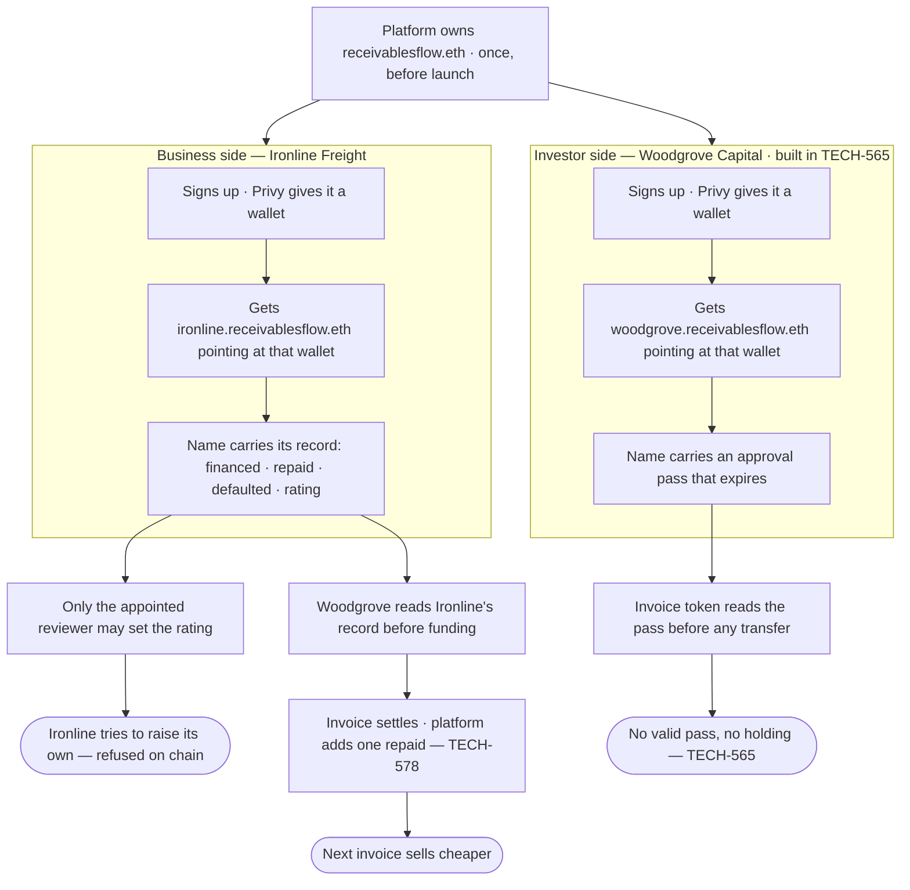

# Stand up the ENS registry, the business profile, and the reviewer role

## Overview

**What:**
A business that sells invoices here earns a credit history that makes each invoice cheaper
to sell than the last — and carries it with them, readable by any funder, on or off this
platform. It takes the form of a public page at the company's own web address,
`ironline.receivablesflow.eth`, showing how many invoices it has financed, how many it
repaid on time, how many it defaulted on, and a credit rating set by an independent
reviewer. Anyone can read it without asking the platform.

**Why:**
An investor is asked to pay $45,000 today for an invoice that pays $50,000 in 60 days.
Whether that is a good trade depends on whether the seller's customers actually pay — and
the investor has never heard of the seller. If the platform simply vouches for them, the
investor is trusting the company that earns a fee on the deal, so every seller is priced
like a stranger forever. A record readable without the platform in the middle is what lets
a good payer stop paying the stranger's rate.

**How:**
The platform owns one public name and gives every company that signs up a page beneath it,
keeping the pen so no company can improve its own record. Repayment counts are published as
raw numbers anyone can recompute a score from. The one judgement no chain can make — are
these invoices real, are the seller's customers good for it — is handed to a named outside
reviewer who can set that single field and nothing else.

**Zone 1 check:**
Advances **Underwriting**. Today a funding decision means asking the platform and believing
the answer — unbounded verification. This is the registry both later checks read from: the
approval pass in TECH-565 and the repricing in TECH-578. Underwriting moves from "ask and
believe" to "read and verify".

---

## Core Logic



### Business rules

- The platform owns its public name and every name issued beneath it; ownership never passes
  to the company.
- The registry is the platform's own, so the next page costs a call, not a purchase — and
  giving one out is identical whether the holder is a business or an investor.
- A business holds no write role on its own profile — it cannot touch any field.
- The platform writes the counts, and only the platform can — that is what owning the name
  buys.
- The reviewer can write the rating and nothing else; anything else is refused on chain, not
  filtered in application code.
- The platform holds no write role on the rating while an appointment stands. It can revoke
  and re-appoint — that is what "appointed" means — but every grant and revocation is a
  public event, so a platform that hands itself the rating is visibly doing so.
- Counts are published raw, never as a derived score, so any score is recomputable by anyone.
- Every value is written at runtime and read back from chain; nothing is hard-coded.
- Running onboarding twice leaves the same registry and the same profile.

---

## File Tree

```
contracts/ens/
├── src/ens.ts               # hackathon addresses; open the registry, give a page, write its record, appoint a reviewer
├── scripts/onboard.ts       # runnable entry point — stands up the registry and Ironline's profile
└── deployed.json            # generated — the registry, the names issued, the reviewer
```

---

## Action Items

**[ ] Open the registry and expose the four things it can do**

Implement: Create `contracts/ens/src/ens.ts` holding the hackathon ENSv2 addresses and the
registry operations this project needs.

- `openRegistry` — buy the platform's own public name and open the registry beneath it, so
  it can hand out pages. Runs once, at platform setup
- `givePage` — give a company its page when it signs up, platform retained as owner
- `writeRecords` — write a company's record onto its page
- `appointReviewer` — give one address write access to one field and nothing else,
  deriving the permission target from the deployed resolver rather than recomputing it

Verify:
```
npm -w @rf/contracts-ens run typecheck
```
→ exits 0

---

**[ ] Stand up Ironline's profile and prove the refusals**

Implement: Create `contracts/ens/scripts/onboard.ts` that opens the registry, issues
Ironline Freight its name, writes the financed, repaid and defaulted counts, appoints the
reviewer on the rating, then attempts each write and reports the outcome — finally recording
the registry, names and reviewer in `contracts/ens/deployed.json`.

Verify:
```
npm -w @rf/contracts-ens run onboard -- --network sepolia
```
→ exits 0 and prints the three counts read back from chain, then three outcomes: reviewer
writes the rating `ok`, reviewer writes another field `refused`, business writes any field
`refused`

---

**[ ] Make a second run a no-op**

Implement: In `contracts/ens/scripts/onboard.ts`, skip any step whose result already exists
on chain, so the script is safe to re-run.

Verify:
```
npm -w @rf/contracts-ens run onboard -- --network sepolia && cp contracts/ens/deployed.json /tmp/a && npm -w @rf/contracts-ens run onboard -- --network sepolia && diff /tmp/a contracts/ens/deployed.json
```
→ exits 0; `diff` reports no differences
