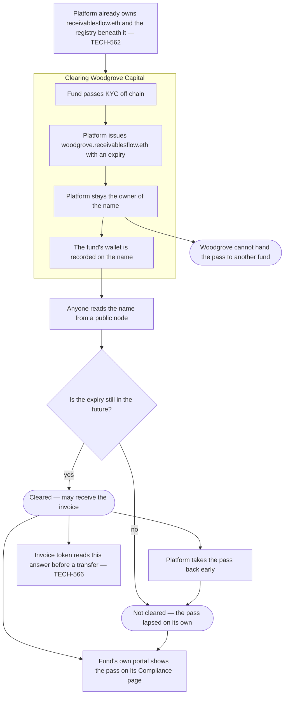

# Issue the investor an approval pass with an expiry

## Overview

**What:**
Woodgrove Capital is given a public name of its own — `woodgrove.receivablesflow.eth` — that
says one thing: this fund is cleared to own invoices, until this date. Anyone can look the
name up and get the answer without asking Receivables Flow.

**Why:**
A tokenised invoice is a security, so only cleared investors are legally allowed to hold one,
and Receivables Flow is liable if one lands with a fund that is not. Today that permission
lives nowhere a buyer can check: the invoice can only change hands on this platform, with us
approving each side by hand. It also has to lapse — a fund's clearance is renewed on a date in
the real world, and a permission that never expires is quietly wrong from the day the fund
stops qualifying.

**How:**
The platform hands each cleared investor a name beneath its own, issued with an expiry and
kept in the platform's name so the investor cannot pass its clearance to someone else. Whoever
is on the other side of a trade reads that name and decides for themselves whether the fund
may receive the invoice.

**Zone 1 check:**
Advances **Deployment**. Moving an invoice to a buyer today means Receivables Flow vetting
that buyer by hand for every trade — unbounded verification, and only inside this platform.
Once clearance is a name with a date on it, the check is a public read anyone can run, and
the same read is what the invoice token itself consumes in TECH-566.

---

## Core Logic



### Business rules

- The name is the pass. There is no separate cleared/not-cleared flag that could disagree with
  the name's own expiry.
- The expiry is set when the pass is issued, and a pass whose expiry has passed reads as not
  cleared without anyone acting.
- The platform owns the investor's name and never transfers it, so a cleared fund cannot pass
  its clearance to a fund that was never cleared.
- The wallet the pass clears is written at issue time and read back from chain; no address is
  hard-coded.
- The platform can take a standing pass back before its expiry, and doing so is a public event.
- A reader holding only the name and a public node can reach the answer — no call to
  Receivables Flow is part of the path.
- The fund's portal shows the pass it actually holds on chain, never a written-down copy of
  it, so the screen cannot disagree with the registry.
- Running onboarding twice leaves the same name, the same wallet and the same expiry.

---

## File Tree

```
contracts/ens/
├── package.json                        # publish the package's source so the portal can import it
├── src/ens.ts                          # add: issue the pass, read it back, take it back early
├── scripts/onboard.ts                  # add: Woodgrove's pass, read back, and the lapse
├── test/unit/encoding.test.ts          # add: the cleared / lapsed decision, no chain
├── test/integration/registry.test.ts   # add: pass issued, read by a stranger, lapses on time
└── deployed.json                       # generated — now also the investor name and its expiry

apps/investor/
├── package.json                        # add the ENS package and the browser test runner
├── next.config.ts                      # compile the ENS package the same way the shared one is
├── tsconfig.json                       # raise the target so the chain package's bigints compile
├── playwright.config.ts                # boot the portal and drive it in a real browser
├── src/lib/ens/pass.ts                 # read Woodgrove's pass from Sepolia at request time
├── src/data/investor.data.ts           # the pass block stops being written down
├── src/app/page.tsx                    # hand the page the pass it read
└── e2e/pass.spec.ts                    # the fund opens Compliance and sees the pass it holds
```

---

## Action Items

**[x] Issue, read and take back an investor's pass**

Implement: In `contracts/ens/src/ens.ts`, add the investor-side registry operations, reusing
the platform registry TECH-562 opened.

- `issuePass` — give the investor a name beneath the platform's registry with an expiry,
  platform retained as owner, recording the wallet the pass clears; a second call for the same
  investor returns the standing pass rather than issuing a new one
- `readPass` — answer cleared or not for a name at a given moment, from a public node alone,
  returning the wallet and the expiry the answer was decided on
- `revokePass` — take a standing pass back before its expiry, so it reads as not cleared

Verify:
```
npm -w @rf/contracts-ens run typecheck && npm -w @rf/contracts-ens run test
```
→ exits 0

---

**[x] Clear Woodgrove during onboarding and show the pass lapse**

Implement: In `contracts/ens/scripts/onboard.ts`, issue Woodgrove Capital its pass after
Ironline's page, read the wallet and expiry back from chain, then report the pass at today's
date and again at a date past its expiry — recording the investor name, wallet and expiry in
`contracts/ens/deployed.json`.

Verify:
```
npm -w @rf/contracts-ens run onboard:fork
```
→ exits 0 and prints Woodgrove's wallet and expiry read back from chain, then two outcomes:
today `cleared`, past the expiry `lapsed`

---

**[x] Show the fund the pass it actually holds**

Implement: Create `apps/investor/src/lib/ens/pass.ts`, reading Woodgrove's pass from Sepolia
through the registry recorded in `contracts/ens/deployed.json`, and render the Compliance
page's eligibility block from that answer instead of the written-down one — holder, status and
expiry all as the chain reports them, and the status reading lapsed when the chain says so.

Verify:
```
npm -w @rf/investor run typecheck && npm -w @rf/investor run build
```
→ exits 0

---

**[x] Prove it in a browser**

Implement: Create `apps/investor/e2e/pass.spec.ts` driving the running portal to the
Compliance page and asserting the eligibility block carries the name, wallet and expiry that
are on chain, plus `apps/investor/playwright.config.ts` booting the portal for the run.

Verify:
```
npm -w @rf/investor run test:e2e
```
→ exits 0, all specs pass
