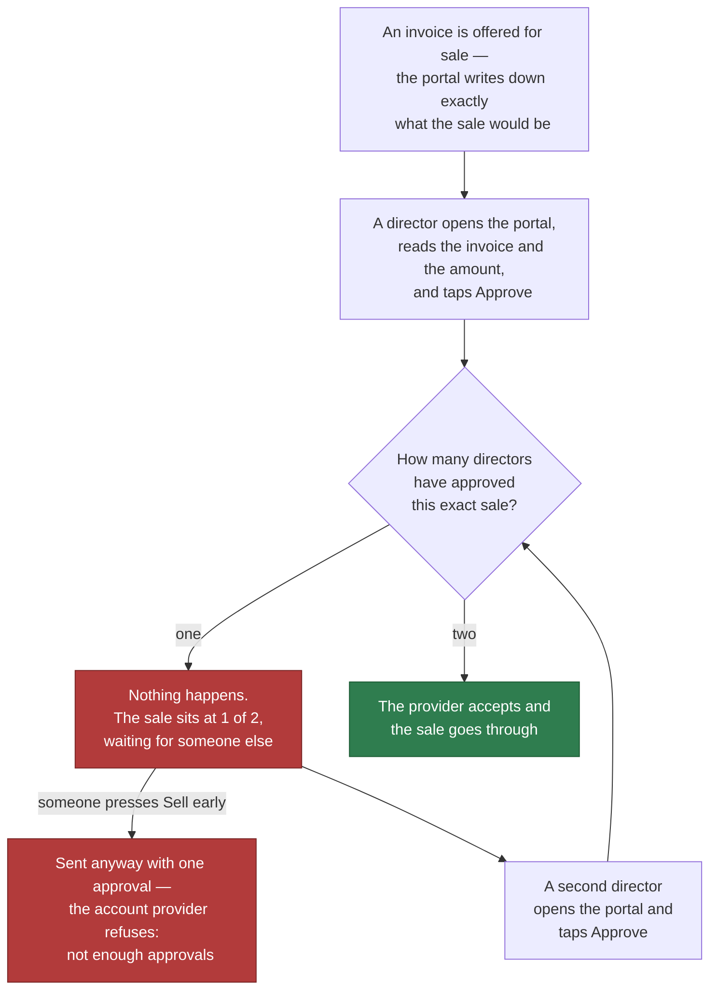
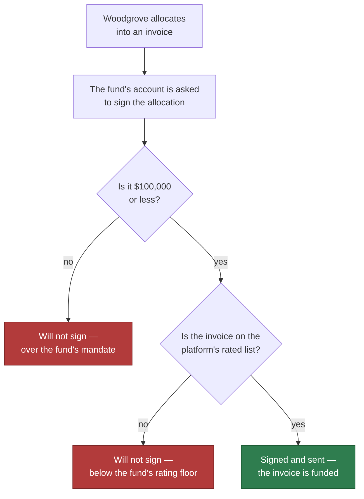

# Open both accounts and make the two refusals happen in the browser

## Overview

**What:**
Ironline Freight's company account and Woodgrove Capital's fund account are actually open, each
carrying its own rule, and both refusals happen on screen. One director approving a sale is not
enough and the sale sits there waiting; the moment a second director approves, it goes through. An
allocation over the fund's mandate will not sign at all.

**Why:**
Both rules currently exist only as words. The company's two-of-three is a paragraph in a policy panel
and the fund's mandate is a row in a table — nobody has ever watched either one refuse anything. A
control nobody has seen refuse is indistinguishable from no control, and the whole platform is sold
on the claim that the refusal is real. Minting a receivable behind two approvals cannot begin until
the company account it mints from exists.

**How:**
Each account is opened with its rule already attached, so the refusal comes from the account provider
and not from anything we wrote. Directors approve from the portal as themselves, and the portal
counts real approvals rather than describing imagined ones. Both refusals are then produced live,
each showing the provider's own reason for refusing.

**Zone 1 check:**
Advances **Sourcing**. "Was this invoice legitimately offered for sale?" is today a matter of trusting
whoever pressed the button. After this it is binary and inspectable: either two named directors
authorised the exact same sale and a transaction exists, or the provider refused and there is nothing.

---

## Core Logic

**Ironline Freight — selling an invoice takes two of three**



**Woodgrove Capital — the fund cannot breach its own mandate**



### Business rules

- There is one company account, not three. It is owned by Anna Reed, Tom Hill and Grace Ward
  together, and two of the three must approve before it does anything. One approval on its own never
  moves anything.
- The directors hold no account of their own. Each holds a key that approves what the one company
  account does — which is why two of them approving is a rule about the company, not a tally we keep.
- Both directors approve **the same sale**, described the same way down to the byte. Two approvals of
  two different sales are not two approvals of one sale, and the provider treats them as such.
- The two approvals do not have to arrive together. The first waits, and the sale goes through the
  moment the second arrives.
- Sending the sale with only one approval is refused by the provider, not by the portal. The portal
  offers that button on purpose so the refusal can be produced on demand.
- The fund's account refuses any allocation above $100,000.
- The fund's account refuses any allocation into an invoice that is not on the platform's list of
  invoices rated B or better. Rating a new invoice means adding it to that list, never rewriting the
  fund's rule.
- Anything the rules do not explicitly permit is refused.
- Both accounts hold far more than any amount attempted, so no refusal can be explained away as an
  empty account.
- Every refusal shown on screen carries the provider's own reason for it, not a sentence we wrote.
- Opening the accounts a second time changes nothing and creates nothing.
- The portals still run with no credentials configured, showing the walkthrough as they do today.

---

## File Tree

```
libs/privy/
├── src/
│   ├── policies.ts              # modified — also builds the exact sale and allocation requests both sides sign
│   ├── provision.ts             # new — opens both accounts with their rules attached, writes accounts.json
│   └── accounts.ts              # new — what the portals call: propose, approve, send, allocate, balances
├── accounts.json                # new — the resolved account addresses, quorum id, policy id, rated list id
└── test/
    ├── policies.test.ts         # modified — the sale request is identical for every director
    └── refusals.test.ts         # new — the provider actually refuses one approval and an over-mandate allocation

apps/business/src/
├── app/api/approvals/route.ts   # new — holds the first approval until the second arrives, then sends
├── components/approvals.tsx     # new — the live Approvals section: who has approved, Approve, Sell early
├── components/portal.tsx        # modified — one optional slot so a section can render live content
└── data/business.data.ts        # modified — drops the office manager and the $10,000 tier

apps/investor/src/
├── app/api/allocate/route.ts    # new — asks the fund's account to sign an allocation, returns the refusal
├── components/allocate.tsx      # new — the live allocation control: within mandate, and over it
└── components/portal.tsx        # modified — the same optional slot
```

---

## Action Items

**[x] Describe a sale the same way for every director who approves it**

Implement: Extend `libs/privy/src/policies.ts` with the builders that turn a sale or an allocation
into the exact request the account provider will be asked to authorise, so that two directors
approving the same sale produce signatures over identical bytes and the provider counts them as two
approvals of one thing.
  - `buildSaleRequest` — the request that hands a named invoice to a named buyer
  - `buildAllocationRequest` — the request that moves a stated dollar amount into a named invoice

Verify:
```
cd libs/privy && npx tsx -e "import {buildSaleRequest} from './src/policies'; const a=JSON.stringify(buildSaleRequest({walletId:'w1',invoiceId:'INV-1',buyer:'0x'+'1'.repeat(40)})); const b=JSON.stringify(buildSaleRequest({walletId:'w1',invoiceId:'INV-1',buyer:'0x'+'1'.repeat(40)})); console.log(a===b)"
```
→ prints `true`

---

**[~] Open both accounts with their rules attached** — written, unrun: no credentials

Implement: Create `libs/privy/src/provision.ts` which opens Ironline Freight's account owned by a
group of the three directors requiring two of them, creates the platform's list of invoices rated B
or better, opens Woodgrove Capital's account under the mandate from `policies.ts`, and writes every
resulting identifier to `libs/privy/accounts.json`. Running it a second time creates nothing.

Verify:
```
cd libs/privy && npx tsx src/provision.ts && npx tsx src/provision.ts && node -e "const a=require('./accounts.json'); console.log(!!a.company.address, a.company.threshold===2, a.company.members===3, !!a.fund.address, !!a.fund.policyId, !!a.ratedListId)"
```
→ prints `true true true true true true`, and the second run reports nothing created

---

**[x] Give the portals the four things they need from the accounts**

Implement: Create `libs/privy/src/accounts.ts` exposing what both portals call, so neither one needs
to know how the accounts were opened.
  - `saleToApprove` — the sale currently on offer, as the payload a director signs
  - `sendSale` — send a sale to the provider with the approvals collected so far, surfacing the
    provider's refusal unchanged when there are too few
  - `allocate` — ask the fund's account to sign an allocation, surfacing the provider's refusal
    unchanged when it breaches the mandate
  - `balances` — what each account holds

Verify:
```
cd libs/privy && npx tsc --noEmit && npx tsx -e "import * as a from './src/accounts'; console.log(typeof a.saleToApprove, typeof a.sendSale, typeof a.allocate, typeof a.balances)"
```
→ prints `function function function function`

---

**[~] Prove the provider refuses, rather than trusting that it would** — written, 6 of 12 stand down without credentials

Implement: Create `libs/privy/test/refusals.test.ts` asserting against the real provider that a sale
carrying one approval is refused and the same sale carrying two goes through, that a $150,000
allocation is refused as over mandate, that an allocation into an invoice absent from the rated list
is refused, and that a $47,500 allocation into a listed invoice succeeds — each refusal asserted to
name the rule rather than a shortfall of funds. Extend `libs/privy/test/policies.test.ts` to cover the
two request builders.

Verify:
```
cd libs/privy && npx vitest run
```
→ exits 0, all tests pass, no test skipped

---

**[x] Let a section of a portal show something live**

Implement: Modify `apps/business/src/components/portal.tsx` and
`apps/investor/src/components/portal.tsx` to accept one optional piece of live content per section,
rendered above that section's existing panels, so the walkthrough still runs unchanged when nothing
live is supplied.

Verify:
```
cd apps/business && npx tsc --noEmit && cd ../investor && npx tsc --noEmit && echo OK
```
→ exits 0 and prints `OK`

---

**[x] Count real approvals in the business portal and refuse on screen**

Implement: Create `apps/business/src/app/api/approvals/route.ts`, which holds each director's
approval of the offered sale until enough have arrived and then sends it, and
`apps/business/src/components/approvals.tsx`, the live Approvals section showing the invoice and the
amount being approved, which directors have approved so far as 0 of 2 → 1 of 2 → 2 of 2, an Approve
button for the signed-in director, and a button that sends the sale with the approvals it has — which
at one approval displays the provider's refusal.

Verify:
```
cd apps/business && npx tsc --noEmit && npx next build && echo OK
```
→ exits 0 and prints `OK`

---

**[x] Refuse an over-mandate allocation on screen in the investor portal**

Implement: Create `apps/investor/src/app/api/allocate/route.ts`, which asks the fund's account to
sign an allocation and returns the provider's refusal unchanged, and
`apps/investor/src/components/allocate.tsx`, the live allocation control offering an allocation within
the mandate and one above it, and displaying whichever the provider gives back — a transaction or its
reason for refusing.

Verify:
```
cd apps/investor && npx tsc --noEmit && npx next build && echo OK
```
→ exits 0 and prints `OK`

---

**[x] Stop describing an office manager who does not exist, and name the directors plainly**

Implement: Modify `apps/business/src/data/business.data.ts` and `apps/business/src/app/page.tsx` to
remove the office manager and the $10,000 tier from the signing policy panel, leaving the plain
two-of-three the account is actually opened with, and to name the three directors Anna Reed, Tom Hill
and Grace Ward throughout.

Verify:
```
cd apps/business && ! grep -rn "Office manager\|10,000\|Okonjo\|Halvorsen\|Nakamura\|Adeyemi" src/ && echo OK
```
→ prints `OK`

---

## Notes

**Both refusals in one PR.** This is larger than a ten-minute review — roughly nine files across
`libs/privy` and both portals. Splitting Woodgrove's mandate into a sibling issue was offered and
declined: the two refusals are one demo, and TECH-561 already deferred half of itself once.

**Why the directors' approvals are signatures and not a click we count.** The portal could easily
count to two itself and then act. It would also be worth nothing — the rule would live in our code,
which is the exact failure the platform exists to prevent. Instead each director signs the sale
request with their own key in their own browser, and the provider is the one that counts.

**One criterion dropped from the Linear issue.** "Privy's own confirmation screen names the invoice
and the amount" is not reachable on this shape: the confirmation screen belongs to a person's own
wallet, and the company account is owned by the three directors together rather than by any one of
them. The portal's own approval panel names the invoice and the amount instead, and the signature the
director produces is over exactly what that panel shows.

**Two accounts, not four.** Ironline has one company account owned by the three directors together;
Woodgrove has one fund account of its own. A director has no account — only a key that approves what
the company account does.

**The allocation is a payment, not yet a token.** Until the receivable token exists, allocating means
paying the seller, and "the rated list" holds the seller's address standing in for the invoice.
TECH-568 swaps the token address in behind the same mandate without touching it.
