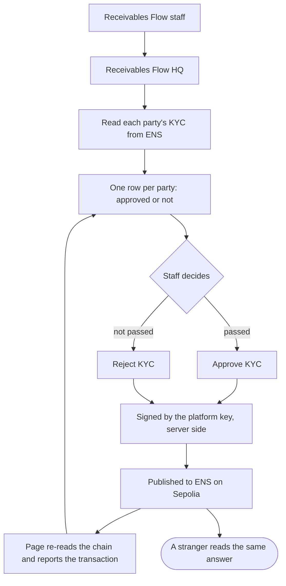

# Open the HQ page so staff approve or reject KYC

## Overview

**What:**
Receivables Flow staff get a page of their own listing every party on the platform, each either
approved or not, with one button to approve and one to reject. Pressing a button there is what
publishes the decision — there is no second step and no script.

**Why:**
Every KYC decision on this platform is currently written by a command run from a terminal, so the
one action the whole record rests on — a person deciding this fund may hold invoices — cannot
be shown to anyone who is not running the repository. The two portals belong to customers and
neither can hold the platform's signing key, so the decision has nowhere to live. Until it
does, the public record looks like something the platform asserts rather than something a
named person did.

**How:**
A third page, for staff rather than customers, lists every party with its KYC either approved or
not, and offers exactly two buttons. Every press publishes to the same public record a stranger
reads, and reports back what it changed.

**Zone 1 check:**
Advances **Design**. Right now the only way to demonstrate a KYC decision is to read a terminal
transcript aloud and ask the audience to believe the record moved — unbounded verification for
anyone outside the repo. Once the decision has a page, watching a status flip and following
the transaction is the whole check.

---

## Core Logic



### Business rules

- Every value on the page is read from the chain on each request; nothing about a party's
  standing is stored by this app.
- The platform key is used only on the server and never reaches the browser.
- KYC is granted for a fixed term, and the page states the date it runs out.
- A party is either approved or not — the page carries no third state and no queue.
- Approving a party that already stands brings its record up to date rather than issuing a
  second name.
- Rejecting ends a standing KYC, and the page reads as not approved immediately afterwards.
- Every action reports the transaction it made, or the reason it made none.
- One place holds every credential the repository needs, at the root, so a value is changed
  once rather than in each package that happens to use it.

---

## File Tree

```
.env.example                            # new — every credential the repo needs, in one place
contracts/ens/hardhat.config.ts         # load the root env instead of the package's own
contracts/hedera-ats/hardhat.config.ts  # same
libs/privy/src/provision.ts             # same
contracts/ens/.env.example              # deleted
contracts/hedera-ats/.env.example       # deleted
libs/privy/.env.example                 # deleted

apps/hq/                                # new — the staff page
├── package.json                        # third Next app, alongside business and investor
├── next.config.ts                      # compile the shared and ENS packages
├── tsconfig.json
├── postcss.config.mjs
├── eslint.config.mjs
├── playwright.config.ts                # boot the page and drive it in a browser
├── src/app/globals.css                 # the design system, as the other two portals carry it
├── src/app/layout.tsx
├── src/app/page.tsx                    # one row per party, read from chain
├── src/lib/ens/standing.ts             # read every party's KYC
├── src/lib/ens/actions.ts              # approve and reject, signed server side
├── src/components/standing.tsx         # the list and its two buttons
└── e2e/standing.spec.ts                # staff reject a fund and watch the row flip
```

---

## Action Items

**[x] Keep every credential in one place**

Implement: Create a root `.env.example` holding every variable the repository needs, grouped by
what it is for; point `contracts/ens/hardhat.config.ts`, `contracts/hedera-ats/hardhat.config.ts`
and `libs/privy/src/provision.ts` at the repository root rather than their own directory; delete
the three per-package examples.

Verify:
```
test -f .env.example && ! ls contracts/*/.env.example libs/*/.env.example 2>/dev/null && npm -w @rf/contracts-ens run check:balance
```
→ exits 0 and prints the platform account and its balance, reading the root env

---

**[x] Read every party's KYC**

Implement: Create `apps/hq/src/lib/ens/standing.ts` returning every party HQ shows — for each,
its name, the wallet it names, whether its KYC is approved right now and the date it runs out —
reading from the registries themselves and never from a stored copy.

Verify:
```
npm -w @rf/hq run typecheck && npm -w @rf/hq run build
```
→ exits 0

---

**[x] Approve or reject from the page**

Implement: Create `apps/hq/src/lib/ens/actions.ts` exposing exactly two decisions — approve and
reject — each taking one party, signing with the platform key on the server and returning the
transaction it made; and `apps/hq/src/components/standing.tsx` rendering one row per party with
those two controls, in the design system the other two portals use.

Verify:
```
npm -w @rf/hq run build && grep -rL "use server" apps/hq/src/lib/ens/actions.ts
```
→ exits 0 and prints nothing, so the actions file is server-only

---

**[x] Prove the flip in a browser**

Implement: Create `apps/hq/e2e/standing.spec.ts` driving the running page to reject the fund's
KYC and asserting the row reads as not approved, then approving it and asserting the row reads
as approved; and `apps/hq/playwright.config.ts` booting the page for the run.

Verify:
```
npm -w @rf/hq run test:e2e
```
→ exits 0, all specs pass
