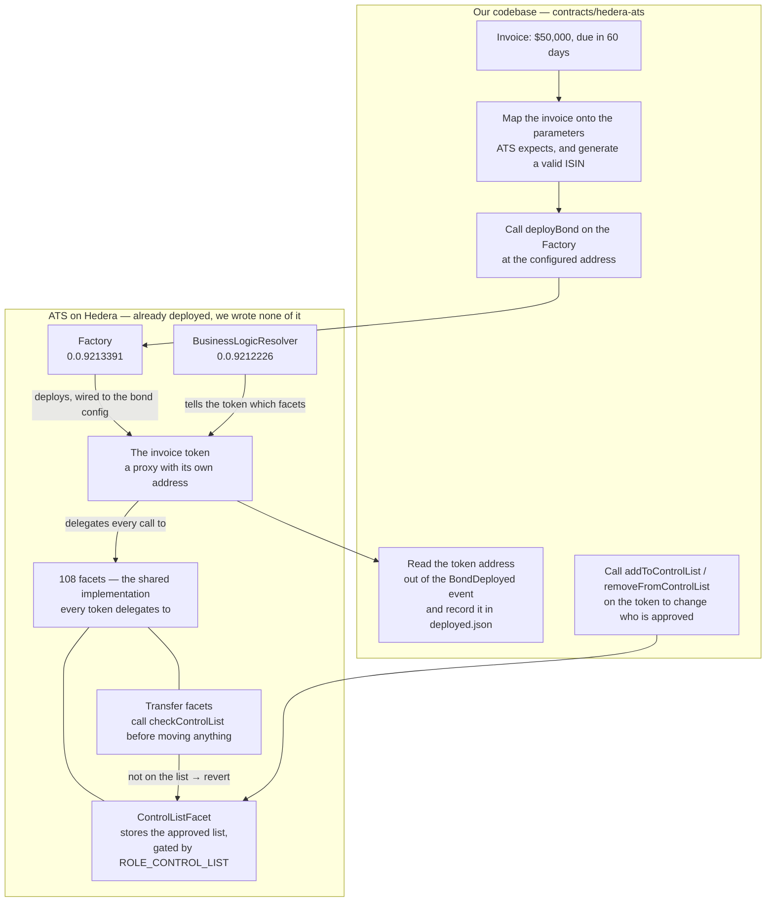

# Issue the receivable token and lock who can hold it

## Overview

**What:**
Receivables Flow turns an unpaid invoice into a security an investor can buy — $50,000 of value, payable in 60 days — and guarantees that only investors Receivables Flow has approved can ever hold it.

**Why:**
There is currently nothing for an investor to buy, and every later stage of the product either displays this asset, sells it, or pays it out. None of that can start until it exists. And the restriction on who may hold it has to be part of the asset, not a check our application performs: an application check is a promise, and a promise is not a security.

**How:**
Represent each invoice as its own security carrying its value and payment date, with an approved-holder list attached. Every transfer is checked against that list by the asset itself, and a transfer to anyone not on it fails. Receivables Flow controls who is on the list.

**Zone 1 check:**
Advances **Deployment** — the stage where investor capital is actually placed into an asset. Today there is no asset to place it into. This creates it, and makes "who may hold this?" answerable by one command instead of by reading our application code.

---

## Core Logic

### The boundary

Everything inside ATS is already deployed and audited. We write no Solidity.



### Who does what

| | Our code | ATS, already deployed |
|---|---|---|
| Build the parameters from an invoice | ✅ | |
| Generate a checksum-valid ISIN | ✅ | |
| Call `deployBond`, read `BondDeployed` | ✅ | |
| Record the token address in `deployed.json` | ✅ | |
| Call `addToControlList` / `removeFromControlList` | ✅ | |
| Deploy the token contract itself | | ✅ |
| Initialise it in whitelist mode, assign roles | | ✅ |
| Store the approved list, enforce `ROLE_CONTROL_LIST` | | ✅ |
| Reject a transfer to an unapproved address | | ✅ |
| ERC-1400 balances and transfer semantics | | ✅ |

### What we pass to `deployBond`

One call per invoice. `deployBond(BondData, FactoryRegulationData)`:

```
BondData.security                       ← SecurityData
  resolver                    0.0.9212226        BusinessLogicResolver address
  resolverProxyConfiguration  BOND_CONFIG_ID     0x…02, version 1
  isWhiteList                 true               ← the lock; fixed at creation
  isControllable              true               lets Receivables Flow hold the compliance role
  maxSupply                   50_000             units, so an investor can buy a slice
  erc20MetadataInfo.name      "Receivables Flow · Acme Invoice #1042"
  erc20MetadataInfo.symbol    "RF1042"
  erc20MetadataInfo.isin      "US1234567894"     checksum-validated by the Factory
  erc20MetadataInfo.decimals  6
  rbacs                       DEFAULT_ADMIN_ROLE + ROLE_CONTROL_LIST + ROLE_ISSUER
                              → the Receivables Flow operator account

BondData.bondDetails                    ← BondDetailsData
  currency                    "USD"              ISO 4217, as bytes3
  nominalValue                100                with nominalValueDecimals 2 → $1.00 per unit
  nominalValueDecimals        2                  50_000 units × $1.00 = $50,000
  startingDate                now
  maturityDate                now + 60 days

FactoryRegulationData
  regulationType              REG_S              no US-person restrictions layered on top
```

Returns the token's address in the `BondDeployed` event.

After creation, changing who is approved is a call on the token itself, not the Factory:
`addToControlList(address)`, `removeFromControlList(address)`, `isInControlList(address)`.

### Business rules

- The token carries $50,000 of value and a maturity 60 days after creation. Both are read back off the token, never from our own stored copy.
- `isWhiteList` is set at creation and cannot be changed afterwards. Absence from the list is refusal, not a default-allow.
- A transfer to an address not on the list reverts. The transaction fails — it does not succeed with balances unchanged.
- Only an account holding `ROLE_CONTROL_LIST` can change the list. Any other caller reverts.
- Removal takes effect immediately: an address that could receive before the call cannot receive after it, with no reissuance.
- $50,000 and 60 days are inputs, not constants. Any value and any maturity are accepted.
- One invoice, one token. Each has its own address, its own approved list and its own maturity, and knows nothing of the others.
- Name and symbol are Receivables Flow's own. Nothing in the token's metadata names ATS or Hedera.
- We write no Solidity. Every rule above is enforced by ATS's audited facets.

---

## File Tree

```
contracts/hedera-ats/
├── .env.example                        # Factory and BusinessLogicResolver addresses, defaulted to the verified testnet pair
├── .gitignore                          # ignore the checkpoint output the ATS deploy writes
├── package.json                        # + @hashgraph/asset-tokenization-contracts, test script
├── hardhat.config.ts                   # in-memory network sized to hold all 108 facets
├── src/
│   └── receivable-token.ts             # map invoice → deployBond; add, remove and query approved holders
├── scripts/
│   └── issue-receivable-token.ts       # network entrypoint; records the token address in deployed.json
└── test/
    └── receivable-token.spec.ts        # value, maturity, and the refusal
```

---

## Action Items

**[x] [config] Take the ATS contracts as a dependency and give the package a test command**

Implement: Add `@hashgraph/asset-tokenization-contracts` to `contracts/hedera-ats/package.json` with a `test` script, extend `hardhat.config.ts` with an in-memory network that can hold the full 108-facet deployment, and add the ATS deploy's checkpoint output to `.gitignore`.

Verify:
```
npm -w @rf/contracts-hedera-ats run typecheck
```
→ exits 0, no output

---

**[x] [integration] Issue a token carrying the invoice's value and maturity**

Implement: Create `contracts/hedera-ats/src/receivable-token.ts` covering the issuance path in Core Logic.

- `issueReceivableToken` — map an invoice onto `BondData`, generate a valid ISIN, call `deployBond`, return the token address
- `readTerms` — read nominal value and maturity date back off the token

Verify:
```
npm -w @rf/contracts-hedera-ats test -- --grep "records its face value and maturity"
```
→ exits 0, 1 passing

---

**[x] [integration] Reject transfers to addresses that are not approved**

Implement: Add the control-list operations to `contracts/hedera-ats/src/receivable-token.ts`, and cover the rejection in `contracts/hedera-ats/test/receivable-token.spec.ts`.

- `approveHolder` — `addToControlList` for one address
- `revokeHolder` — `removeFromControlList` for one address
- `isApprovedHolder` — `isInControlList` for one address

Verify:
```
npm -w @rf/contracts-hedera-ats test
```
→ exits 0, 5 passing: value and maturity recorded; transfer to an unapproved address reverts; transfer to an approved address settles; revocation stops an address that could receive before; a caller without `ROLE_CONTROL_LIST` reverts

---

**[x] [e2e] Issue onto a live network from one command**

Implement: Create `contracts/hedera-ats/scripts/issue-receivable-token.ts`. It reads the Factory and BusinessLogicResolver addresses from the environment — defaulting to the verified testnet pair — issues the token, and records its address in `contracts/hedera-ats/deployed.json`. Document both variables in `.env.example`.

Verify:
```
npm -w @rf/contracts-hedera-ats run typecheck && grep -c "ATS_FACTORY_ID\|ATS_RESOLVER_ID" contracts/hedera-ats/.env.example
```
→ exits 0, prints `2`

*Running this against Hedera testnet is blocked on TECH-580 funding an operator account. Until then the script ships proven by the test suite, which exercises the same code path against a local deployment of the same contracts.*
