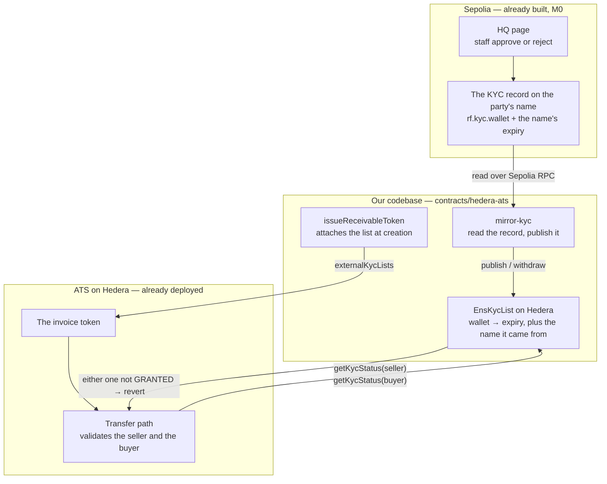

# Check the investor's KYC status at the moment of purchase

## Overview

**What:**
A party whose KYC is approved can buy or sell the receivable, and a party whose KYC was rejected or has run out is refused by the asset itself at the instant of the trade — with nobody at Receivables Flow approving or blocking anything.

**Why:**
Today the KYC decision staff make and the asset investors trade are two separate demos that never meet: the KYC record is written in one place, and the asset lets people hold it based on a list Receivables Flow edits by hand. That makes the KYC decision decorative — it describes who ought to be allowed rather than deciding who is. It also puts Receivables Flow in the middle of every trade, which is the position the product exists to remove.

**How:**
Make the KYC decision an input the asset consults during the trade itself. Whatever staff decided most recently is what the asset enforces, on both sides of the trade, and an approval that has run out stops being valid on its own without anyone acting.

**Zone 1 check:**
Advances **Deployment** — the stage where investor capital is placed into an asset. Today placing capital requires a human to have hand-listed the buyer beforehand, so "may this investor buy?" is answered by reading our application code and our operations history. After this it is answered by one call on the asset, and the answer is the same one a counterparty would get.

---

## Core Logic

### The boundary

ATS already consults external KYC lists on every transfer. The only thing missing is a list on Hedera that answers from the KYC record on Sepolia.



### Who does what

| | Our code | ATS, already deployed |
|---|---|---|
| Hold wallet + expiry on Hedera, answer `getKycStatus` | ✅ | |
| Read the KYC record off Sepolia and publish it | ✅ | |
| Attach the list to the token at creation | ✅ | |
| Call `getKycStatus` on every listed provider during a transfer | | ✅ |
| Validate the seller as well as the buyer | | ✅ |
| Revert the transfer when either side is not GRANTED | | ✅ |

### Why the answer is recomputed on Hedera rather than copied

`EnsKycList` stores the expiry, not a yes/no. `getKycStatus` compares it against Hedera's own block timestamp on every call, so an approval that runs out stops granting at the moment it lapses with no transaction from us. Only a rejection made before the expiry needs a call, because only that is new information.

### Business rules

- A transfer is refused unless **both** the seller and the buyer are GRANTED — ATS validates both sides, so an unapproved business cannot sell any more than an unapproved investor can buy.
- The refusal is the token's own, raised inside the transfer. There is no separate approval step, and no Receivables Flow code decides it.
- A wallet is GRANTED only while its published expiry is strictly ahead of the current block timestamp — never at the expiry itself.
- An approval that has run out stops granting with no call from us. A rejection before expiry takes effect on the next call after it is published.
- A wallet nobody published is refused. Absence is refusal, not default-allow.
- Only the publisher named at construction can publish or withdraw. Any other caller reverts.
- Publishing is idempotent: publishing the same wallet and expiry twice leaves the same answer.
- The name the approval came from is stored alongside it, so a reader on HashScan can see which ENS name granted a wallet.
- The list is attached to the token at creation and consulted from then on; the existing approved-holder list keeps working unchanged beside it.

---

## File Tree

```
contracts/hedera-ats/
├── package.json                    # + @rf/contracts-ens, for the mirror script's read
├── contracts/
│   └── EnsKycList.sol              # holds wallet → expiry on Hedera and answers getKycStatus
├── src/
│   ├── ens-kyc-list.ts             # deploy the list, publish or withdraw a party, read its answer
│   └── receivable-token.ts         # + attach external KYC lists when the token is issued
├── scripts/
│   └── mirror-kyc.ts               # read the KYC record on Sepolia, publish it onto the list on Hedera
├── test/
│   └── ens-kyc-list.spec.ts        # approved settles; rejected, lapsed and unpublished are refused, both sides
└── deployed.json                   # + ensKycList address
```

---

## Action Items

**[x] [contract] Answer "is this wallet KYC approved right now" on Hedera**

Implement: Create `contracts/hedera-ats/contracts/EnsKycList.sol` implementing ATS's `IExternalKycList` per the Core Logic diagram.

- `publish` — record a wallet's expiry and the ENS name it came from
- `withdraw` — drop a wallet's approval before its expiry
- `getKycStatus` — GRANTED only while the stored expiry is ahead of the block timestamp

Verify:
```
npm -w @rf/contracts-hedera-ats run compile
```
→ exits 0, `EnsKycList` in the compiled artifacts

---

**[x] [integration] Attach the list to the token and drive it from TypeScript**

Implement: Create `contracts/hedera-ats/src/ens-kyc-list.ts` with the deploy, publish, withdraw and read helpers, and add an `externalKycLists` input to `issueReceivableToken` in `contracts/hedera-ats/src/receivable-token.ts` that passes them to ATS at creation.

Verify:
```
npm -w @rf/contracts-hedera-ats test -- --grep "refuses a buyer whose KYC was rejected"
```
→ exits 0, 1 passing

---

**[x] [integration] Prove the refusals happen inside the transfer, on both sides**

Implement: Cover the Business rules in `contracts/hedera-ats/test/ens-kyc-list.spec.ts`, driving each case through a real sale on `ReceivableDvp` rather than a direct transfer.

Verify:
```
npm -w @rf/contracts-hedera-ats test
```
→ exits 0, all passing, including: an approved buyer settles; a buyer whose KYC was rejected is refused; a buyer whose approval has lapsed is refused with no call from us; a buyer nobody published is refused; a seller whose KYC was rejected cannot sell

---

**[ ] [e2e] Publish the real Sepolia record onto Hedera from one command**

Implement: Create `contracts/hedera-ats/scripts/mirror-kyc.ts`, which reads the business's and the investor's KYC records from the ENS registry on Sepolia, publishes both onto the list on Hedera, and records the list's address in `contracts/hedera-ats/deployed.json`. Add `@rf/contracts-ens` to `contracts/hedera-ats/package.json`.

Verify:
```
npm -w @rf/contracts-hedera-ats run mirror:kyc
```
→ exits 0, prints the business's and the investor's wallets with the same expiry the live ENS name carries, a HashScan link per publish, and records `ensKycList` in `deployed.json`

*Written and typechecking, but this verify clause has not been run: it needs the root `.env`, which this worktree does not have and which is outside what this session may read. Everything it publishes is proven against the same contract locally by the 13 tests above; what remains unproven is only that the live Sepolia names and the live Hedera list agree.*
