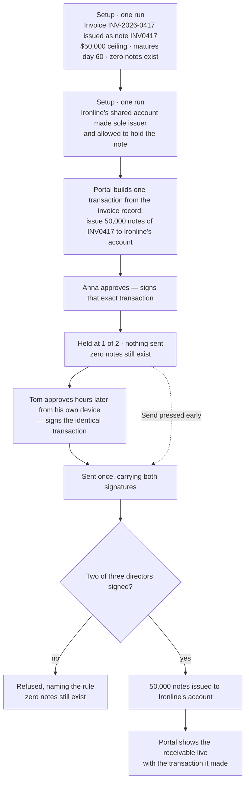

# Mint the token only when two directors have approved

## Overview

**What:**
Two of Ironline Freight's three directors approving is the act that brings the $50,000 receivable into existence. One director alone leaves nothing owned by anyone.

**Why:**
Turning a $50,000 invoice into something a fund can buy is a treasury action, and today it is not one. The receivable is created by whoever holds a key on a laptop, while the directors' approvals sign a placeholder that moves nothing and creates nothing — so the approval and the thing being approved are unrelated. Until they are the same action, the approval is theatre and the receivable has no authority behind it.

**How:**
The transaction the directors sign becomes the issuance of the receivable itself, carrying the invoice's own face value and payment date. Their shared account is made the only account permitted to issue it, so the issuance cannot happen any other way — including by us.

**Zone 1 check:**
Advances **Deployment**. Issuing a receivable currently costs an off-platform, unauditable action by a keyholder, which is unverifiable by anyone but the operator. After this, issuance has one binary condition — two directors approved, or nothing exists — which a reviewer, and a judge, verifies in one look at the chain.

---

## Core Logic



### Business rules

- The transaction the directors sign is byte-identical on every build — no clock, no nonce, no counter — or two directors approving hours apart count as one approval each of two different transactions.
- One director approving twice counts as one approval, and replaces their earlier signature rather than adding to it.
- Nothing in our code decides whether the issuance may proceed; the account refuses or accepts, and Send is offered with too few approvals so that refusal can be produced on demand.
- Face value and maturity come from the one invoice record, never from a literal written beside the token or beside the portal copy.
- The amount issued is the face value in whole dollars, one note per dollar, expressed in the token's own six decimals.
- Ironline's shared account is the only account holding the issuer role, so no key we hold can issue the note.
- Re-running setup against a token that already exists issues a fresh one rather than mutating it, because a security's name, ceiling and maturity are fixed when it is created.

---

## File Tree

```
libs/shared/
  src/invoice.ts                              # the one invoice record: INV-2026-0417, $50,000, 60 days, note name and ticker
  package.json                                # exports the record alongside the types

libs/privy/
  src/policies.ts                             # builds the issuance transaction the directors sign; face value to notes
  src/accounts.ts                             # offers the issuance for approval and sends it with the approvals held
  test/issuance.test.ts                       # the transaction is stable, correctly encoded, and priced off the invoice
  test/refusals.test.ts                       # live: one approval refused, two approvals issue the notes

contracts/hedera-ats/
  src/receivable-token.ts                     # grants the issuer role to another account
  scripts/issue-receivable-token.ts           # issues the note from the invoice record and hands issuance to Ironline
  package.json                                # npm script for the issue run, and the shared record as a dependency

apps/business/
  src/app/api/approvals/route.ts              # approves and sends the issuance instead of the placeholder transfer
  src/components/approvals.tsx                # names what is being approved and links the transaction it made
```

---

## Action Items

**[x] The invoice exists in one place**

Implement: Create `libs/shared/src/invoice.ts` holding the single demo invoice — reference, customer, face value in whole dollars, days to maturity, note name and ticker INV0417 — and export it from `@rf/shared` so the portal and the issuance script read the same record.

Verify:
```
npm run typecheck -w @rf/shared
```
→ exits 0

---

**[x] The directors sign the issuance itself**

Implement: Add to `libs/privy/src/policies.ts` a builder for the issuance transaction — a call to the note's mint entry point, addressed to Ironline's account for the invoice's face value in notes — plus the conversion from whole dollars to the token's six-decimal amount.

Verify:
```
npm test -w @rf/privy
```
→ exits 0; the issuance suite asserts the built transaction is byte-identical across calls, targets the note, encodes Ironline's account and 50,000 notes, and carries the mint selector the deployed ABI actually uses

---

**[x] The portal offers the issuance and sends it**

Implement: Add to `libs/privy/src/accounts.ts` the issuance offered for approval — reading the note's address from the recorded deployment and the terms from the invoice record — and rename the send helper so it sends whatever request was approved rather than a sale specifically.

Verify:
```
npm run typecheck -w @rf/privy && npm test -w @rf/privy
```
→ exits 0

---

**[x] Ironline's account is the only issuer**

Implement: Add a role grant to `contracts/hedera-ats/src/receivable-token.ts`, and extend `contracts/hedera-ats/scripts/issue-receivable-token.ts` to build the note from the invoice record, add Ironline's account as an approved holder, and hand it the issuer role — printing both so the run is auditable.

Verify:
```
npm run issue -w @rf/contracts-hedera-ats
```
→ prints the new note address, `face $50,000`, a maturity 60 days out, and `issuer <Ironline's account address>`

---

**[x] The approvals panel approves the issuance**

Implement: Point `apps/business/src/app/api/approvals/route.ts` at the issuance request and the shared invoice record, and update `apps/business/src/components/approvals.tsx` so the panel names the receivable being issued and links the transaction on HashScan once it lands.

Verify:
```
npm run build -w @rf/business
```
→ exits 0

---

**[x] Two approvals issue the notes and one does not**

Implement: Point the company-account group in `libs/privy/test/refusals.test.ts` at the issuance request, keeping the existing pair — one approval refused by name, two approvals accepted — and assert the notes exist only after the second.

Verify:
```
npm test -w @rf/privy
```
→ exits 0 with the company-account group reported as run, not skipped, when three director access tokens are supplied

---

## Cuts

Logged so the pruning is visible, not silent.

- **Reading the terms back off the chain into the portal** — cut. It needs an RPC read path and a chain library inside the browser app; the transaction link already lets anyone read the terms off HashScan themselves.
- **Sourcing the walkthrough copy in `business.data.ts` from the invoice record** — cut. It is seed text for a scripted walkthrough, and nothing issues from it.
- **A separate script to grant the issuer role** — merged into the issue run, since a note that exists without an issuer is never a state we want to leave behind.
- **A custom contract creating and issuing the note in one transaction** — cut. The role check would still refuse it, so it would be Solidity written to hide a split that costs nothing.
