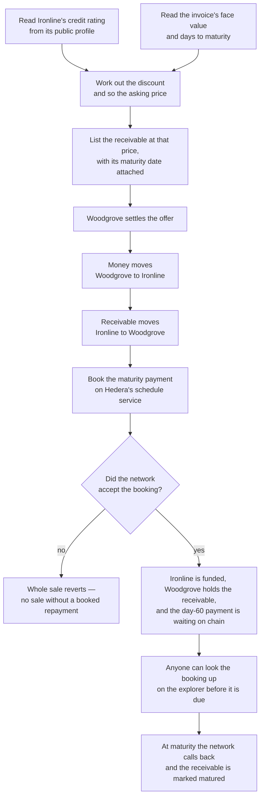

# Sell the invoice at a discount and book the day-60 payout

## Overview

**What:**
When Woodgrove Capital buys Ironline Freight's invoice, two things become true that were not
true before. The price it pays is worked out from the invoice's own terms and Ironline's
published credit rating rather than being a number someone typed in. And the repayment owed at
day 60 is booked onto the network in the same instant the sale happens, so anyone can look it
up and see it waiting long before it is due.

**Why:**
Today the sale is a swap with two soft spots. The price is asserted — nothing connects it to
the invoice being sold or to the record of the business selling it, so a buyer has no way to
tell a fair discount from an arbitrary one, and a business that has always paid on time earns
nothing for it. And the repayment is a promise: after the money and the receivable change
hands, nothing anywhere says the investor gets paid at maturity, so "you will be paid in 60
days" rests on somebody at this company remembering to make it happen. A funding product whose
price is unexplained and whose repayment depends on human diligence is the product we set out
to replace.

**How:**
Work the price out from what is already public — the invoice's face value, how long the money
is tied up, and the rating on the business's own profile — so the discount is a calculation a
buyer can repeat rather than a claim they have to accept. And make the network itself hold the
repayment: at the moment of sale, book the maturity payment so that it is scheduled on Hedera
and visible to anyone from that moment until the day it is due.

**Zone 1 check:**
Advances **Deployment** — the stage where investor capital is placed into an asset. Settlement
made the capital move; this makes the terms of that movement checkable by someone who does not
trust us. Before it, "is this priced fairly?" and "will I actually be repaid?" are answerable
only by asking us. After it, both are answerable from the ledger and the public profile: the
price is a function of published inputs, and the repayment is an entity on Hedera with an
execution time on it.

---

## Core Logic



### Business rules

- The maturity payment is booked inside the same transaction as the sale — there is no moment
  at which the receivable has been sold and the repayment has not been booked.
- If the network refuses the booking, the entire sale reverts: the investor keeps their money
  and the business keeps its units.
- Maturity is the moment the sale settles plus the invoice's stated days to maturity, so it is
  measured from when the money actually moved rather than from when the offer was listed.
- The booked call may only be executed by the schedule service calling back into the contract;
  no account can invoke it directly, at maturity or before.
- A receivable matures once — a second callback is refused rather than marking it twice.
- The price is derived from three published inputs and nothing else: face value, days to
  maturity, and the rating on the business's profile.
- A better rating never produces a larger discount, and a longer maturity never produces a
  smaller one.
- A business with no rating published is priced at the worst rating rather than the best, so an
  empty profile cannot be mistaken for a clean one.
- The pricing calculation counts a year as 360 days, the convention the discount rates it
  produces are quoted in.

---

## File Tree

```
contracts/hedera-ats/
├── contracts/
│   ├── ReceivableDvp.sol            # settle() now books the maturity payment before it returns
│   ├── IHederaScheduleService.sol   # the schedule service at 0x16b, as HIP-1215 declares it
│   └── test/
│       └── MockScheduleService.sol  # stands in for 0x16b, which hardhat has no implementation of
├── src/
│   └── pricing.ts                   # what the invoice sells for, given its terms and a rating
├── scripts/
│   └── demo-settlement.ts           # prices the sale from the rating; prints the booked schedule
└── test/
    ├── pricing.spec.ts              # the pricing rules above, checked directly
    └── receivable-dvp.spec.ts       # the booking, its refusal path, and the maturity callback
```

---

## Action Items

**[x] Schedule service interface and its stand-in**

Implement: Create `contracts/hedera-ats/contracts/IHederaScheduleService.sol` declaring the
schedule service as HIP-1215 defines it, and
`contracts/hedera-ats/contracts/test/MockScheduleService.sol`, a stand-in that records what it
was asked to book and can be made to refuse — hardhat has no system contract at `0x16b`, so
without it every settlement test would fail for the wrong reason.

- `scheduleCall` — books a future call and returns a response code and the schedule's address
- `hasScheduleCapacity` — reports whether the network can take a booking at that second

Verify:
```
cd contracts/hedera-ats && npx hardhat compile
```
→ exits 0, reports `Compiled 4 Solidity files successfully`

**[x] Book the maturity payment inside the sale**

Implement: Change `contracts/hedera-ats/contracts/ReceivableDvp.sol` so an offer carries the
invoice's days to maturity, `settle` books the maturity call on the schedule service before it
returns and reverts if the network refuses, and a `mature` entry point exists that only the
schedule service's callback can reach.

- `offer` — now also records days to maturity
- `settle` — books the maturity call after delivery, reverting the sale if it cannot
- `mature` — marks the receivable matured; refuses any caller but the scheduled callback
- `offerOf` — now also reads back the maturity time and the booked schedule's address

Verify:
```
cd contracts/hedera-ats && npx hardhat compile
```
→ exits 0, reports `Compiled 4 Solidity files successfully`

**[x] Price the invoice from its terms and the rating**

Implement: Create `contracts/hedera-ats/src/pricing.ts`, which turns a face value, a number of
days to maturity, and a published rating into the discount and the asking price. It lives
beside the code that consumes it rather than in the shared library because that is where a test
runner already exists, and nothing else reads it yet.

Verify:
```
cd contracts/hedera-ats && npx hardhat test test/pricing.spec.ts
```
→ exits 0, every test passes, including that a `B`-rated $50,000 invoice at 60 days prices at
exactly `$47,500`

**[x] Cover the booking and the pricing with tests**

Implement: Extend `contracts/hedera-ats/test/receivable-dvp.spec.ts` and create
`contracts/hedera-ats/test/pricing.spec.ts` so that every business rule above is checked —
including the sale reverting when the booking is refused, and `mature` refusing an ordinary
account.

Verify:
```
cd contracts/hedera-ats && npx hardhat test
```
→ exits 0, all tests pass, none pending

**[x] Show the derived price and the booked schedule in the demo**

Implement: Change `contracts/hedera-ats/scripts/demo-settlement.ts` to read Ironline's rating
from its profile, price the sale from it rather than from a constant, and print the booked
schedule's address and maturity date alongside the settlement.

Verify:
```
cd contracts/hedera-ats && npx hardhat run scripts/demo-settlement.ts
```
→ exits 0, output shows the rating it read, an asking price of `$47,500`, and a booked schedule
address against a maturity 60 days out

**[ ] Prove the booking exists on Hedera testnet**

Implement: Run the settlement against Hedera testnet and record the resulting schedule in
`contracts/hedera-ats/deployed.json`, so the claim that a judge can see the payment waiting is
backed by an entity on the public explorer rather than by a local run.

Verify:
```
cd contracts/hedera-ats && npx hardhat run scripts/demo-settlement.ts --network hederaTestnet
```
→ exits 0, prints a HashScan link whose page shows a schedule that has not yet executed, with an
expiry 60 days out
