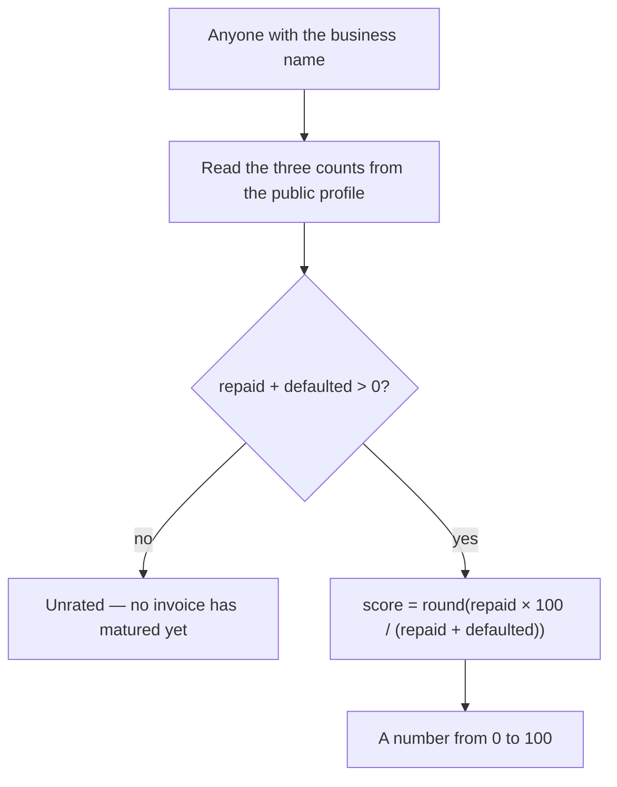

# Make the business credit score a public formula anyone can recompute

## Overview

**What:**
A business's credit score stops being a grade somebody assigns and becomes a number
anyone works out for themselves from the company's own repayment record. Nobody on the
platform, and nobody appointed by the platform, can move it.

**Why:**
Today the score on a business profile is a field an appointed reviewer writes. That is
the exact arrangement the product exists to replace: a business's standing decided by one
firm's judgment, behind one firm's door. A funder has no reason to trust our grade over
their own underwriting, and a business has no way to appeal a number a stranger typed. If
the score is a published formula over facts already on the public record, there is no
judgment to trust and no appeal to make — two people who disagree can each run the sum.

**How:**
The profile already publishes how many invoices a business financed, repaid, and
defaulted on. The score is defined as the share of matured invoices that were repaid,
stated out of 100, and a business with nothing matured yet is unrated rather than
scored. The stored grade and the reviewer who wrote it are removed outright, so there is
no writable score record left to capture. A fund looking at an offer sees that number on
the offer itself, in place of the letter grade the screen used to show.

**Zone 1 check:**
Underwriting. Pricing a receivable today requires trusting a rating whose author cannot be
audited — verification means asking the reviewer. After this, the inputs are public and
the formula is published, so verifying a price is rerunning one division. That moves
underwriting from "trust the source" to a binary check.

---

## Core Logic



### Business rules

- No page carries a stored score; the score is derived on read and never written.
- The score is the share of matured invoices repaid, out of 100: `round(repaid × 100 / (repaid + defaulted))`.
- A business with no matured invoices is unrated, which is not the same answer as a score of 0.
- The same three counts always produce the same score, whoever computes it — no signer, no key, no privileged read.
- `financed` is published as context and is never an input to the score, because an invoice still outstanding has neither been paid nor missed.
- No address holds a role that writes a score, because there is no score record to write.
- The fund's offer table shows the computed score, never a letter grade — a letter would need band cutoffs somebody chose.
- The score on screen falls back to computing from the counts the portal already holds when the chain cannot be reached, so the screen is never blank and never stale in silence.

---

## File Tree

```
contracts/ens/
  src/ens.ts                        # rating record + reviewer grants removed; score formula and reader added
  scripts/onboard.ts                # stops appointing a reviewer; prints the derived score instead
  test/unit/encoding.test.ts        # sample key no longer names a record that was deleted; score formula unit tests
  test/integration/registry.test.ts # reviewer cases removed; score derived from records read back off-chain
tools/proof/src/engine/seed/
  business.seed.ts                  # journey step no longer claims a reviewer sets the rating
apps/investor/src/
  lib/ens/score.ts                  # reads the issuer's counts off ENS and derives the score, falling back to the counts on hand
  data/investor.data.ts             # offer table and mandate carry the number instead of tier B
apps/e2e/tests/
  score.spec.ts                     # a fund sees the computed score on the offer, not a grade
```

---

## Action Items

**[x] Delete the stored rating and the reviewer who wrote it**

Implement: In `contracts/ens/src/ens.ts`, remove `credit.rating` from the published profile
records, and remove the `appointReviewer` and `revokeReviewer` grants along with the
special-casing that existed only to keep the platform off that field.

Verify:
```
cd contracts/ens && grep -rn "credit.rating\|RATING_RECORD\|appointReviewer\|revokeReviewer" src scripts | wc -l
```
→ prints `0` — the shipped package names the deleted record nowhere; the integration suite still names it once, to prove the page carries no such record

**[x] Publish the score as a pure function of the three counts**

Implement: In `contracts/ens/src/ens.ts`, add the exported score formula described in Core
Logic — taking the three counts and returning a number from 0 to 100, or unrated when
nothing has matured — plus a reader that fetches a named business's counts from its page and
returns that score.

Verify:
```
cd contracts/ens && npm run test:unit
```
→ exits 0; the score suite passes, including the unrated case and a repeated call returning an identical result

**[x] Prove on-chain that no score can be written and the derived score matches the record**

Implement: In `contracts/ens/test/integration/registry.test.ts`, replace the reviewer cases
with coverage that a business's page exposes no score record to write, and that the score
read back through the reader matches the counts written to that page.

Verify:
```
cd contracts/ens && npm run test:int
```
→ exits 0; the registry suite passes with no reviewer case remaining

**[x] Make the demo run tell the same story**

Implement: In `contracts/ens/scripts/onboard.ts`, stop appointing a reviewer and stop writing
a grade; print the derived score for each business alongside its counts. In
`tools/proof/src/engine/seed/business.seed.ts`, reword the journey step that claims the rating
is handed to an independent reviewer.

Verify:
```
grep -rin "reviewer" contracts/ens/scripts tools/proof/src/engine/seed/business.seed.ts | wc -l
```
→ prints `0`

**[x] Keep both packages compiling**

Implement: No new artifact — this item is the typecheck gate over the four items above.

Verify:
```
cd contracts/ens && npm run typecheck && cd ../../tools/proof && npm run typecheck
```
→ both exit 0

**[x] Put the number in front of the fund**

Implement: Add `apps/investor/src/lib/ens/score.ts`, which reads the issuer's counts off ENS
and derives the score the way `lib/ens/pass.ts` reads the pass, falling back to computing from
the counts the portal already holds when there is no deployment or the chain cannot be
reached. Change `apps/investor/src/data/investor.data.ts` so the offer table's `Tier` column and
the fund's mandate floor carry that number instead of `B`.

Verify:
```
cd apps/investor && npm run typecheck && grep -c "tier B\|'Tier'\|'B'" src/data/investor.data.ts
```
→ typecheck exits 0 and the count is `0`

**[x] Prove it on screen, through the browser**

Implement: Add `apps/e2e/tests/score.spec.ts` driving the investor portal to the offer and
asserting the fund reads a computed score out of 100 on it, and that no letter grade appears
anywhere on the market screen.

Verify:
```
cd apps/e2e && ../../node_modules/.bin/playwright test score.spec.ts --trace on
```
→ exits 0 with the new tests passing and a trace retained for each
