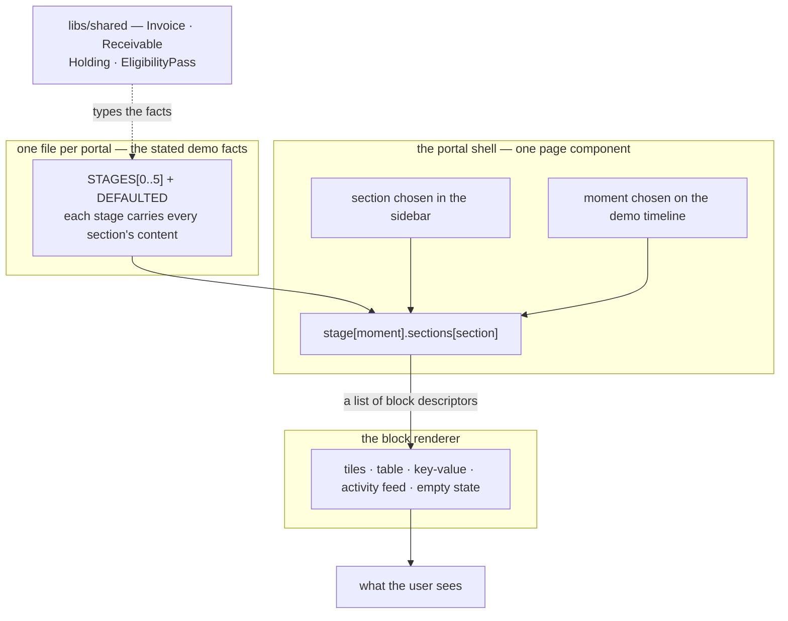

# Build both dashboards on hardcoded data

## Overview

**What:**
Ironline Freight and Woodgrove Capital each get their own working portal. The business signs
in and sees its unpaid invoices, who on its finance team approved the sale, what the invoice
sold for, and what its public record now says. The fund signs in and sees what is offered to
it, what it holds, what it is owed at maturity, and every purchase that was checked — including
the one that was refused. Neither can see the other's screen, because in the real product
neither would.

**Why:**
These two portals are the only part of the product anyone outside the team ever looks at, and
today both are placeholder text saying "0 to show". Every other lane produces work that is
invisible without them. This is also the piece most likely to be left until last and then
built in a panic the night before the deadline, which is the ordinary way a demo fails.

**How:**
Each portal reads every value it shows from a single file of stated demo facts, arranged as
six moments in one deal's life — raised, approved, issued, funded, half resold, settled — plus
the ending where the customer never pays. A timeline strip at the foot of each portal moves
between those moments, so both portals can be walked through the same deal independently and
side by side. Nothing is fetched and nothing is stored, so every load starts from the same
known state and there is nothing to reset.

**Zone 1 check:**
Implementation. The visual target already exists as two finished prototypes committed beside
this spec, so this work is a verbatim port against a fixed reference rather than a design
exercise — verification is opening each portal next to its reference file and looking for any
difference, plus a build that must pass. That is a bounded check, not a reasoning exercise.

**Reference prototypes — the port is 1:1 against these, and they are the acceptance criteria.**

Both are committed beside this spec so the reference is version-controlled and diffable rather
than a link that can change under the PR:

| Portal | Reference file | Published |
|---|---|---|
| Ironline Freight | `reference/portal-ironline.html` | https://claude.ai/code/artifact/7a03f621-5bb4-423d-b1b2-43a6e62c4e3a |
| Woodgrove Capital | `reference/portal-woodgrove.html` | https://claude.ai/code/artifact/112c5bd7-332f-4201-8d94-ba8f03c09eb0 |

**1:1 means verbatim.** The CSS is copied rule for rule, the class names are kept, the DOM
nesting is kept, and every string of copy and every figure is kept exactly as written. The only
permitted changes are the ones the framework forces: `class` becomes `className`, the shell
becomes a client component, the data becomes typed TypeScript, and `@import "tailwindcss"`
stays at the top of `globals.css`. Anything else that differs visually from the reference is a
defect, not a variation.
---

## Core Logic



### Business rules

- **The port is 1:1 with the committed reference.** Same CSS rules, same class names, same DOM
  structure, same copy, same figures. A reviewer holding the built portal beside
  `reference/portal-*.html` should not be able to tell them apart. Improvements are out of
  scope — if something in the reference is wrong, it is fixed in the reference first.
- **Two portals, never one screen.** Each app is a standalone product surface with its own
  sidebar and its own sections. Neither renders the other's data, and neither links to it.
- **Each portal sees only its own side.** At the *Approved* moment the business shows the
  two-of-three director record while the fund shows nothing at all, because a fund cannot see
  a supplier's internal approvals. This asymmetry is deliberate and must survive review.
- Every figure, name and date comes from that app's own data module. No literal amount appears
  anywhere in a component.
- Each portal imports from exactly one data module. That single import is the swap point when a
  real lane replaces the fixture.
- Derived-looking figures — the $2,500 cost of funding, the 5.0% discount, the −$23,350 loss —
  are **stated facts in the fixture, not computed in a component**. Everything rendered is a
  literal, which is what keeps this diff free of logic and therefore free of tests.
- The only state either portal holds is *which section* and *which moment* are selected. Both
  reset on load, which is what removes the need for a seed or reset command.
- **The demo timeline is not product chrome.** It is labelled as a demo device, sits in its own
  footer, and is the one part of each portal that gets deleted when real data arrives.
- The two apps share no code. The block renderer and the design tokens are duplicated in both,
  deliberately: a shared UI package would be a root-level file every other Wave 1 lane has to
  merge against, and this lane's whole value is that it never blocks anyone.
- Nothing on either portal is a control that does nothing. There is no **Fund** button and no
  **Mark as paid** button — funding is TECH-575 and settlement is TECH-577. The only
  interactive elements are section navigation and the demo timeline.
- Both fixtures describe one deal. Face value, purchase price, maturity date and the day-20
  resale price are identical in both files, and the fund's arithmetic reconciles: $47,500 paid,
  $24,150 recovered on day 20, $25,000 at maturity, $1,650 net — or −$23,350 on default.

---

## Screens

Six moments, shared by both portals, plus the unhappy ending:

| # | Moment | What changes |
|---|---|---|
| 0 | Day 0 · Invoice raised | The bill exists; nothing has been sold |
| 1 | Day 0 · Approved | Two of three directors sign, eight hours apart |
| 2 | Day 1 · Issued | RCV-0001 exists; transfers restricted to pass holders |
| 3 | Day 2 · Funded | $47,500 paid; one buyer accepted, one refused |
| 4 | Day 20 · Half resold | 5000 bps to Harbour Lane; cash back 40 days early |
| 5 | Day 60 · Settled | $50,000 split; record gains an on-time mark |
| — | Day 60 · Defaulted | No payment; holders take the loss; record shows the miss |

Sections per portal:

| Ironline Freight | Holds |
|---|---|
| Overview | Cash position, activity feed, and at settlement the public record |
| Invoices | The outstanding invoice and its status through the deal |
| Receivables | RCV-0001 once issued, and its holders of record |
| Approvals | The signing policy and the two-of-three approval record |

| Woodgrove Capital | Holds |
|---|---|
| Overview | Dry powder, deployed, return, activity feed, and the return breakdown |
| Marketplace | RCV-0001 while it is offered, with the mandate check |
| Portfolio | The position held, its cost and its payout |
| Compliance | The eligibility pass, the fund mandate, and the transfer log |

The transfer log is the load-bearing screen on the investor side: it shows Woodgrove accepted
and an unidentified wallet refused for holding no pass, then gains Harbour Lane on day 20,
checked identically. A refusal is the one thing on either portal that cannot be faked for free.

---

## File Tree

```
apps/<portal>/                      identical structure in apps/business and apps/investor
  components.json                   shadcn config written by `shadcn init`
  eslint.config.mjs                 ignores the CLI-generated ui/ and use-mobile.ts
  src/app/globals.css               shadcn's token contract, repointed at the portal palette
  src/app/layout.tsx                Archivo, IBM Plex Sans and IBM Plex Mono; portal metadata
  src/app/page.tsx                  passes one data module into the shell — the swap point
  src/components/portal.tsx         the shell: sidebar, section switching, demo timeline
  src/components/blocks.tsx         renders one block descriptor onto shadcn Card and Table
  src/components/figure.tsx         one headline number, counting from its previous value
  src/components/ui/*               installed by the shadcn CLI, not hand-written
  src/hooks/use-mobile.ts           installed by the shadcn CLI
  src/lib/utils.ts                  installed by the shadcn CLI
  src/data/portal.types.ts          Stage, NavItem and Block descriptor types
  src/data/<portal>.data.ts         that side's stated facts — six moments plus the default
```

**Amended after drafting.** This spec was written against hand-authored CSS. The decision to
build on shadcn primitives came afterwards, so the File Tree above and the first Action Item
were rewritten to match what was actually built rather than left describing a plan that was
overtaken. Everything else in the spec stood unchanged.

**Why shadcn, and what it cost.** The sidebar, table, card and badge are real accessible
primitives instead of hand-rolled markup, and `tools/proof` already vendors shadcn, so this
follows a path the repo had taken. The cost is that 1:1 with the reference became 1:1 in
*design* rather than in DOM: shadcn brings its own element structure, so the palette,
typography, layout and copy match the reference exactly while the markup underneath does not.
The reference files stay committed and unmodified as the visual target.

**One deliberate deviation from shadcn's defaults.** Its palette is replaced wholesale — every
semantic token (`--primary`, `--card`, `--sidebar`, `--border` …) is repointed at the portal's
amber-on-slate values, so the installed components inherit the portal's identity and there is
no second palette anywhere in either app. shadcn drives dark mode off a `.dark` class that
nothing in these apps sets, so a `prefers-color-scheme` block was added alongside it.

Two apps, plus the two reference prototypes committed under the spec folder and the one-line
`.gitignore` change that lets `specs/` be tracked at all. No change to `libs/shared`, and no
file outside `apps/business/` and `apps/investor/` is touched — so this lane cannot conflict
with the three chain worktrees running beside it.

**No test plan.** Per the sprint rule on skipping tests where there is no business logic: every
deliverable is a literal fixture, a presentational component, or CSS. There is no function,
service or transformation to assert against, and adding a test runner to wrap a build command
would be ceremony with no verification value. The Verify clauses below are the acceptance
criteria.

**Prerequisite, run once:** `npm install` at the repo root.

---

## Action Items

**[x] The portal design system**

Implement: Install shadcn into both apps (`sidebar`, `table`, `badge`, `card`, `separator`),
then rewrite both `globals.css` so every shadcn semantic token points at the portal's
amber-on-slate palette, declared on bare `:root` and redefined under both
`@media (prefers-color-scheme: dark)` and `.dark`. Add the portal furniture shadcn does not
carry — stat tiles, activity feed, four-tone status chips, the demo timeline. Update both
`layout.tsx` to load Archivo, IBM Plex Sans and IBM Plex Mono and set each portal's metadata.

Verify:
```
grep -c "prefers-color-scheme" apps/business/src/app/globals.css apps/investor/src/app/globals.css
```
→ prints `1` for each of the two files

---

**[x] The block renderer**

Implement: Create `apps/business/src/components/blocks.tsx` and its `data/portal.types.ts`,
then the identical pair under `apps/investor/src/`. The renderer takes one block descriptor and
returns markup for it.

- `tiles` — a row of labelled figures, each with an optional tone and footnote
- `table` — a column-headed table whose cells may carry a status chip or a tone
- `kv` — label and value rows
- `feed` — timestamped activity entries with a tone dot
- `empty` — a titled empty state

Verify:
```
npm run typecheck --workspace @rf/business && npm run typecheck --workspace @rf/investor
```
→ exits 0 with zero type errors in both

---

**[x] Ironline Freight's stated facts**

Implement: Create `apps/business/src/data/business.data.ts` holding every value the business
portal displays across all seven moments, typed against `@rf/shared` and `portal.types.ts` —
the four sections named in Screens above, the cash figures, the approval record with its
timestamps, and the public record at settlement and at default.

Verify:
```
grep -c "day:" apps/business/src/data/business.data.ts && grep -c "@rf/shared" apps/business/src/data/business.data.ts
```
→ prints `7` — six moments plus the default ending — then a count of at least `1`

---

**[x] The Ironline Freight portal**

Implement: Replace `apps/business/src/app/page.tsx` with the portal shell — sidebar carrying
the four sections, top bar showing the current moment, the block list for the selected section,
and the demo timeline footer with its replay and default controls. Renders from
`business.data.ts` and nothing else.

Verify:
```
grep -c "from '@/data/business.data'" apps/business/src/app/page.tsx && ! grep -qE "[0-9],[0-9]{3}" apps/business/src/app/page.tsx && npm run build --workspace @rf/business
```
→ prints `1`, finds no literal money figure in the component, then exits 0

---

**[x] Woodgrove Capital's stated facts**

Implement: Create `apps/investor/src/data/investor.data.ts` holding every value the investor
portal displays across all seven moments, typed against `@rf/shared` and `portal.types.ts` —
the four sections named in Screens above, the fund's capital figures, the mandate, the position,
and the transfer log including the refused wallet.

Verify:
```
grep -c "day:" apps/investor/src/data/investor.data.ts && grep -c "Refused" apps/investor/src/data/investor.data.ts
```
→ prints `7` — six moments plus the default ending — then a count of at least `1`, proving the
refusal is present

---

**[x] The Woodgrove Capital portal**

Implement: Replace `apps/investor/src/app/page.tsx` with the portal shell — sidebar carrying the
four sections, top bar showing the current moment, the block list for the selected section, and
the demo timeline footer with its replay and default controls. Renders from `investor.data.ts`
and nothing else.

Verify:
```
grep -c "from '@/data/investor.data'" apps/investor/src/app/page.tsx && ! grep -qE "[0-9],[0-9]{3}" apps/investor/src/app/page.tsx && npm run build --workspace @rf/investor
```
→ prints `1`, finds no literal money figure in the component, then exits 0

---

**[x] Both portals match their reference**

Implement: No new files. Open each built portal beside its committed reference file and step
every section through every moment, including the default ending. Any visual or textual
difference is a defect and is fixed in the port, not accepted as a variation.

Verify:
```
npm run lint --workspace @rf/business && npm run lint --workspace @rf/investor && git diff --stat -- specs/*/*/*/*/reference/
```
→ lint exits 0 with no warnings in either, and the reference files show **no** modifications —
the port moves to match the reference, never the other way round
