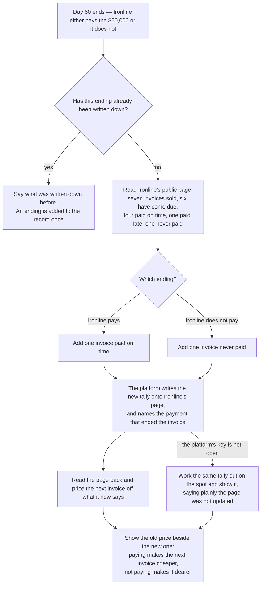

# Write the outcome onto the business profile so the next invoice is cheaper

## Overview

**What:**
How day 60 ended is added to Ironline Freight's own public record — one more invoice paid, or
one more never paid — and the price of its next invoice is worked out from that record the
moment it changes. Paying makes the next invoice cheaper, not paying makes it dearer, both shown
on the same screen in the same minute.

**Why:**
This closes the loop the product exists for. A business's track record lives inside one
factoring company's spreadsheet today, so the next funder cannot see it and Ironline is priced
like a stranger forever. On our own platform the same thing is true in miniature: the record
Ironline is priced against was written once at sign-up and nothing that has happened since has
touched it, so repaying $50,000 on time and defaulting on it produce exactly the same price
tomorrow. Until an ending changes the record, nothing a business does for us earns it anything.

**How:**
When day 60 ends, the platform adds that ending to the tally published on Ironline's page and
names the payment that ended it, so the tally points at something that happened rather than
asserting it. The screen then prices the next invoice off the changed page and shows the old
price beside the new one, because the movement is the proof.

**Zone 1 check:**
Advances **Sourcing**. Pricing a business's next invoice today means asking what it did last
time — an answer that lives with whoever financed it, and cannot be checked. After this, an
ending is on the public record within a minute of happening and the next price is derived from
it, so sourcing the next deal is reading a page rather than trusting a reference.

---

## Core Logic



### Business rules

- An ending changes the tally on the business's page; it never writes a score, because there is
  no score to write — the number is worked out by whoever is reading.
- Paying adds one invoice paid on time. Not paying adds one invoice never paid. Nothing else on
  the page moves — how many invoices Ironline has sold was counted when this one was sold.
- The page also names the payment that ended the invoice, so a reader can check the tally
  against something that happened instead of taking the tally's word for it.
- Day 60 is added to the record once. A second attempt says what was written down before and
  writes nothing, because a record that can be pressed twice is one anyone can inflate.
- The score after an ending is read back off the page rather than assumed — what the screen says
  Ironline's record is has to be what a stranger reading the same page would get.
- When the platform's key is not open the same tally is worked out on the spot and shown, said
  plainly to be unpublished. The business still sees what its ending is worth; it is simply told
  the page has not been updated.
- The old price and the new price are shown together. One number on its own cannot show that a
  price moved, and the movement is the whole claim this issue makes.
- A default must be able to make the next invoice dearer on screen, from the same starting
  record that a repayment makes cheaper — an honest record moves both ways.

---

## File Tree

```
contracts/ens/
  src/ens.ts                             # `rf.invoices.settlement` record; `applyOutcome`; the record a business starts with
  scripts/onboard.ts                     # seeds the page from that constant instead of its own copy
  test/unit/encoding.test.ts             # the starting record scores 75; paying scores 79, not paying scores 64
apps/business/src/
  lib/ens/outcome.ts                     # adds the ending to Ironline's page and reads the page back
  app/api/repay/route.ts                 # writes the ending down once, then publishes it and re-prices
  components/repay.tsx                   # the page before and after, old price beside new price
apps/e2e/tests/
  outcome.spec.ts                        # drives day 60 and asserts the score and the price moved, both endings
```

---

## Action Items

**[x] Publish what an ending does to the counts**

Implement: In `contracts/ens/src/ens.ts`, add `applyOutcome` — taking what a business's page
says today and how day 60 ended, returning what it says afterwards — and the
`rf.invoices.settlement` record name that names the payment behind the latest ending, listed
with the other profile records so a page issued earlier is granted it on its next onboard run.

Verify:
```
cd contracts/ens && npm run test:unit
```
→ exits 0; a business with four invoices paid on time, one paid late and one never paid scores
79 once it pays this one and 64 once it does not, and how many it has sold is unchanged by
either

**[x] Seed Ironline with a record that has somewhere to go**

Implement: In `contracts/ens/src/ens.ts`, export the record a business is onboarded with —
seven invoices sold, four paid on time, one paid late, one never paid, which scores 75 rather
than a perfect 100 — and have `contracts/ens/scripts/onboard.ts` seed the page from that one
constant instead of its own copy, so the number the demo starts from is the number the tests
assert.

Verify:
```
cd contracts/ens && npm run test:unit
```
→ exits 0; the seeded record scores 75, and paying this invoice scores higher than 75 while not
paying it scores lower

**[x] Write the ending onto Ironline's page**

Implement: Create `apps/business/src/lib/ens/outcome.ts`, which adds the ending to what
Ironline's page says using the platform's key, names the payment that ended it alongside, reads
the page back, and returns what the page said before and after — falling back to the same tally
worked out on the spot, named as not published, when the key is not open.

Verify:
```
npm run typecheck -w @rf/business && npm run lint -w @rf/business
```
→ exits 0

**[x] End day 60 by publishing it and re-pricing the next invoice**

Implement: In `apps/business/src/app/api/repay/route.ts`, publish the ending once it is written
down and price the next invoice off the page read back, returning what the page said and what
the invoice cost before and after in the same answer — and, for an ending already written down,
returning what was published then rather than publishing it again.

Verify:
```
npm run build -w @rf/business
```
→ exits 0

**[x] Show Ironline the price move on the day-60 panel**

Implement: In `apps/business/src/components/repay.tsx`, show what Ironline's page said before
the ending beside what it says after, and what the next invoice cost before beside what it costs
now, saying plainly which way the price moved and whether the page was updated.

Verify:
```
npm test -w @rf/e2e -- outcome.spec.ts
```
→ exits 0; paying shows a higher score and a cheaper next invoice than before, not paying shows
a lower score and a dearer one
