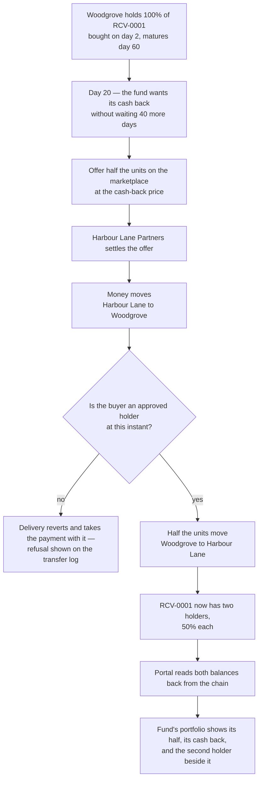

# Sell half the position early to another approved investor

## Overview

**What:**
Twenty days into a sixty-day receivable, Woodgrove Capital can put half its position up for
sale and get its cash back from a second approved investor, without waiting for the invoice to
be paid. After this, the receivable has two owners at once, both of them visible on screen,
and each one's share of the eventual payout is a fact the chain holds rather than a note in a
spreadsheet.

**Why:**
Right now the fund's money is stuck the moment it is deployed — the only way out is to wait
until day 60. An investor who cannot leave early has to be paid for being trapped, and that
premium is charged straight back to Ironline Freight as a bigger discount on day 2. This is
also the half of the demo that currently only *looks* built: the day-20 resale, the second
buyer, and the two-holder split are all written into the portal by hand today, so the screen
makes a claim the system cannot back up.

**How:**
Let the holder offer part of what it owns on the same marketplace the original sale used, and
let a second investor buy it under exactly the same check the first one faced — approved at the
instant of transfer, refused otherwise. Then show the resulting two-owner split on the fund's
own screen, read back from the chain, so the day-20 numbers on the portal stop being typed and
start being reported.

**Zone 1 check:**
Advances **Recovery** — the stage where deployed capital comes back. Today recovery has exactly
one path and one date: the invoice pays at maturity or it does not, and verifying that a fund
can exit early is impossible because it cannot. After this, early recovery is a transaction
anyone can run and read: the cash returned, the share given up, and the second holder are all
on the ledger, so "can this position be exited before maturity?" is answered by looking rather
than by asking us.

---

## Core Logic



### Business rules

- A holder may only offer units it actually holds; offering more than the balance is refused.
- The buyer is checked at the moment of transfer against the approved-holder list as it stands
  at that instant — never against a list approved earlier.
- An unapproved buyer's purchase reverts whole: no units move and no money moves.
- The resale is a partial transfer — the seller keeps the units it did not sell and stays a
  holder of the same receivable.
- After a resale the two holders' shares sum to the whole receivable; no units are created or
  destroyed by selling part of a position.
- The portal's day-20 figures — units held, share, and cash returned — are read from the chain,
  never written into the page.
- If the chain cannot be reached, the screen falls back to the known balances and says the
  figures are not live, rather than showing a number it cannot support.
- Pricing the resale off the live rating is **out of scope** — TECH-594 owns that. Here the
  cash-back price is the offer's stated price, whatever it is set to.

---

## File Tree

```
apps/investor/src/lib/hedera-ats/resale.ts        # reads both holders' balances off Hedera; runs the offer-and-settle for half
apps/investor/src/app/api/resell/route.ts         # POST that executes the resale and reports the hash or the refusal
apps/investor/src/components/resell.tsx           # the Sell half action and the two-holder split it produces
apps/investor/src/app/page.tsx                    # passes the live resale block into the portal's portfolio section
apps/investor/src/data/investor.data.ts           # day-20 stage and transfer log derive from the live view instead of literals
apps/investor/vitest.config.ts                    # unit runner for the investor app, mirroring apps/hq
apps/investor/package.json                        # adds the test:unit script and the vitest devDependency
apps/e2e/tests/resale.spec.ts                     # drives the button and asserts the split and the refusal on screen
```

---

## Action Items

**[x] Read the two holders' balances off the chain**

Implement: Create `apps/investor/src/lib/hedera-ats/resale.ts` exposing a `resale()` view that
reports each holder's units, share and the cash returned, read from the receivable token on
Hedera testnet with a `live` flag and a fallback to known balances when the endpoint cannot be
reached — the same shape `apps/investor/src/lib/ens/score.ts` already uses for the rating.

Verify:
```
npm run test:unit -w @rf/investor
```
→ exits 0; the view reports two holders summing to the whole receivable, and reports `live: false` with the fallback balances when the RPC endpoint is unreachable

---

**[x] Execute the resale and report what the chain said**

Implement: Create `apps/investor/src/app/api/resell/route.ts` — a POST that offers half the
seller's units on `ReceivableDvp` and settles them to the named buyer, returning the
transaction hash on success and the chain's own refusal message when the buyer is not an
approved holder, following the refusal-passthrough shape of
`apps/investor/src/app/api/allocate/route.ts`.

Verify:
```
npm run test:unit -w @rf/investor
```
→ exits 0; an approved buyer returns a hash, an unapproved buyer returns a refusal and no units move

---

**[x] Put the Sell half action and the split on the fund's screen**

Implement: Create `apps/investor/src/components/resell.tsx` rendering a `Sell half` button and,
after it resolves, the two-holder split with the cash returned — carrying `data-testid`
handles for the split table and the refusal line — and pass it into the portal from
`apps/investor/src/app/page.tsx` as the portfolio section's `live` block.

Verify:
```
npm run build -w @rf/investor
```
→ exits 0; `apps/investor/src/app/page.tsx` still declares `export const dynamic = 'force-dynamic'`

---

**[x] Stop the day-20 story being hardcoded**

Implement: Change `apps/investor/src/data/investor.data.ts` so the Day 20 stage's held share
and the second buyer's row in the transfer log are derived from the live resale view passed
into `buildStages`, rather than the literal `50.00%`, `$24,150` and Harbour Lane rows written
there today.

Verify:
```
grep -n "24,150\|50.00%" apps/investor/src/data/investor.data.ts
```
→ no match in the Day 20 stage or the transfer log; both read from the view

---

**[x] Prove it in a browser**

Implement: Create `apps/e2e/tests/resale.spec.ts` driving the investor portal to the portfolio
section, clicking `Sell half`, and asserting on screen that two holders are shown with their
shares, that the cash returned appears, and that an unapproved buyer is refused with the
chain's reason — following the pattern of `apps/e2e/tests/refusals.spec.ts`.

Verify:
```
npm test -w @rf/e2e
```
→ exits 0; the resale spec passes and its trace shows the click and the resulting split

---

## Notes

Six logic files. The Playwright spec is required by the project's definition of done on every
issue, and `vitest.config.ts` plus the `test:unit` script are the runner the unit tests need —
`apps/investor` has none today. Both are copied from `apps/hq`, which already has them.

`ReceivableDvp.offer` and `ReceivableDvp.settle` already do everything the resale needs: units
are a parameter, and the delivery leg reverts on an unapproved buyer. No Solidity is written
here.
