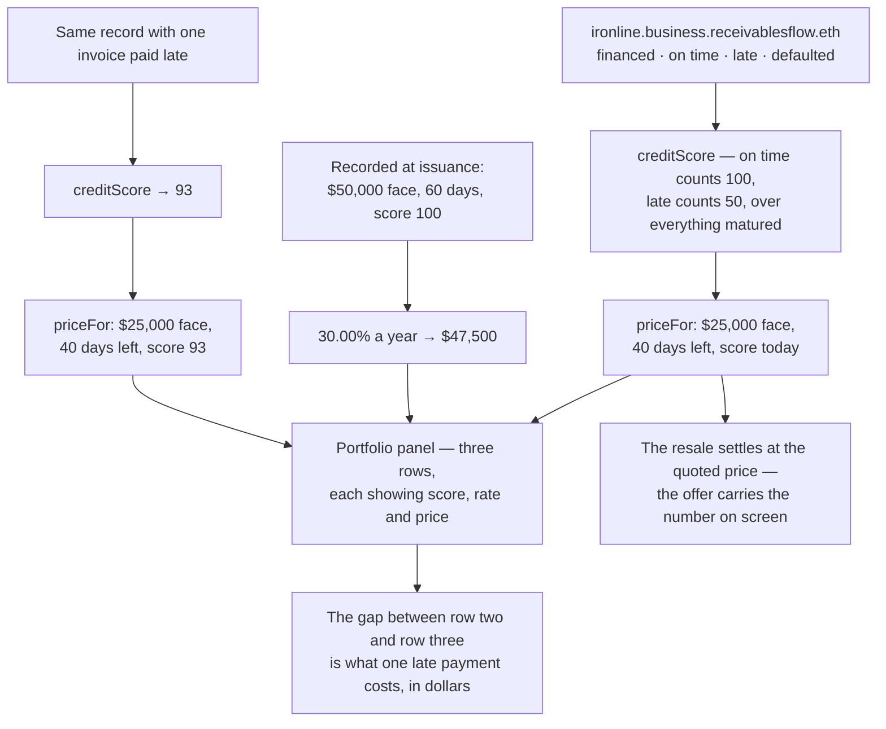

# Price the resale off the live rating and show it against the day-0 rate

## Overview

**What:**
On day 20, the price Woodgrove Capital gets for half its position is worked out from Ironline
Freight's public record and the forty days still left on the invoice — not from a figure typed
into the portal. The fund's screen shows that price beside the rate the whole invoice was
funded at on day 0, and beside what the same half would fetch if Ironline had paid one of its
earlier invoices late.

**Why:**
Without this the resale is a token transfer, which is a lifecycle operation two previous Hedera
winners already shipped. With it, the demo shows the mechanism the whole project claims: the
receivable reprices against a public record, and ENS is the thing being priced against rather
than a badge written after the fact. It also closes the last place where the day-20 story is
asserted — `resale.ts` carries a hardcoded `24_150` today, with a comment admitting a figure
derived there "would look like a calculation while being a guess".

**How:**
Run the same `priceFor` the invoice was funded under a second time, with the score standing on
the profile now and the days that are actually left, and render the two quotes as rows of one
table so a fund can read the working. Add a third row priced against a record carrying one late
payment, so the part the rating is doing has a number on it rather than a claim.

**Zone 1 check:**
Advances **Recovery**. Today a fund can exit early but cannot tell whether the price it got was
fair — the number came from us. After this, the exit price is a published formula over public
inputs, so "was this a fair price?" is answered by rerunning one line rather than by trusting
the venue.

---

## Core Logic



### Business rules

- A business's record distinguishes three endings: paid on time, paid late, never paid. Which
  one an invoice was is a comparison of the redemption's consensus timestamp against the
  security's maturity date — never a judgement anyone records by hand.
- A late payment is worth half an on-time one. That weighting is the single judgement in the
  formula, so it is a named constant rather than a number buried in the arithmetic.
- The resale price is `priceFor` run again on the score standing on the profile at the moment
  of the read, and on the days remaining — never a literal.
- The day-0 rate is history and stays fixed at what the sale actually happened at. Re-deriving
  it from today's record would restate what the fund paid every time the record moves.
- A worse record produces a worse price, and the difference is stated on screen in dollars.
- The price the resale settles at is the price the panel quotes; the two cannot disagree.
- Every figure that follows the resale — cash back, still at risk, realised return — is derived
  from what the sale returned, so no tile can carry its own copy of the price.
- A profile written before the three-way split is read on its legacy `repaid` count, with those
  invoices read as paid on time. A record that already exists must not be made unrated by a
  release.
- Every read of the profile is bounded by a time budget. An endpoint that never answers renders
  the counts on hand, named as not live — never a blank page.

---

## File Tree

```
contracts/ens/src/ens.ts                                  # three-way counts, weighted creditScore, legacy-record fallback
contracts/ens/scripts/onboard.ts                          # seeds ontime/late instead of repaid
apps/investor/src/lib/hedera-ats/resale-quote.ts          # the three legs: day 0, today, and one-late
apps/investor/src/components/resale-price.tsx             # the panel that renders them on the fund's screen
apps/investor/src/app/page.tsx                            # passes the quote into the portfolio section
apps/investor/src/lib/hedera-ats/resale.ts                # takes the price rather than carrying one
apps/investor/src/app/api/resell/route.ts                 # settles at the quoted price
apps/investor/src/data/investor.data.ts                   # day-20 and day-60 figures derive from the sale
apps/investor/src/lib/ens/score.ts                        # read budget and pinned network
apps/business/src/lib/ens/score.ts                        # same, plus the three-way record it now reads
apps/business/src/components/quote.tsx                    # shows on time and late, not repaid
apps/e2e/tests/resale-price.spec.ts                       # drives the portfolio and asserts the three rows
```

---

## Action Items

**[x] Split a business's record into paid on time, paid late, and never paid**

Implement: Change `Counts` and `creditScore` in `contracts/ens/src/ens.ts` to weight on-time
payments at 100 and late ones at a named `LATE_WEIGHT` of 50 over everything matured, extend
`PROFILE_RECORDS` to publish `rf.invoices.ontime` and `rf.invoices.late`, and add `splitPaid`
so a profile still carrying only the legacy `rf.invoices.repaid` count reads those invoices as
paid on time.

Verify:
```
npm test -w @rf/contracts-ens
```
→ exits 0; a late payment scores above a default and below an on-time one, and six on time with
one late scores 93

---

**[x] Quote the resale off the record standing on the profile now**

Implement: Create `apps/investor/src/lib/hedera-ats/resale-quote.ts` exposing `resaleQuote()`,
returning three legs — the recorded day-0 sale, half the position priced on today's live score
over the days remaining, and the same half priced against a record with one late payment —
each carrying the score, rate, face value, days and price behind it.

Verify:
```
npm run test:unit -w @rf/investor
```
→ exits 0; the day-20 leg equals `priceFor(25_000, 40, score)`, the day-0 leg holds at 30.00%
whatever the record now says, and the one-late leg prices below the live one

---

**[x] Put both rates on the fund's screen, side by side**

Implement: Create `apps/investor/src/components/resale-price.tsx` rendering the three legs as a
table with `data-testid` handles per row, stating what the late payment costs in dollars, and
pass it into the portfolio section's `live` block from `apps/investor/src/app/page.tsx`.

Verify:
```
npm run build -w @rf/investor
```
→ exits 0; `page.tsx` still declares `export const dynamic = 'force-dynamic'`

---

**[x] Settle at the price on the panel, and derive every figure that follows from it**

Implement: Change `resale()` and `sellHalf()` in `apps/investor/src/lib/hedera-ats/resale.ts`
to take the price rather than carry the literal `24_150`, have
`apps/investor/src/app/api/resell/route.ts` pass the quoted price into both, and rework the
day-20 and day-60 tiles in `apps/investor/src/data/investor.data.ts` to derive cash back, still
at risk, dry powder and realised return from what the sale actually returned.

Verify:
```
grep -n "24,150\|23,350\|251,650\|226,650" apps/investor/src/data/investor.data.ts
```
→ no match; every post-resale figure is computed from `split.cashReturnedUsd`

---

**[x] Keep both portals rendering when the record is slow to read**

Implement: Pin the Sepolia network on the providers in `apps/investor/src/lib/ens/score.ts` and
`apps/business/src/lib/ens/score.ts`, wrap each read in a time budget that falls back to the
counts on hand, and update `apps/business/src/components/quote.tsx` to show the on-time and
late counts rather than a single repaid figure.

Verify:
```
npm run build -w @rf/business && npm run build -w @rf/investor
```
→ both exit 0; a request to either portal returns 200 in under five seconds

---

**[x] Prove it in a browser**

Implement: Create `apps/e2e/tests/resale-price.spec.ts` driving the investor portal to the
portfolio section and asserting on screen that the day-0 and day-20 rows are both present with
their terms, that the one-late row prices below the live one, that the stated cost of the late
payment equals the difference between the two rows, and that the settled sale returns the price
the panel quoted.

Verify:
```
npm test -w @rf/e2e
```
→ exits 0; the resale-price spec passes and its trace shows the three rows on screen

---

## Notes

The three-way record is what makes this issue possible at all: a business at 100 out of 100 has
nowhere to improve, so a demo built on a two-way repaid/defaulted count can only ever show the
score standing still. Splitting paid into on time and late gives the score somewhere to move in
both directions without inventing a default that did not happen.

Writing the outcome onto the profile stays out of scope — TECH-578 owns that, and it is blocked
on settlement. This issue reads whatever the profile says and prices off it; the one-late row is
priced, not written, so nothing here touches Ironline's record.

The legacy fallback in `splitPaid` exists because the deployed profile on Sepolia still carries
`rf.invoices.repaid`. Re-running `npm run onboard -w @rf/contracts-ens` with `SEPOLIA_PRIVATE_KEY`
publishes the new records and the fallback stops applying.
