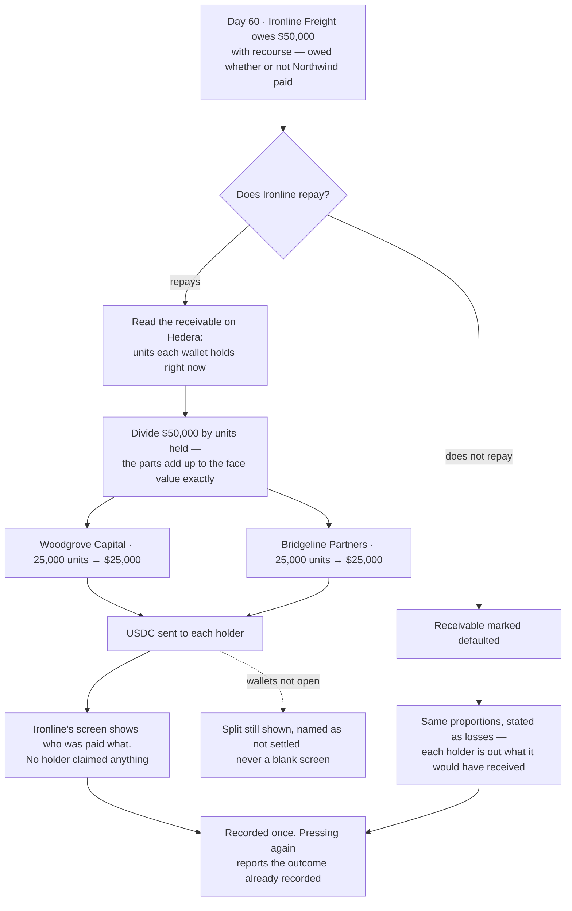

# Pay every holder their share when the invoice settles

## Overview

**What:**
On day 60 Ironline Freight repays the $50,000 it owes, and that money is split across everyone
holding the receivable at that instant — Woodgrove half, Bridgeline half — without either of
them claiming, signing, or pressing anything. The unhappy ending is built beside it: if Ironline
does not repay, the receivable is marked defaulted and both holders take the loss in the same
proportions they would have been paid in.

**Why:**
This is the moment the asset does what it promised, and today it is the one moment that is not
real: day 60 is typed-in copy claiming the fund received $25,000, and Bridgeline — which owns
half the receivable — is never paid at all. Until a repayment actually lands and divides itself,
nothing in the demo shows what buying half of somebody's invoice is worth.

**Why Ironline repays, and not the customer:**
The sale is with recourse. Ironline sold the invoice and carries the obligation to repay it at
maturity whether or not Northwind Brokerage pays Ironline. That is the whole reason the price on
day 0 and day 20 is quoted against Ironline's credit record: under recourse the party being
priced and the party that repays are the same party. It also keeps the demo to the two portals
that exist — Northwind never appears on a screen because Northwind never touches the platform.

**How:**
Ironline's own portal carries the day-60 obligation and the two ways it can end. Repaying reads
who holds the receivable straight off the chain, divides the face value across them in
proportion to what each holds, and pays each one. Not repaying marks the receivable defaulted
and states each holder's loss in the same proportions.

**Zone 1 check:**
Advances **Recovery**. Today the capital coming back is an assertion — the portal says $25,000
was received and nothing checked it, and the second holder is not paid at all. After this,
recovery is a division of the repayment across balances read off the receivable, so "did
everyone get what they were owed?" is answered by adding up what was paid rather than by
trusting the page.

---

## Core Logic



### Business rules

- The obligation is Ironline's, and it stands at face value whether or not Northwind Brokerage
  paid Ironline. That is what recourse means, and it is why the price was quoted against
  Ironline's record rather than Northwind's.
- Who is owed what is the receivable's own balances at the moment of repayment, never a list
  anyone stored. A holder appears because the chain says it holds units.
- Each holder receives the face value in proportion to the units it holds, and the parts add up
  to the face value exactly — the rounding remainder goes to the largest holder rather than
  being lost.
- A wallet holding nothing is not a holder and is not paid.
- No holder claims, signs, or presses anything. The only party acting is the one that owes.
- With no repayment the receivable is marked defaulted, and each holder's loss is stated in the
  same proportion its payment would have been.
- The outcome is recorded once. Repaying twice must not pay twice — a second attempt reports the
  outcome already recorded.
- The split is computed and shown even when no cash can move, named as not settled. A portal
  that blanks out because a key is missing tells Ironline less than one that shows the division
  and says the money has not moved.
- The trust boundary is stated in the README rather than papered over: under recourse Ironline
  repays the platform, and nothing on-chain compels Ironline to do so. Real factoring closes
  that with a guarantee and a recourse clause, which is paperwork rather than code.

---

## File Tree

```
contracts/hedera-ats/src/distribution.ts          # the split as a published formula — face value across holders
contracts/hedera-ats/test/distribution.spec.ts    # proportions, exact sum, nothing lost to rounding
apps/business/src/lib/hedera-ats/repay.ts         # reads the holders off the receivable and pays each one
apps/business/src/app/api/repay/route.ts          # records the outcome once — repaid, or never paid
apps/business/src/components/repay.tsx            # the two buttons, and the table of who got what
apps/business/src/app/page.tsx                    # passes it into the receivables section
apps/business/src/data/business.data.ts           # day-60 copy: an obligation with recourse, not a final sale
apps/e2e/tests/repay.spec.ts                      # drives Ironline's screen and asserts both holders paid
README.md                                         # the recourse trust boundary, stated out loud
```

---

## Action Items

**[x] Publish the split as a formula, the way the price already is**

Implement: Create `contracts/hedera-ats/src/distribution.ts` exposing `distribute()`, which
takes the face value and what each wallet holds and returns what each is owed, with the
remainder from rounding going to the largest holder and wallets holding nothing left out.

Verify:
```
npm test -w @rf/contracts-hedera-ats
```
→ exits 0; two equal holders of a $50,000 receivable are owed $25,000 each, the parts always sum
to the face value, and a wallet holding nothing is not in the answer

---

**[x] Read who holds the receivable, and pay each of them**

Implement: Create `apps/business/src/lib/hedera-ats/repay.ts` exposing the day-60 view and the
repayment itself — the holders read off the receivable on Hedera, what each is owed by
`distribute()`, and a USDC transfer to each holder — falling back to the balances on hand and
naming itself not settled when the accounts are not open, in the same shape `resale.ts` uses.

Verify:
```
npm run typecheck -w @rf/business && npm run build -w @rf/business
```
→ both exit 0

---

**[x] Record the outcome once — repaid, or never paid**

Implement: Create `apps/business/src/app/api/repay/route.ts` accepting the two outcomes, paying
every holder on a repayment and marking the receivable defaulted when there is none, holding the
recorded outcome so a second attempt reports what already happened rather than paying twice.

Verify:
```
npm run build -w @rf/business
```
→ exits 0; the route declares `runtime = 'nodejs'` and `dynamic = 'force-dynamic'`

---

**[x] Put the day-60 obligation on Ironline's screen**

Implement: Create `apps/business/src/components/repay.tsx` rendering the amount owed, a repay
control and a do-not-repay control, and the resulting table of holder, units, share and amount
paid with `data-testid` handles; pass it into the receivables section from
`apps/business/src/app/page.tsx`; and reword the day-60 and defaulted copy in
`apps/business/src/data/business.data.ts` so the sale reads as an obligation with recourse
rather than a final sale whose loss is the holders'.

Verify:
```
grep -n "the sale was final" apps/business/src/data/business.data.ts
```
→ no match; `npm run build -w @rf/business` exits 0

---

**[x] State the recourse trust boundary in the README**

Implement: Add a short section to `README.md` saying that Ironline carries the obligation under
recourse, that nothing on-chain compels it to repay, and that real factoring closes this with a
recourse clause and a guarantee rather than with code.

Verify:
```
grep -in "recourse" README.md
```
→ at least one match, in a section that names what the platform does not enforce

---

**[x] Prove it in a browser**

Implement: Create `apps/e2e/tests/repay.spec.ts` driving Ironline's portal to the receivables
section and asserting on screen that repaying pays both holders, that each amount is that
holder's share of $50,000, that the amounts add up to $50,000, that not repaying states both
losses in the same proportions, and that repaying a second time does not pay again.

Verify:
```
npm test -w @rf/e2e
```
→ exits 0; the repay spec passes and its trace shows both holders paid on screen

---

## Notes

Recourse is the simplification that makes the demo honest rather than smaller. Under a
non-recourse sale the party that repays is Northwind Brokerage, which has no account, no portal
and no credit record on the platform — so the price quoted against Ironline's record on day 0
and day 20 would be pricing the wrong company. Recourse puts the obligation on the party the
formula already prices.

The split lives in `contracts/hedera-ats` beside `pricing.ts` rather than inside the business
app, because it is the same kind of thing: a published figure anyone can recompute. It also
means the unit test runs on test infrastructure that already exists.

Writing the outcome onto Ironline's public profile stays out of scope — TECH-578 owns that and
is blocked on this issue. This one repays and divides; the record it leaves behind is the next
issue's work.
