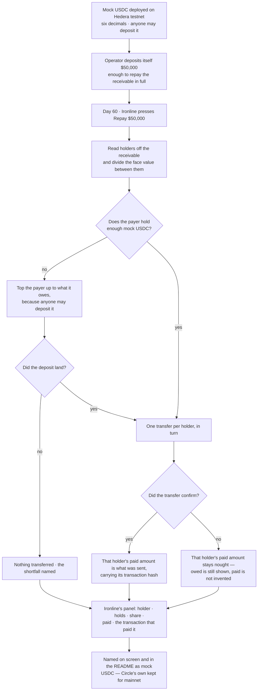

# Pay the day-60 repayment in mock dollars anyone can mint

## Overview

**What:**
The cash leg of day 60 becomes real. Ironline Freight's $50,000 repayment moves as mock USDC
this project deploys, so Woodgrove Capital and Bridgeline Partners are each actually paid on
screen — with the transaction that paid them — instead of reading a correct division beside a
line saying nothing was transferred.

**Why:**
Every other part of day 60 is already real: the receivable is on chain, the holders are on
chain, the split is computed from their balances. The money is the one thing that is not. The
dollars the platform pays in are Circle's testnet USDC, and Circle's faucet hands out twenty of
them per address every two hours — so a $50,000 repayment can never be funded, and the panel
that should be the payoff of the whole demo ends on "nothing was transferred". The only two ways
out are a dollar we can issue ourselves or an invoice worth $20, and a $20 invoice makes the
price, the score and the split beside it unbelievable. Issuing our own keeps the receivable at
face value and makes the transfers genuine.

**How:**
The platform issues its own mock dollar on the same test network the receivable lives on, tops
its own account up to what it owes, and pays each holder out of it. Ironline's day-60 panel reports
what actually landed in each holder's wallet rather than what each was owed, and names the money
as a mock so nobody mistakes it for Circle's.

**Zone 1 check:**
Advances **Recovery**. Today "did everyone get what they were owed?" is answered by a division
the screen computes and nothing settles — the paid column shows what each holder was owed even
when no transfer was made. After this the column shows what each holder was actually sent and
the transaction that sent it, so the question is answered by reading the chain rather than by
trusting the page.

---

## Core Logic



### Business rules

- The money is a mock this project issues, never presented as Circle's USDC. The screen
  and the README both say so in words, and Circle's real token address stays recorded for anyone
  running against mainnet.
- Anyone may deposit the mock token. It stands in for dollars in a demo; gating who can issue it
  would add an owner, a role and a failure mode to a thing whose only job is to be freely
  available.
- It carries six decimals, the same as the USDC it stands in for, so no amount on screen or in
  the split changes because the money changed.
- What a holder is owed and what a holder was paid are two different figures, and the screen
  shows the second once an ending has been pressed. A payment that was not made is nought, never
  the owed amount wearing a paid label.
- A holder that was paid shows the transaction that paid it. An amount with no transaction
  behind it is a claim.
- A payer short of the full repayment tops itself up first, because the money is a mock anybody
  may deposit and the payer has usually already paid this receivable on an earlier run. It
  transfers nothing and says what it is short by only when that deposit does not land — a
  repayment that paid the first holder and stranded the second is worse than one that paid
  nobody and said why.
- The division, the holders and both endings are unchanged. This issue changes what the money is
  and what the screen reports about it, nothing about who is owed what.

---

## File Tree

```
contracts/hedera-ats/contracts/MockUsdc.sol              # mock USDC — six decimals, open deposit
contracts/hedera-ats/contracts/test/MockUsdc.sol         # deleted — the test-only duplicate this replaces
contracts/hedera-ats/test/receivable-dvp.spec.ts         # funds its buyer through the same deposit
contracts/hedera-ats/test/ens-kyc-list.spec.ts           # funds its buyer through the same deposit
contracts/hedera-ats/scripts/demo-settlement.ts          # funds its buyers through the same deposit
contracts/hedera-ats/test/mock-usdc.spec.ts              # decimals, open deposits, transfers move balances
contracts/hedera-ats/scripts/deploy-mock-usdc.ts       # deploys it, deposits the face value, records the address
contracts/hedera-ats/package.json                        # the npm script that runs the deploy
contracts/hedera-ats/deployed.json                       # the deployed mock USDC address
apps/business/src/lib/hedera-ats/repay.ts                # pays from the mock dollar; reports what actually landed
apps/business/src/components/repay.tsx                   # paid column reads the amount paid, with its transaction
apps/investor/src/lib/hedera-ats/resale.ts               # same payment token, under its honest name
.env.example                                             # the mock dollar's variable; Circle's address kept for mainnet
README.md                                                # says the demo pays in a mock, not Circle's USDC
apps/e2e/tests/repay.spec.ts                             # asserts both holders paid, each with a transaction
```

---

## Action Items

**[x] Issue a dollar anyone can deposit**

Implement: Create `contracts/hedera-ats/contracts/MockUsdc.sol`, an ERC-20 standing in for US
dollars with six decimals and an unrestricted `deposit`, and
`contracts/hedera-ats/test/mock-usdc.spec.ts` covering its decimals, that any account can deposit
to itself, and that a transfer moves the balance.

Verify:
```
npm test -w @rf/contracts-hedera-ats
```
→ exits 0; mock USDC reports six decimals, an account that owns nothing can deposit itself
$50,000, and a transfer leaves the sender short by exactly what the recipient gained

---

**[x] Deploy it and fund the repayment**

Implement: Create `contracts/hedera-ats/scripts/deploy-mock-usdc.ts` deploying mock USDC
to Hedera testnet, depositing the invoice's face value to the operator, recording the address under
the network key in `deployed.json`, and printing the line to paste into the repository `.env`;
add the npm script that runs it to `contracts/hedera-ats/package.json`.

Verify:
```
npm run deploy:musdc -w @rf/contracts-hedera-ats
```
→ exits 0, prints a `0x` address and an operator balance of `50000.000000`, and
`deployed.json` gains a `mockUsdc` entry under `hederaTestnet`

---

**[x] Pay from it, and report only what landed**

Implement: Rewrite the payment half of `apps/business/src/lib/hedera-ats/repay.ts` to pay from
the mock USDC named by `HEDERA_MOCK_USDC_TOKEN_ADDRESS`, topping the payer up to what it owes
when its balance falls short and refusing to transfer anything if that deposit does not land,
naming the shortfall either way, and setting each
holder's paid amount from its confirmed transfer rather than from what it was owed; rename the
same variable in `apps/investor/src/lib/hedera-ats/resale.ts` so one token has one name.

Verify:
```
grep -rn "HEDERA_USDC_TOKEN_ADDRESS" apps libs contracts .env.example
```
→ one match only, the commented mainnet note in `.env.example`; `npm run build -w @rf/business`
and `npm run build -w @rf/investor` both exit 0

---

**[x] Show each holder paid, and what paid it**

Implement: Change `apps/business/src/components/repay.tsx` so the paid column renders the amount
actually transferred to each holder and each paid row carries its transaction hash, and add the
line naming the money as mock USDC this project deploys rather than Circle's USDC.

Verify:
```
npm run build -w @rf/business
```
→ exits 0; the component renders `repay-holder-paid` from the amount paid and a
`repay-holder-hash` handle per paid row

---

**[x] Say what the money is, in the README and the env**

Implement: Add the mock USDC variable to `.env.example` with Circle's own address kept
beside it as the mainnet value, and a short section to `README.md` saying the demo settles in
mock USDC this repository deploys because Circle's faucet cannot fund a $50,000 repayment.

Verify:
```
grep -in "mock USDC" README.md .env.example
```
→ at least one match in each, and Circle's `0.0.429274` still appears in `.env.example`

---

**[x] Prove it in a browser**

Implement: Extend `apps/e2e/tests/repay.spec.ts` to assert that repaying leaves every holder row
showing an amount actually paid that adds up to $50,000, that every paid row shows the
transaction that paid it, and that the panel names the money as a mock.

Verify:
```
npm test -w @rf/e2e
```
→ exits 0; the repay spec passes and its trace shows both holders paid with a transaction hash
beside each

---

## Notes

The issue asked for a native HTS token. It is an ERC-20 instead, because HTS requires every
recipient to associate with the token before it can hold any, and Woodgrove's wallet is a Privy
server wallet — association would mean a new Hedera SDK dependency and an association
transaction signed through Privy for each holder, to reach exactly the same screen. An ERC-20
deployed with the Hardhat setup already in this package needs no association step and no new
dependency, and the transfers, the balances and the HashScan links are equally real.

Depositing is left open on purpose, and the repayment uses it. Each demo run moves the whole
$50,000 out of the payer's account, so a payer funded once is empty the second time day 60 is
shown — which would read as a broken feature and is not one. Topping itself up is what makes the
demo repeatable; what is topped up is the stand-in for dollars, and the transfers that follow
are as real as the balances they move.

The repository already carried a `MockUsdc` under `contracts/test`, used by the settlement tests
to fund a buyer. Two contracts of the same name cannot both compile, and two mock dollars in one
repository is one more than the demo needs, so the test-only one is deleted and its three callers
fund themselves through the deposit the repayment uses. That is the whole reason this diff
touches files outside its own File Tree.

The split, the holders, the two endings and the public-record consequence are all out of scope —
they are TECH-577 and TECH-578 and they already work. This issue changes what the money is and
what the screen honestly reports about it.

Deploying the token and funding the repayment are real transactions on Hedera testnet, so this
spec is not finished by a passing build: the deploy script has to be run, its address written
into the repository `.env`, and the e2e run has to pay the two holders for real.
