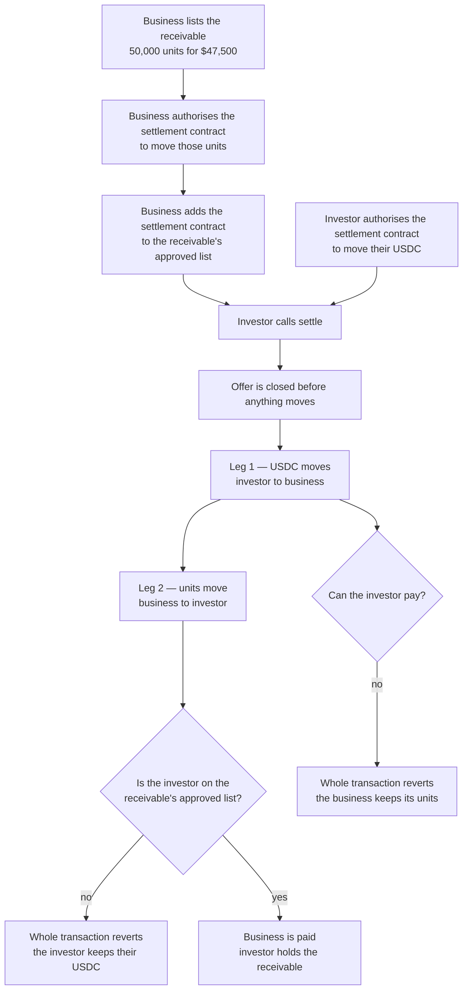

# Settle the sale on-chain, verify it on HashScan, and contribute back to ATS

## Overview

**What:**
An investor buys a receivable and the money and the asset change hands together — the business is paid and the investor holds the receivable in the same instant, or neither happens. Everything the project puts on-chain is then readable by anyone on the public explorer, and the gap this exposed is offered back to the tooling we built on.

**Why:**
Today the sale has no money in it. The receivable can be issued and it can be restricted to approved investors, but the payment for it is not part of the deal — an investor could pay and receive nothing, or receive the asset and never be paid. A funding product where the funding step is unenforced is not a funding product. Separately, being able to read the terms of a deal without trusting the company that wrote them is the entire argument for putting it on a public ledger, and that argument fails if the code behind those terms is unreadable.

**How:**
Make the purchase a single indivisible exchange rather than two hopeful transfers, and let the asset's own approval rule decide whether the exchange is allowed at all. Publish the source of everything deployed so a stranger can read the rules for themselves, and offer the missing exchange step back to the asset tooling that lacks it.

**Zone 1 check:**
Advances **Deployment** — the stage where investor capital is actually placed into an asset. Issuance made the asset exist; nothing so far makes capital move into it. This closes the only remaining step between an approved investor and a funded business, and makes "did the business get paid for this?" answerable from the ledger instead of from our database.

---

## Core Logic

### The boundary

ATS is the register: it records who holds the security and what the issuer owes at maturity. It deliberately knows nothing about what anyone paid. The settlement contract is the one piece of Solidity this project writes, and it exists only to bind the two legs into one transaction.



### Who does what

| | Our code | ATS, already deployed |
|---|---|---|
| Record an offer's terms — units, payment token, price | ✅ | |
| Pull both legs inside one transaction | ✅ | |
| Close an offer before moving anything | ✅ | |
| Let the seller withdraw an unsettled offer | ✅ | |
| Decide whether the buyer may hold the security | | ✅ |
| Refuse an allowance to an unlisted spender | | ✅ |
| Move the security's balances | | ✅ |
| Record what anyone paid | ❌ | ❌ |

### Business rules

- An offer is closed before either transfer runs, so a payment token that calls back cannot settle the same offer twice.
- Payment moves before delivery, so a buyer the security refuses loses the payment leg with it — atomicity is what protects them, not an ordering trick.
- The settlement contract never holds a balance of either token; both legs are pulled straight through from one party to the other.
- The settlement contract must itself be on the receivable's approved-holder list, because ATS refuses to grant an allowance to an unlisted spender. It is listed as a spender, not as a holder.
- Only the seller may cancel an offer, and only while it is still open. A closed offer never reopens.
- An offer of zero units is refused at creation rather than settling to nothing.
- The refusal an investor sees when they are not approved comes from the security's own compliance rule, not from a check written in the settlement contract.

---

## File Tree

```
contracts/hedera-ats/
├── contracts/
│   ├── ReceivableDvp.sol              # the settlement contract — the only Solidity we write
│   └── test/
│       └── MockUsdc.sol               # minimal ERC-20 standing in for USDC in tests
├── scripts/
│   ├── deploy-dvp.ts                  # deploys the settlement contract, records its address
│   ├── demo-settlement.ts             # walks the refusal and the sale end to end
│   └── verify-hashscan.ts             # publishes the source to Sourcify, which HashScan reads
├── test/
│   ├── receivable-dvp.spec.ts         # settlement against the full ATS system in-memory
│   └── receivable-token.spec.ts       # existing — clock fix so it survives a longer chain
├── deployed.json                      # token and settlement contract addresses per network
└── package.json                       # adds the deploy:dvp script
docs/settlement.md                     # why the gap exists and how the contract closes it
README.md                              # HashScan links to everything deployed
```

---

## Action Items

**[x] Settlement contract**

Implement: Create `contracts/hedera-ats/contracts/ReceivableDvp.sol`, which binds the payment and delivery legs of a receivable sale into one transaction.

- `offer` — records a sale's terms and returns its id
- `settle` — pays the seller and delivers the units, or reverts having done neither
- `cancel` — withdraws an unsettled offer, seller only
- `offerOf` — reads an offer's terms back

Verify:
```
cd contracts/hedera-ats && npx hardhat compile
```
→ exits 0, `Compiled 2 Solidity files successfully`

**[x] Settlement test suite**

Implement: Create `contracts/hedera-ats/test/receivable-dvp.spec.ts` and `contracts/hedera-ats/contracts/test/MockUsdc.sol`, covering every business rule above against the full ATS system deployed in-memory.

Verify:
```
cd contracts/hedera-ats && npx hardhat test test/receivable-dvp.spec.ts
```
→ exits 0, 6 passing: both legs move for an approved investor; an unapproved buyer's payment stays put; an underfunded buyer's units stay put; a settled offer cannot settle twice; a cancelled offer cannot settle; only the seller may cancel

**[x] Whole suite stays green**

Implement: Correct the clock mismatch in `contracts/hedera-ats/test/receivable-token.spec.ts`, which compared a wall-clock maturity date against a block timestamp and failed once the chain ran long enough for the two to drift apart.

Verify:
```
cd contracts/hedera-ats && npx tsc --noEmit && npx hardhat test
```
→ exits 0, 11 passing, 0 failing

**[x] Deploy to Hedera testnet**

Implement: Run `contracts/hedera-ats/scripts/issue-receivable-token.ts` and `contracts/hedera-ats/scripts/deploy-dvp.ts` against Hedera testnet, recording both addresses in `contracts/hedera-ats/deployed.json`. Each script merges into its network's entry rather than replacing it, so one does not wipe the other's address.

Verify:
```
cd contracts/hedera-ats && node -e "const d=require('./deployed.json').hederaTestnet;if(!d.receivableToken||!d.receivableDvp)process.exit(1);console.log(d.receivableToken,d.receivableDvp)"
```
→ exits 0, prints both addresses

**[x] Verify the settlement contract on HashScan**

Implement: Create `contracts/hedera-ats/scripts/verify-hashscan.ts`, which submits the compiled standard-JSON input and sources for `ReceivableDvp` to Sourcify — where HashScan reads verified sources from — so the contract's source is readable at its address. Re-running it on an already-verified contract is a no-op rather than an error.

Verify:
```
curl -s "https://sourcify.dev/server/v2/contract/296/0x46900157F8137F4545F8F1237549cafaBAaF7Cb9" | node -e "let s='';process.stdin.on('data',d=>s+=d).on('end',()=>console.log(JSON.parse(s).match))"
```
→ prints `exact_match`

**[x] HashScan links in the README**

Implement: Add a section to `README.md` listing every address this project put on-chain — the receivable token, the settlement contract, and the ATS factory and resolver it builds on — each as a HashScan link.

Verify:
```
grep -c "hashscan.io/testnet" README.md
```
→ prints `4` or more

**[ ] Upstream contribution to ATS**

Implement: Open a pull request against `hashgraph/asset-tokenization-studio` offering delivery-versus-payment settlement for an ATS security, and link it from this issue.

Verify:
```
gh pr list --repo hashgraph/asset-tokenization-studio --author @me --json url --jq '.[0].url'
```
→ prints a pull request URL
